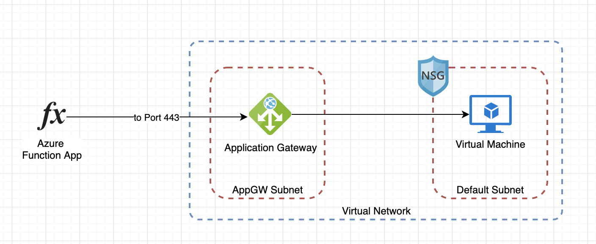

# General Structure
Used for the documentation of architecture principles.

## Short Description
Short Descriptions help the reader to get a quick overview over the topic and support the process of quick evaluation wether an article might be helpful or not.

## Content
The content should always clearly declare the concept and thoughts of the decision process behind a dedicated architecture or design prinicple. It should be written in a straight way but also provide indepth knowledge and reference further (official) documentation (e.g. MSDN articles). 
If an architecture eventually differs from best practices it should be clearly documented and comprehensively described why a dedicated situation calls for an adaption of the solution.

## Drafts
Use drafts as often as possible. Drafts can be created using  and are visual representations of an architecture. They generally strenghten the readers' understanding of complex topics. 

## Versioning
As the project is going to grow and evolve, so will the architectural concepts. Make sure to add versions to clearly identify when they were introduced into the software. In case the architecture changes, so its version should be updated as well.

## Add Tags
Tags optimize searches and help developers to quickly find documentations of the current state of implementation.

# Example

---

# Title of the Concept
|  | Version |
|--|--|
| Article Version | 1.2 |
| Implemented in Version | 2.29 |

# Short Description
A brief overview of the topic, to enable a reader to evaluate wether this article is relevant for him or not.

# Architecture Draft

##### Tags: e.g. architecture, concept, networking, aks, service

