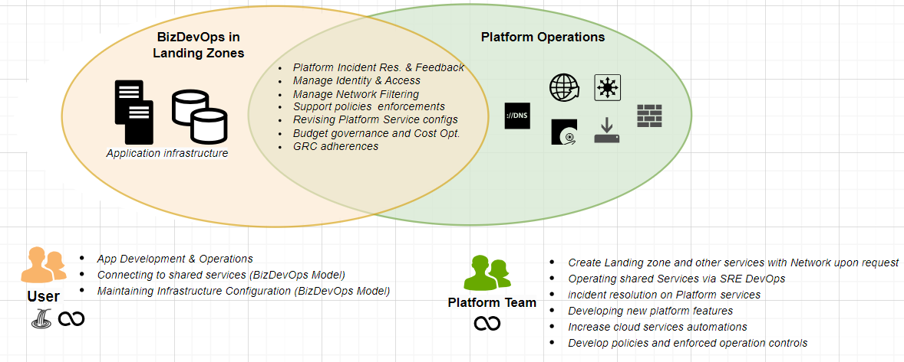
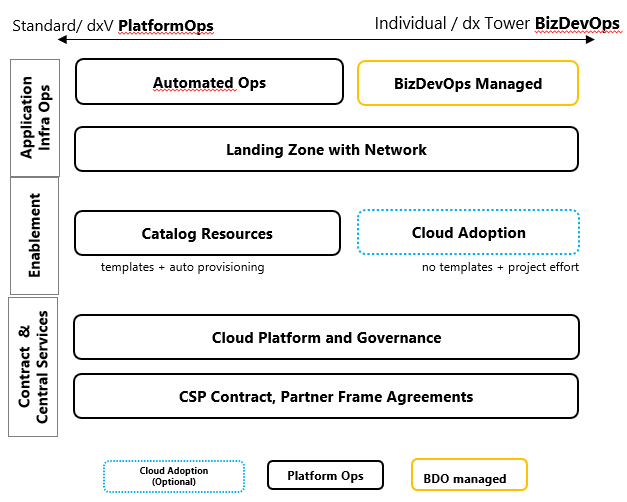

# Cloud Service Model

The Cloud platforms are developed and operated by the designated Platform Team which consists of Leading Architects, Cloud Engineers and Site-Reliability Engineers. 

All support levels are related to the cloud infrastructure configuration and not related to middelware or application logic.

operations support is described into the types, BizDevOps and Platform Ops, This is to allow individual development to leverage the potential of the hyper-scalers and at the same time to offer a minium basis for control and security at enterprise scale.

Firstly Platform operations is given via the platform team on shared services. Amogst these platform services are the Landing Zone config, a virtual network, connectivity as well as Catalog resources which are provided into Landing Zones.

Left to the to the Platform Operated Services you find the actual application infrastructure in Landing Zones  which is managed by the user in BizDevOps as default.

[source](https://henkelgroup.sharepoint.com/:p:/r/teams/MST-C-HybridCloud-Henkelinternal/Shared%20Documents/Henkel%20internal/31%20-%20Azure%20Landing%20Zone/Integrating%20Azure%20into%20Skywalker.pptx?d=w8875b4b926db4ed4867f7ad9f8ee017e&csf=1&web=1&e=BBg0Re)

For new teams we recommend an enablement service option. Users can aquire services to create and adopt the cloud in an joint excercise via Cloud Adoption. 

[source](https://henkelgroup.sharepoint.com/:p:/r/teams/MST-C-HybridCloud-Henkelinternal/Shared%20Documents/Henkel%20internal/31%20-%20Azure%20Landing%20Zone/Integrating%20Azure%20into%20Skywalker.pptx?d=w8875b4b926db4ed4867f7ad9f8ee017e&csf=1&web=1&e=BBg0Re)

## Catalog Resources and Automated Ops

Only App infrastructure and service controls which are ordered via an [Catalog item](../cloud-portal-catalogrequest.md) can be managed by the Platform. Find commited controls and service detailes in the following sections.

## Cloud Adoption

Cloud Adoption is a complimentary enablement & consulting service to create custom Landing Zone Environments. It is an optional transition scheme that gives the user an opportunity to get cloud services partially or entirely into the Platform operations support. This can be beneficial to optimize run costs and allow operations at scale by the cloud platform team. 

Cloud adoption is a project support engagement between the requester and the Cloud Adoption team. Environments that are supported by Cloud Adoption are labled as "BizDevOps Mainteance" and firmed under the operations responsibility of the App Owner or Requester. This demarcation is required to determine liability and contract terms when it comes to security, compliance and operations governance. Cloud Adoption is no managed service.

Adoption can be ordered at the [Adoption Project Support Team](../azure/adoption.md) over a [Cloud Portal Generic Ticket](../cloud-portal.md). 

- Best Effort advisory and Operations support with no SLA or response time other than agreed in the Cloud Portal Ticket
- Only Project related and agreed business hour response time [Cloud Adoption](../azure/adoption.md)
- SecOps + GRC’s are mainly done by BDO team

## BizDevOps Maintenance

BizDevOps managed Landing Zone Environments have following limitations re Platform Operation Services

- Best Effort advisory and Operations support with no SLA or response time
- Independently align your resource configuration with the central Landing Zone and Platform Services 
- Independently handling Security updates
- SecOps + GRC’s are mainly done by BDO team

!!! warning 
    In this cases only the shared services such as network are commited on SLA and Operations Support.
    
## Platform and Landing Zone Service

Following sections explain which operation support solutions and services are maintained centrally by the Platforms. platform Operations are a minimum foundation to the opertions in the cloud.

The mininum that is applied in BizDevOps are services related to the platform and the Landing Zone including a virtual Private Network. Optionally Platofrm Operations is applied on catalog items, also called Cloud Resource or Cloud Service.

!!! info
    The catalog services can be ordered via an [Catalog item](../cloud-portal-catalogrequest.md) if not othwerwise agreed. Other centrally managed guardrails and minimum requirements are documented in [Azure Service Enablement framework](sef/introduction.md)

### Platform Operations Requirments

#### Pre-requisites for Support 

- The services are ordered via [Catalog items](../cloud-portal-catalogrequest.md)
- Requester Team will focus on Application Development 
- Requester Team will organize the Application Support
- Requester Team cannot change the cloud infrastructure independently or only where agreed 

#### Pre-requisites to transition resources from Cloud Adoption to Platform Operations are

- Services have been provisioned by [Cloud Adoption Team](../azure/adoption.md) over [Cloud Portal](../cloud-portal.md) order
- Efforts to standarize infrastruture operations towards Level 1 is  and funded by the tenant user

#### Following limitations at Platform Operations may occure 

- The Tenant user has conflicting permissions to change the cloud resources independently from the Platform Team
- The Cloud Resources are created or managed by the tenant user (BizDevOps Team) 

!!! warning 
    **Only shared platform services such as network and other Landing Zone constituting components are commited on operations.**

### Management Group

**Scope: Platform**

The platform manages cloud resources via policies and shared operations solutions such as an Azure Devops integration

In Azure the policies are organized in a hierarchie called management groups that looks like below

In GCP policies are organized in a hierarchical resource schema- "Organization" as primarily used structural unit

### Identity and Access Management

**Scope: Platform**

We secure the Landing Zones with best practice access technologies in conjunction with the Henkel Access tooling. In order to establish access we follow automation. User can find further informatio in the [Landing Zone Goveranance](../cloud_governance.md) Identiy Section:

Pleae find more information for this Service at

- [Azure platform Guide Landing Zone # Access](platform-guide/platform-guide-landing-zone.md)
- [Azure Dev Guide](../azure/dev-guide.md)
- [GCP Access Controls](../gcp/landing-zone.md)

### Vulnerability Management

**Scope: Platform/Landing Zone**

Vulnerability management fouses on Container and Virtual Machine Workloads. Provider Managed Cloud Services are maintained centrally. 

However the CSP issues Configuration Hardening guidelines to prevent customers from new vulnerbilities and maybe recommends that the Customer (Henkel) applies certain configurations itself to mitigate security risks.

The Henkel Cloud Platform offers VM OS patch configurations that reduces vulnerbilities. Beyond this there is no platform guaranteed Vulnerbility Management that means the users has to manage and monitor vulnerbilities. The input for monitoring will be provided by either the CSP native technology or Henkel Standard Tools that the user can further embeed into custom operations procedures.

- Azure offers the Defender for Cloud under the Portal
- Google cloud offers the Security Command Center as part of the console
- On-demand access to Vulberbiity Scanning via CrowdStrike through dxS Cloud Security team, mail-DL-dxS-CloudSecurity

For virtual machines we apply scanning where possible and inform Cloud Users via Email about Vulnerbilities. These findings are typically issued by Henkel Cyber Security department. The pre-requisites that scanning can be applied by the cloud platform centrally varies per CSP, Virtual Machine foundation.

Pre-requisites that the platform user need to confirm:

- The GCP OS Agents are installed into the OS and up-to-date
- Azure VM Guest configuration are installed into the OS 

Provisioning and management of GCP OS Agent is in responsibility of the asset owner and operator if not defined differently

In addition the Platform team is able to enforce Vulnerbiity controls that monitor infrastructure vulnerbilities and remediate these on behalf of the user. The confirmation is either individually agreed via a [Cloud Portal Ticket](../cloud-portal.md) or the Platform informs what kind of vulnerbilities are prevented centrally via the [Azure Service Enablement framework](sef/introduction.md) or [Security Sections](../../security/security.md).

!!! Info
    Vulnerbilities can be found on applications and middleware components. Remediations here are not in scope of Cloud platform operations.
    Important distinction is differentiation of application and middleware vulnerabilities versus vulnerabilities in centrally managed infrastructure components that are in responsibility of the Platform Team.

###  Hardening Management

**Scope: Platform /Landing Zone /Cloud Resource**

The Cloud Platform offers hardend Virtual machines images that can be referenced in a deplyoment via infrastucture as code. Further details can be found [here](../gcp/landing-zone.md).

!!! Info
    For Azure we are wokring on an image galery, providing the same hardended image OS types. 

### Patch Management

**Scope: Platform/Landing Zone**

Responsibility of Platform Team

- VM OS Patch Management is enforced from central source into your VM.
- Patch Templates are configured at [GCP project](https://cloud.google.com/compute/docs/os-patch-management) or [Azure Subscription](../azure/platform-guide/vm-patching.md) level
- VM OS Patch schedule exception can be requested via the [Cloud Portal](../cloud-portal.md)

Responsibility of User

- [Patch control creation on GCP Project](https://cloud.google.com/compute/docs/os-patch-management/create-patch-job) or Azure Subscription Level is in your responsibility 
- [VM OS Patch Job monitoring](https://cloud.google.com/compute/docs/os-patch-management/monitor-patch-jobs) & job re-conciliation is in your responsibility

### Cloud Cost Management

**Scope: Platform/Landing Zone**

Please refer to the designated [Cloud Governance Model](../cost-governance.md) for further information.

### Infrastructure Incident Management

**Scope: Platform**

Please report incidents via Service Now. Response times are ~24h depending on the critically. The Cloud Platform is no Henkel consumer or Business end-user platform. The platform is meant for for BizDevOps, Development and Technical Operations Teams.

Conditions before the platform team gets involved are:

- First Contact over Service Health Desk, or other Infrastructure Support Teams (GTC NOC/IOC) 
- First Incident analysis has been initiated by the user- or technical responsible team on the application tier (e.g. application code)
- If the App is under BizDevOps Maintenance, the user- or technical responsible team has to make an analysis on infrastructure level before contacting the platform teams

| Platform | Area | Group/ Email |  Comments  |
|-------------|----------------------|----------|--------|
| Azure | Platform  | Global.Appl.AzurePlatform.X | 24h response time.   |
| Google | Platform  | Global.Appl.GoogleCloudPlatform.X | currently only hypercare agreements  |
| Private Cloud | Platform  |  | following  |

!!! Info 
    Please find the Operations Flow for incidents in the folder [Hybdrid Cloud Community Teams > OPs Model](https://henkelgroup.sharepoint.com/:f:/r/teams/MST-F-CloudCenterTheOfficialSite/Shared%20Documents/General/Ops%20Model?csf=1&web=1&e=U6229R)

!!! Info
    Detailed information is in design, e.g for P1/P2. Operations support and incident response times can vary.

### Infrastructure Security and Alert Management

**Scope: Platform**

Security Alerts are reported to the Asset Owner and to the dxS Cyber Defense Team via Email. The dxS teams overlook if the App owner becomes active or otherwise inform the Cloud Platform team via ServiceNow. The Cyber Defense or Platform Team can decide to take a service offline if no response by the App Team is documented. This activity is last resort and causes service interruption and/ or Business Loss in the responsibility of the App owner. 

!!! Info
    Please find the Operations Flow for Security Incident in the folder [Hybdrid Cloud Community Teams > OPs Model](https://henkelgroup.sharepoint.com/:f:/r/teams/MST-F-CloudCenterTheOfficialSite/Shared%20Documents/General/Ops%20Model?csf=1&web=1&e=U6229R)

!!! Info
    We recommend that the App Owners note a shared Email Box or Assignment Group in the Cloud Portal. For further details or consultancy on how to set up Security and Alert mechanisms don´t hesitate to approach us.

### Change Management

**Scope: Platform**

Changes to the Cloud Platform or shared assets incl. Landing Zones can be requested based on an Incident, pull-request per [Azure Devops*](https://dev.azure.com/hmanagedcloud/AzurePlatform) or per Cloud Portal General Ticket type   

Important distinction again is differentiation of application and middleware changes to respective.

!!! Info
    Please find the Operations Flow for Change in the folder [Hybdrid Cloud Community Teams > OPs Model](https://henkelgroup.sharepoint.com/:f:/r/teams/MST-F-CloudCenterTheOfficialSite/Shared%20Documents/General/Ops%20Model?csf=1&web=1&e=U6229R)

!!! Info
    *Please approch us via Incident or Portal Ticket, if no permissions to Azure DevOps are granted (Error Message 403 or 404  in Azure DevOps Website show up)

### License Management

**Scope: Platform**

Licenses for Cloud Services, OS and Databases, can be gained by the CSP automatically (pay-as-you-go lIcense) or potentially reused from on-premise. On-premise license needs are to be analysed before project before cloud resource provisioning is started. Please approach the dx license management team or cloud@henkel.com.

### Monitoring and Alerting

**Scope: Platform/Landing Zone**

Monitoring meaning to set up monitoring solutions to track the health, performance, and resource utilization of cloud infrastructure and services. recommended is to configure alerting rules to receive notifications when certain thresholds are exceeded or specific events occur.

**The platform monitors activities, security, billing on shared platform services, that constitute the Landing Zone.**

Further read:

- [GCP General Monitoring and Logging](../gcp/index.md)
- [Azure General Monitoring and Logging](../azure/platform-guide/platform-guide-intro.md) 
- [Azure Monitoring and Logging per Service](sef/introduction.md)

!!! Info
    Please check with Cloud Adoption or support to experience more about monitoring and logging.

### List of Network & Access Management Services

**Scope: Platform/Landing Zone**

We provide a list of network related Communication and Access solutions in correspondence with the Network and Security teams in dxV and DxS.

- Private Endpoint Support policies
- Network Access management through shared VPCs and Vnets
- Firewall Management through Gitlab and Azure Devops (powered by DxS Edge Security team)
- Henkel User Access via Zsclaer App connectors (powered by DxS Edge Security team)
- Henkel on-premeise access via GCP PartnerConnect and Azure ExpressRoute
- DNS Forwarder
- DNS automation for SSL Certificates and Domains 

We recommend to read through the platform and landing zones articles in [GCP](../gcp/index.md) and [Azure Platform Guide](../azure/platform-guide/platform-guide-intro.md)

