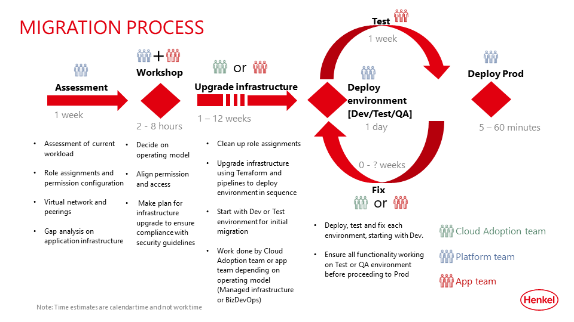

# Azure Migration
Subscriptions provided before March 2023 were created by the IQ3 service with a few services and tools to ensure central auditing and minimal compliance. As of March 2023, a new landing zone concept based on [Microsoft Cloud Adoption Framework](https://learn.microsoft.com/en-us/azure/cloud-adoption-framework/ready/landing-zone/) which follows the best practices for managing Azure Subscriptions.

The legacy subscriptions need to be migrated across to the new landing zone concept to ensure compliance with Henkel security guidelines and allow operation across all Azure resources. New features are continously added to the new landing zones while the legacy subscriptions only receive minimal support and migratoin of subscriptions is one of the key priorities for the Azure Platform. 

A process has been defined for the migration which involves several teams:
- Platform Team: Responsible for initial assessment of resources and can provide guidance on the process
- Application Team: Responsible for providing input and decisions on updates to resources and role assignments. If the infrastructure is managed by the application team (BizDevOps operating model), they are also responsible for all changes required to infrastructure and pipelines.
- Cloud Adoption Team: Can assist with updates to infrastructure. Cost is T&M.

The migration process is split into multiple steps which are described below.
## Assessment
The first step is to assess the resources of the workload to be migrated as well as the permissions and role assignments. The Platform Team will usually perform an initial assessment which is used as input for the workshop. There are a couple of scripts to perform a gap analysis between the current state and the state needed in the landing zone. These Powershell scripts can also be provided to teams so they can check what state their subscription and resources are in.

The assessment also looks at existing virtual networks and peerings which should be migrated.

## Workshop
A workshop is planned between the Platform Team and the Application Team to go through the assessment. This would be a meeting of 2 to 8 hours depending on size of workload and complexity of migration. Depending on the operating model, the meeting can also include someone from the Cloud Adoption team if they are requiered to assist with the migration.

In the workshop, the participants will go through the initial assessment and align on the permissions and access needed for the workload. A plan for the infrastructure upgrade is made to ensure compliance with security guidelines in the new landing zone.

## Upgrade infrastructure
Depending on the size, complexity and current state of the workload in terms of compliance, this phase can take between a week and several months. Depending on operating model, this work will be done by either the Application Team or Cloud Adoption Team.

The goal of this phase is to get the first environment (dev or test) ready for migration. If all resources are provisioned through Terraform, then the work will primarily involve the update of scripts to ensure the configuration of services is compliant. If resources are not provisioned with Terraform or similar IaC language, then additional work is probably needed to redeploy resources using Terraform or having to duplicate work across environments. The migration would also be a good opportunity to upgrade and fix any issues that exist in the current IaC configuration.

## Deploy -> Test -> Fix
Once the initial environment is ready to be migrated, the Platform Team will create a new landing zone for the workload and move the subscription and potential network into the landing zone.

The Application Team verifies that all functionality is still working by performing a test of the application. The connectivity and permissions is also verified to ensure that all external endpoints can be reached by the services in the workload.

An important part of the verification is to ensure that it is still possible to deploy applications and other necessary artifacts such as secrets to a KeyVault. Due to the enhanced security profile, most services will no longer have public endpoints available which means that apps must be deployed using a self-hosted build agent which is integrated in the internal network. This will often require substantial changes to the build and deploy pipelines.

Once all issues arising from the migration are addressed and fixed, the full set of changes and fixes are applied to the next environment after which it can be migrated and the process repeated.

Most projects should have a minimum of three environments (dev / test / prod) which allows for two test migrations before the production environment.