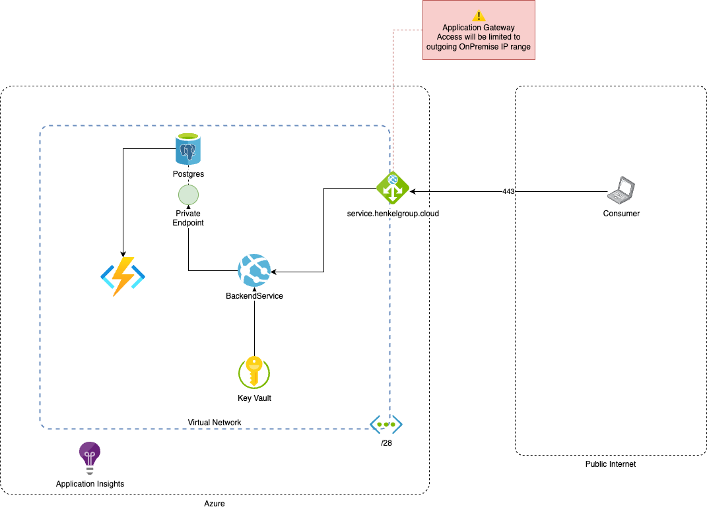
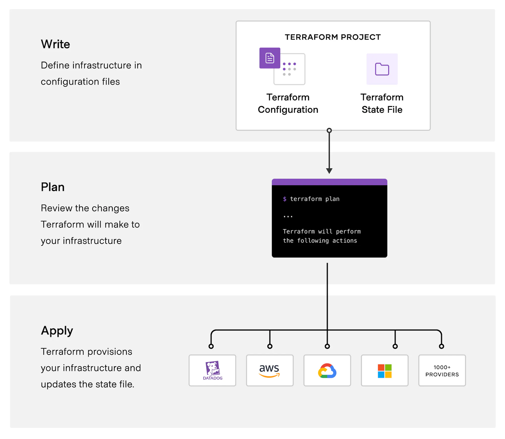

# Developer Guidelines for Azure

In this section, we introduce guidelines for developers, e.g., how an architecture diagram should look like or what Infrastructure as Code is and how we use it at Henkel. If you need more information about the Landing Zone we provide, [read the section Landing Zone in the Platform Guidelines](platform-guide/platform-guide-landing-zone.md).

## Architecture Diagram
The architecture diagram is an important part of your request so that both we as cloud team can understand your demand and you as a requester have an overview what you would like to deploy. Providing an architecture diagram is mandatory, regardless of the targeted operating model. That is, even if you will operate a subscription in BizDevOps mode and deploy the infrastructure on your own, we still need to understand what you will deploy. The figure below contains an example for an architecture diagram. It should always contain:

- all services which will be deployed
- how they interact with each other and already deployed infrastructure/external services (also add protocols and ports if applicable)
- the network layout, i.e., which service belongs to which VNET/subnet, what peering to the Henkel environment is necessary

Also add information to the services (e.g., what data will be in a database) if it supports the understanding of your request. Please also make sure that it is visible which part of the infrastructure belongs to the request and will be created and what has already been created, is an external service, or out of scope for the request (e.g., via different colors). The architecture diagram is one part to evaluate the maturity of the request and can be part of our decision whether we provide a managed or BizDevOps subscription.

## Infrastructure as Code (IaC)
When you use Azure for the first time, it is likely that you manually configured your infrastructure via the graphical user interface on the Azure portal website. However, this approach has multiple drawbacks:

- Manual interaction for every change necessary
- Cannot be automated, i.e., similar services have to be configured multiple times
- Hard to rebuild your infrastructure

Infrastructure as Code (IaC) follows a different approach, in which you describe your infrastructure in a configuration file. A tool takes the configuration file as input, sets up the infrastructure in Azure, and maintains the current state of the deployment. A change in the configuration file (e.g., an added service or a changed setting) leads to updated infrastructure in Azure. The configuration file can be checked in to source control systems, similar service configurations can be stored and reused via modules, and the infrastructure deployment can be integrated into Continuous Integration/Continuous Deployment workflows. You can [read more about IaC in this blog post](https://www.linode.com/docs/guides/introduction-to-infrastructure-as-code/).

At Henkel, we use [Hashicorp's Terraform](https://www.terraform.io) as IaC solution to ensure that infrastructure is easy maintainable. The following figure shows the three steps to deploy infrastructure using Terraform. First, you define your infrastructure in a configuration file. Second, you run the command `terraform plan` so that Terraform validates your configuration file and compares the infrastructure defined in the configuration file with possible deployed infrastructure. The result is a list of changes Terraform will make in the apply stage. Third, you run the command `terraform apply` so that the previously described changes tare provisioned.

If you need more details about how Terraform works, [read the Terraform introduction](https://developer.hashicorp.com/terraform/intro) or [follow the tutorial](https://developer.hashicorp.com/terraform/tutorials/azure-get-started) to set up your own infrastructure via Terraform.

## Azure DevOps
[Azure DevOps](https://azure.microsoft.com/en-us/products/devops) is a tool from Microsoft to store your source code in Git repositories, build pipelines, store build artifacts, or organize your work with boards and backlogs. You can request an Azure DevOps project along with Service Connections connected to your landing zones, enabling you to create infrastructure and deploy applications via pipelines. In case you already have an Azure DevOps project, it is also possible to get only the Service Connection to deploy from your existing project into your landing zone. You can find more information about how we use Azure DevOps at Henkel in the section [Azure DevOps at Henkel](../../devops/azure-devops.md).