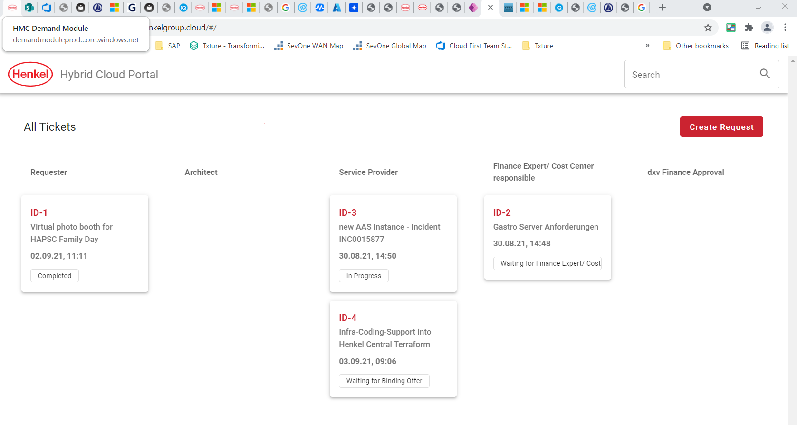

# Getting Started
You are eager to get started on your cloud journey and the cloud team is happy to help but before you jump into it then there are a few things to consider to prepare yourself.

## Considerations before starting
- Project Description
  - What is your use case?
  - Do you have an available budget via an dx Clarity/Sandhil Code for this?
  - Do you need to reach Henkel internal systems?
  - Do you need inbound connection from the internet? 
  - Do you have Azure Services in mind that are not yet enabled in the platform [Service Enablement](/docs/cloud/azure/sef/introduction.md)?
  - Where are your users located?
  - What does your architecture look like?
  - if Cloud Solution Architecture is unclear, then you may require an Azure Sandbox (WIP, Preview Release July 2023 15)

Currently we are working on a clear Microsoft approved checklist for developers and BizDevOps Teams. The below list is meant for technical expert such as SRE, Devops Engineers or solutions Architecture.

## Checklist

1. Cloud User Governance is read  [Cloud Landing Zone Governace](/docs/cloud/cloud_governance.md) 
2. Security Setup and Landing ZOnes are understood? [Security](/docs/security/security.md) 
3. Test and Prod systems are changed by infra-as-code automation piplines --> [Terraform](/docs/howto/getting-started-terraform.md) |
6. Azure Defender for Cloud Recommendation are handled with documentation evidence from High to Medium

## What are the next steps?

Next step is to create a ticket in the [Hybrid Cloud Portal](/docs/cloud/cloud-portal.md)
If you need to access the cloud or have a question regarding the Azure cloud platform please contact [cloudrequests@henkel.com](mailto://cloudrequests@henkel.com)

## How to get estimated Cloud consumption costs?

First of all it requires a defined target cloud design as mentioned in [Hybrid Cloud Portal Workflow](/docs/cloud/cloud-portal.md)

Check the usual cloud cost components  [here](../hmc-costs.md).

Use the **cost estimator** from [Azure](https://azure.microsoft.com/de-de/pricing/calculator/) to calculate your recurring costs.

Note that there will be a managed fee on top of the Azure costs for your requested resources.

In case of incidents, please create a ticket in ServiceNow and assign it to 'Global.Appl.AzurePlatform.X'.
For changes to landing zones or network configuration, a ticket can be raised in the Hybrid Cloud Portal.