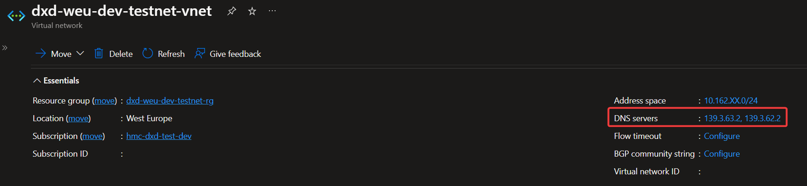
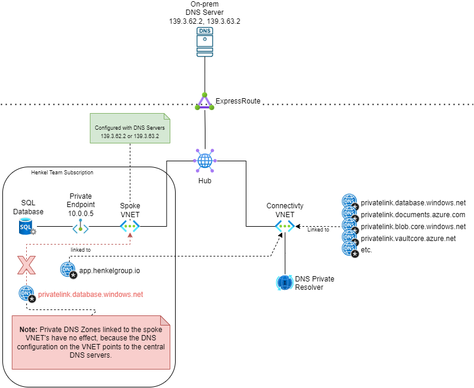
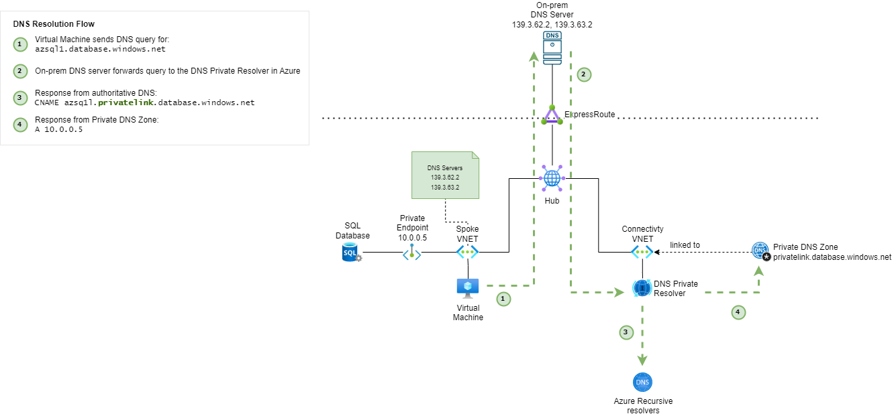

# DNS

DNS is central for mapping domains to IP addresses. This page describes the DNS setup in Azure that allows resolution across on-prem and Azure as well as between various Azure workloads.

## Architecture

For network-integrated workloads running in Azure, the on-prem Henkel DNS servers (`139.3.63.2` and `139.3.62.2`) are configured on the Virtual Networks.

!!! note
    The IP addresses assigned to the Henkel DNS servers are only accessible over the private network even though they are in the Public IP Range. The IPs are owned by Henkel and are used on the private network.

Custom forwarding has been configured on the on-prem Henkel DNS Servers for certain DNS zones for [Private Endpoints](azure-network-private-endpoints.md) and for some `henkelgroup.io` and `henkelgroup.net` DNS Zones that are hosted in Azure.

Shared Private DNS Zones are located in a central connectivity subscription managed by the Azure Platform team. These are managed through Policy automation.

Application Teams can request and manage their own Private DNS Zones which are located in the team's subscription(s). This is illustrated in the diagram below.

Application-specific Private DNS Zones can be requested and managed in the Landing Zone configuration. Find configuration reference in [Landing Zone Configuration](https://docs.henkelgroup.cloud/cloud/azure/platform-guide/configuration-reference-network/#vnetsprivate_dns_zones).

For workloads in the legacy Azure environment, the Private DNS Zone must created by the Application Team. A Cloud Portal request must be raised for having the Private DNS Zone linked with the connectivity VNet.

Private DNS Zones linked with the individual spoke Virtual Networks (Virtual Network in the application team's subscription) are generally **not** having any effect as the on-prem DNS servers are used for DNS resolution.

## DNS Resolution Flow for a Private Endpoint

The following diagram illustrates how a Private Endpoint to a SQL Database is resolved from a Virtual Machine in Azure.

A resolution scenario from a Virtual Machine on-prem would follow a similar path.

## Custom Private DNS Zones

If you would like to have a custom Private DNS Zone for your application, e.g. `someapp.az.henkelgroup.io`, or services requiring a separate Private DNS Zone, e.g. Azure Kubernetes Service (AKS) or PostgreSQL Flexible Server, they can either be managed in the [Landing Zone Configuration](https://docs.henkelgroup.cloud/cloud/azure/platform-guide/configuration-reference-network/#vnetsprivate_dns_zones) for Landing Zone subscriptions or requested through the Cloud Portal for Legacy/Non-Landing zone subscriptions.

A custom Private DNS Zone is created in the application subscription and linked to the central connectivity Virtual Network. This ensures that the application team will be able to manage the entries in the Private DNS Zone while making it available from both Azure and on-premise.

In addition, we will request Custom Forwarding of the DNS Zone from the on-prem DNS servers to the DNS Private Resolver in Azure, if needed.

## Troubleshooting

### A private endpoint cannot be resolved

[Please check the troubleshooting of Private Endpoints.](azure-network-private-endpoints.md#troubleshooting-connectivity-to-a-private-endpoint)

### DNS is not working for an Azure workload

1. Ensure that the DNS servers on the Virtual Network is set to: `139.3.63.2`, `139.3.62.2`
2. Ensure that the VNET is peered to the hub
3. For App Services, ensure that **Route All** is enabled (see [Microsoft Documentation](https://learn.microsoft.com/en-us/azure/app-service/overview-vnet-integration#application-routing)). Without this setting, the DNS server can't be reached.

## References

- [Virtual network and on-premises workloads using a DNS forwarder](https://learn.microsoft.com/en-us/azure/private-link/private-endpoint-dns#virtual-network-and-on-premises-workloads-using-a-dns-forwarder)
