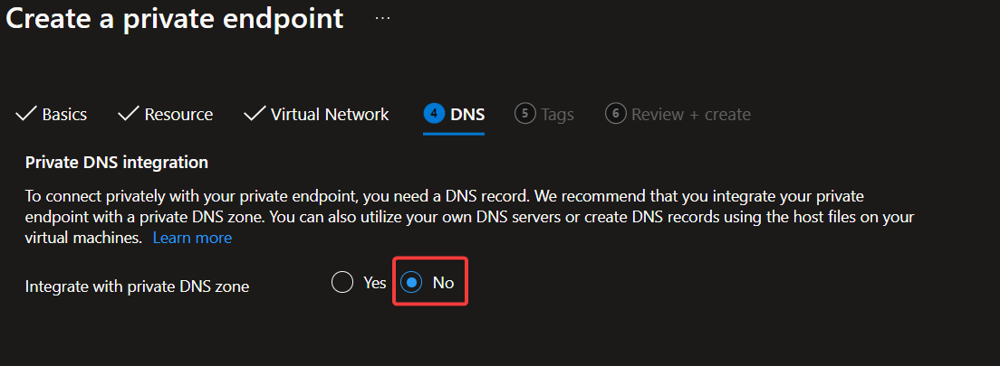

# Private Endpoints

For many Azure PaaS services, connectivity from the internal Henkel network to the service can happen over a Private Link by the creation of a Private Endpoint inside a Virtual Network pointing to a specific resource.

The Private Endpoint is assigned a Private IP that can be accessed inside the Virtual Network and from the Henkel network, and traffic can be ensured to only traverse the internal network and the Azure backbone.

## Setup a Private Endpoint

!!! note "Delay before a Private Endpoint is functional"
    After creation of a Private Endpoint, it can take 2-10 minutes before the Private DNS Zone Group and the needed DNS records are created.

    Furthermore, if connecting via zScaler it can take up to 24 hours additionally before the Private Endpoint is accessible as DNS records need to be synchronized.

### Using the Portal

When creating a Endpoint through the Azure Portal, the correct approach is to set **Integrate with private DNS zone** to **No**:



An Azure Policy will take care of integrating the Private Endpoint with a central Private DNS Zone.

If **Yes** is selected, then the Private Endpoint will be integrated with a standalone Private DNS Zone and it **won't be resolvable inside or outside of Azure**.

### Using Terraform

A Private Endpoint can be created through Terraform using code similar to the following:

```terraform
resource "azurerm_private_endpoint" "keyvault" {
  name                = "${var.keyvault_name}-pep"
  resource_group_name = var.resource_group_name
  location            = var.location
  subnet_id           = var.private_endpoint_subnet_id

  lifecycle {
    ignore_changes = [
      # Changes to 'private_dns_zone_group' should be ignored as it
      # will be created outside of Terraform through an Azure Policy.
      private_dns_zone_group
    ]
  }

  private_service_connection {
    name                           = "${var.keyvault_name}-pep-psc"
    private_connection_resource_id = var.keyvault_id
    is_manual_connection           = false
    subresource_names              = ["vault"]
  }
}
```

Notes:

- Ensure that `private_dns_zone_group` is included in `ignore_changes`. This is needed as Azure Policies are in place for automatically creating a Private DNS Zone Group and linking the Private Endpoint with the central Private DNS Zone. If changes to `private_dns_zone_group` are not ignored, then Terraform will delete the Private DNS Zone Group on each apply, and minor outages can be expected.
- The necessary value for `subresource_names` depends on the linked resource and can be found in the [Azure Private Endpoint DNS configuration](https://learn.microsoft.com/en-us/azure/private-link/private-endpoint-dns#azure-services-dns-zone-configuration) documentation, or in the table below in the `GroupId` column.

## Accessing resources behind a Private Endpoint

When configuring access to a resource behind a Private Endpoint, the public FQDN should be used for accessing the resource.

- Use `storageaccountname.blob.core.windows.net` to connect to blob storage.
- Don't use the FQDN containing `privatelink`, e.g. `storageaccountname.privatelink.blob.core.windows.net`

[Further information regarding the resolution of Private Endpoints](azure-network-dns.md#).

## Supported Services

Private Endpoints are automatically integrated with the centrally managed Private DNS Zones and can be resolved using the on-prem DNS server and through zScaler.

The following resources are supported at this time:

{{ read_json_if_exists('docs/cloud/azure/data/policies/prod/DnsForPrivateEndpoints.json') }}

Please reach out, if you would like to see another resource on the list.

## Opting out of automatic DNS integration

In some scenarios, the automatic DNS integration of Private Endpoints is not needed, e.g. when having resources in Virtual Networks that are not peered with the hub.

The automatic DNS integration can be disabled by adding the tag `auto-register-dns` with the value `false` to the Private Endpoint at the time of creation.

The consequences of opting out are:

- The Private Endpoint can't be resolved through the Henkel DNS server
- DNS resolution inside the Virtual Network should be handled by the team (creating the needed Private DNS Zones and linking them to the Virtual Network)
- The Private Endpoint is not directly accessible from outside the Virtual Network as it's not peered to the hub

## Troubleshooting Connectivity to a Private Endpoint

If a Private Endpoint is not functional, there can be several reasons and the list below can help pinpoint where the issue might be.

### The Private Endpoint is linked with the wrong Private DNS Zone

The Private Endpoint needs to be linked with a central Private DNS Zone to be resolvable. This can be verified by checking the configuration of the Private Endpoint.

1. Run the `az` CLI command: `az network private-endpoint dns-zone-group list --endpoint-name <name of private endpoint> --resource-group <resource group>`
2. Check whether the value in `privateDnsZoneId` is starting with `/subscriptions/c16a2604-640d-4594-b989-edef8e9ded34/resourcegroups/s-weu-prd-lzprivdns-rg-1` which is the location of the central Private DNS Zones.
3. If the `privateDnsZoneId` is pointing to a Private DNS Zone in another location, then the easiest solution is to redeploy the Private Endpoint and ensuring not to integrating it with a Private DNS Zone as we have a policy in place that will do this.

### It can take time before a Private Endpoint is accessible over zScaler

If connecting via zScaler it can take up to 24 hours before a Private Endpoint is accessible as DNS records need to be synchronized from the Central Private DNS Zones into the zScaler setup.

### Accessing Private Endpoints through Ivanti/Pulse Secure VPN

There are currently two requirements for having access to Private Endpoints over Ivanti/Pulse Secure VPN:

1. The Ivanti VPN only allows traffic to allowed IP Addresses. This means that the IP Addresses of the Private Endpoints must be allowed as part of the VPN Profile. [Request a new SSLPVN (Pulse VPN) profile or modify existing profile](https://henkelprod.service-now.com/sp?id=sc_cat_item&sys_id=ae2f81191bc12d506965eb9f7b4bcbdc&sysparm_category=0fdcd4891b3ed5502ab476628b4bcb95). This is used for Henkel business owners to request or Modify the VPN profile.
2. Due to a regression in the Ivanti VPN, resolution of Private Endpoints must be enabled for the required DNS Zones on the VPN Profile, e.g. `blob.core.windows.net` for Blob Storage, or `vault.azure.net` for KeyVault. Please create a ServiceNow incident with the Assignment Group `Global.Srvc.OPS_Network.I` requesting the needed access.

### The system is not using the Central Henkel DNS Server

Try to run `nslookup` on the system that needs access to the Private Endpoint. Note that you should use the public domain of the service (e.g. `mykeyvault1234.vault.azure.net`) and not the private link domain (e.g. `mykeyvault1234.privatelink.vaultcore.azure.net`).

```
> nslookup mykeyvault1234.vault.azure.net
Server:  UnKnown
Address:  139.3.63.2

Non-authoritative answer:
Name:    mykeyvault1234.privatelink.vaultcore.azure.net
Address:  10.164.211.36
Aliases:  mykeyvault1234.vault.azure.net
```

1. Check whether the IP listed under _Server Address_ is either `139.3.62.2` or `139.3.63.2`. If another IP is listed, then the DNS setup on the system might not be correct.
2. Check whether the IP listed under _Address_ is the private IP of the Private Endpoint. If a public IP is listed, then the Private Endpoint might not be integrated correctly with the central Private DNS Zones.

### A Network Security Group (NSG) might block the access

The NSG attached to the subnet where a Private Endpoint is deployed can block the access.

1. Run the `az` CLI command: `az network vnet subnet show --name <subnet name> --vnet-name <vnet name> --resource-group <resource group> --query privateEndpointNetworkPolicies`
2. If the command returns `Enabled`, then an NSG can block access to the Private Endpoint.
3. Check whether there are NSG rules in place that would allow traffic to the Private Endpoint.
4. Please create a Cloud Portal request for the necessary NSG rules needed for accessing the Private Endpoint.

### Create a ServiceNow Request, if the Private Endpoint can't be resolved

If the troubleshooting steps above didn't help solve the issues, then please create a ServiceNow request with the Azure Platform team, Assignment Group `Global.Appl.AzurePlatform.X`, and we will assist in identifying and fixing the issue.
