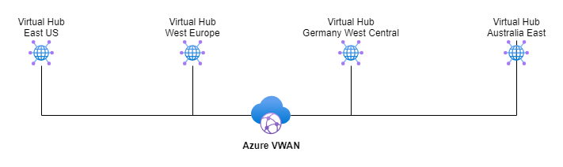
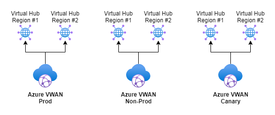
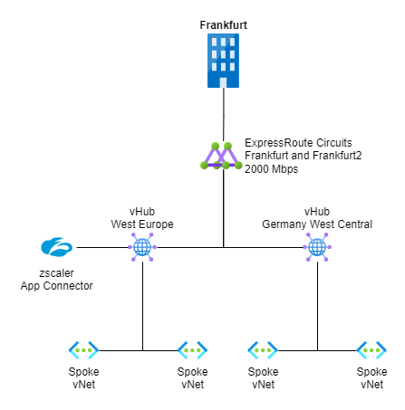
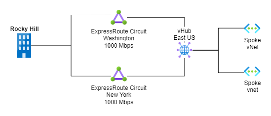
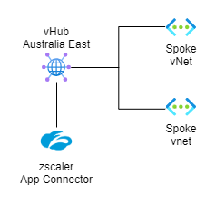
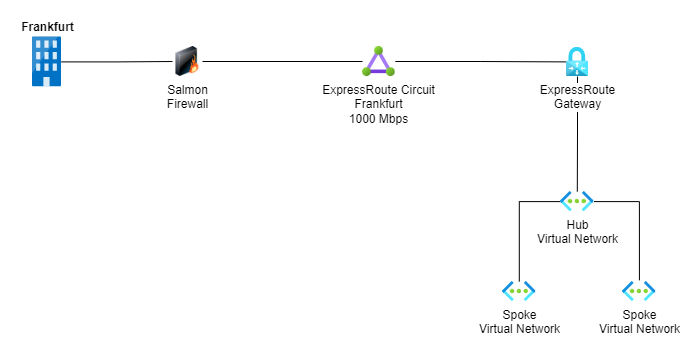
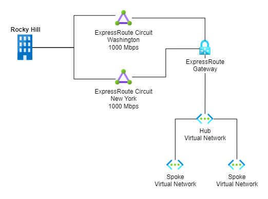

# Network

## Introduction

This page gives an overview of the network setup in Azure and how the networks are connected with the on-premises network.

## Landing Zones

The network in the new Landing Zones is built upon a Virtual WAN with Virtual Hubs in multiple regions:

There is a separate Virtual WAN per platform environment, so network changes can be rolled out gradually to avoid impacting production application workloads:

The text and diagram below are centered around a single environment, but similar setups are in place for all environments.

Traffic between Landing Zone environments has at this point in time connectivity over the Express Route Circuits.
For the future, it is planned that Express Route circuits will be split to correspond with Landing Zone Environments, thus traffic can not flow freely between environments.
It is therefore recommended that there are no dependencies between Application Team infrastructure in different Landing Zone environments.

### Europe

Two virtual hubs have been deployed in Europe (West Europe and Germany West Central):

Connectivity to on-premises is enabled by two ExpressRoute circuits. The circuit in Frankfurt2 is active, and the circuit in Frankfurt is passive.

In addition, a zScaler App Connector has been deployed which enables connectivity inbound through zScaler.

### US

A virtual hub has been deployed in East US:

Connectivity to on-premises is enabled by two ExpressRoute circuits. The circuit in Washington is active, and the circuit in New York is passive.

### APAC

A virtual hub has been deployed in Australia East:

Connectivity to on-premises is enabled through the ExpressRoute circuits in Europe (traffic is first flowing to one of the hubs in Europe).

In addition, a zScaler App Connector has been deployed which enables connectivity inbound through zScaler.

## Legacy

The network consists of separate hub-spokes for the various Azure regions.

### Europe

The network in Legacy is a hub-spoke in West Europe.

Connectivity to on-premises is enabled by an ExpressRoute circuit. The circuit has two connections where one is active and the second is passive.

!!! info "Firewall openings are required for traffic from Azure to on-premises"
    The Salmon firewall blocks traffic from Azure to on-premises and firewall openings must be requested through [ServiceNow](https://henkelprod.service-now.com/sp?id=sc_cat_item&sys_id=de24f2371b5355542542db58bb4bcbcd). Traffic from on-premises to Azure is not restricted by the Salmon Firewall.

### US

The network in Legacy is a hub-spoke in the East US.

Connectivity to on-premises is enabled by two ExpressRoute circuits. The circuit in Washington is active, and the circuit in New York is passive.

### APAC

The network in legacy is connected through a Silverpeak SDWAN solution in APAC.
