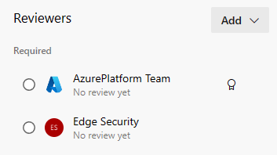

# Network Security Group review (Firewall Factory)

Network Security Groups (NSG) act as a firewall controlling the traffic in- and outbound of Virtual Networks (vNET) specified as network security rules. Changes to network security rules are reviewed by the firewall Factory feature which enforces that all changes to Network Security Group rules are reviewed by the Edge Security Team.

!!! note "Applies to Landing Zone only"

    The Firewall Factory functionality is currently only applied for Landing Zone environments (subscriptions). In a future update, the same review process will also apply to all Legacy environments.

As a default, Azure resources provisioned on Henkel Azure Cloud must be integrated with or provisioned into Virtual Networks as a prime security principle. Virtual Networks are managed resources by the Platform Team.
A Landing Zone is provisioned with one or many virtual networks which can be peered with the Henkel cooperate network.

When an Azure service is integrated with a Virtual Network, in and outbound traffic flows through the Virtual Network for connections to services in the same vNET, between vNETs or when breaking out to the Internet.

For services that use Private Endpoints, only the inbound traffic flows through the vNET. Outbound traffic for services with Private Endpoints can have different ways of integrating outbound traffic to a vNET varying for each Azure service, e.g. App Services have a dedicated subnet for outbound traffic, other services have Managed Private Endpoint to other services etc. Read more on the [Henkel network](./azure-network.md).

## Designing Network Security rules

As a guiding principle, network security rules should be as restrictive as possible and not be too permissive to what ranges and ports are opened.

Below overview is a guideline for designing network security rules:

- Prioritize using specified Source and Destination ranges and ports. Rules with a specified Source and Destination range and Port(s) are auto-approved
- General service tags like `Virtual Network` and `Internet` should be minimized to the extent possible
- Destination port(s) must be explicitly defined
- Wildcard Source, Destination IP range or Destination port are always denied
- Ports 22 (SSH), Telnet (23), 389, 636 (LDAP), 3389 (RDP), 5985 and 5986 (WinRM) always requires an approval

## Built-in rules

As a standard, all NSGs provisioned by the Landing Zone contain built-in standard NSG rules. These provide access to resources from common sources like zScaler, SSLVPN (Ivanti) and central Platform Team resources. The built-in rules can be used as is and do not require the creation of new rules to utilize.

Below is an overview of the Built-in NSG rules

=== "Inbound"

    **Built-in inbound rules**

    | Rule Name                   | Protocol | Source                         | Destination Port                      | Destination         | Action                 |
    | --------------------------- | -------- | ------------------------------ | ------------------------------------- | ------------------- | ---------------------- |
    | Quarantine_Inbound_newZone  | Any      | Any                            | Any                                   | Quarantine solution | :material-close: Deny  |
    | AllowEndUserInbound         | Any      | zScaler   SSL VPN (Pulse) | Any                                   | Landing Zone vNET   | :material-check: Allow |
    | AllowTFEInbound             | Any      | Terraform Enterprise           | 80, 443                               | Any                 | :material-check: Allow |
    | Allow_LiftRDPAccess_Inbound | Tcp      | Lift                           | 3389                                  | Landing Zone vNET   | :material-check: Allow |
    | AllowHttpsVnetInbound       | Any      | Landing Zone vNET              | 80, 443                               | `https` (ASG)       | :material-check: Allow |
    | AllowDbVnetInbound          | Any      | Landing Zone vNET              | 1433, 3306, 5432, 10250, 10255, 10256 | `db` (ASG)          | :material-check: Allow |
    | Allow_AzureBackup_Inbound   | Tcp      | Landing Zone vNET              | 443                                   | `azurebackup` (ASG) | :material-check: Allow |
    | Deny All                    | Any      | Any                            | Any                                   | Any                 | :material-close: Deny  |

    Built-in Application Security Groups (ASGs) for HTTPS and Databases (DB) will be provisioned with the virtual network.

=== "Outbound"

    **Built-in outbound rules**

    | Rule Name                                   | Protocol | Source                       | Destination Port                       | Destination                             | Action                 |
    | ------------------------------------------- | -------- | ---------------------------- | -------------------------------------- | --------------------------------------- | ---------------------- |
    | Quarantine_Outbound_newZone                 | Any      | Any                          | Quarantine solution                    | Any                                     | :material-close: Deny  |
    | Crowdstrike_Outbound                        | Any      | VirtualNetwork (Service Tag) | 443                                    | Crowdstrike IPs                         | :material-check: Allow |
    | Allow_EntraID_Outbound                      | Tcp      | Landing Zone vNET            | 443                                    | AzureActiveDirectory (Service Tag)      | :material-check: Allow |
    | Allow_AzureBackup_Outbound                  | Tcp      | Landing Zone vNET            | 443                                    | `azurebackup` (ASG)                     | :material-check: Allow |
    | Allow_DomainJoin_TCP_Outbound               | Tcp      | Landing Zone vNET            | 53, 135, 88, 389, 636, 445, 3268, 3269 | 139.3.247.0/27                          | :material-check: Allow |
    | Allow_DomainJoin_RCP_Outbound               | Tcp      | Landing Zone vNET            | 1024-65535                             | 139.3.247.0/27                          | :material-check: Allow |
    | Allow_DomainJoin_UDP_Outbound               | Udp      | Landing Zone vNET            | 53, 88, 389                            | 139.3.247.0/27                          | :material-check: Allow |
    | Allow_VNet_to_AzureResourceManager_Outbound | Any      | Landing Zone vNET            | Any                                    | AzureResourceManager (Service Tag)      | :material-check: Allow |
    | Allow_VNet_to_AzureMonitor_Outbound         | Tcp      | Landing Zone vNET            | 443                                    | AzureMonitor (Service Tag)              | :material-check: Allow |
    | Allow_WindowsUpdateMetadata_Outbound        | Tcp      | Landing Zone vNET            | 443                                    | AzureUpdateDelivery (Service Tag)       | :material-check: Allow |
    | Allow_WindowsUpdateDownload_Outbound        | Tcp      | Landing Zone vNET            | 80, 443                                | AzureFrontDoor.FirstParty (Service Tag) | :material-check: Allow |
    | Blue Zone                                   | Any      | VirtualNetwork (Service Tag) | Any                                    | Blue Zone IPs                           | :material-check: Allow |
    | Allow_Internet_Outbound                     | Any      | Landing Zone vNET            | 80, 443                                | Internet (Service Tag)                  | :material-check: Allow |
    | Deny All                                    | Any      | Any                          | Any                                    | Any                                     | :material-close: Deny  |

    By Blue Zone is understood services hosted on the internal Henkel Network which has an inbound firewall e.g. Azure resources.

## Understanding Firewall Factory analysis

Firewall Factory automatically reviews a Pull Request (change request) to network security rules for a Landing Zone. The review is based on the requested changes only. The output of the automated review lists what network security rules can be accepted without further approval (so-called Auto-Approved rules) or identify rules that require approval from the Edge Security Team.

The Firewall Factory analysis is automatically run with each Pull Request with changes to the network of a Landing Zone. The result of the automated analysis is summarized in a table overview as a comment to the Pull Request.
The assessment of a network security rule can have different evaluations: `AutoApproved`, `ApprovalRequired` or `AutoDenied`.

When a rule receives the evaluation `ApprovalRequired` or `AutoDenied`, the Edge Security team is assigned as a reviewer to the Pull Request and must approve the requested changes.

The below image is an example of a Firewall Factory analysis. The first columns capture information about the vNET, NSG and rule content for the requested changes. The Status column shows the evaluation result of a given rule, the Reason column has a description of the evaluation status.

### Reviews requring approval from Edge Security

!!! info

    The Edge Security Team are automatically notified and will review a Pull Request requiring manual approval on a best effort basis. Please reach out to the team should you have a request with a urgent priority

When a Pull Request is evaluated to require approval from the Edge Security Team, the team is assigned as a required approver to the Pull Request and will automatically be notified of a pending review.

The Edge Security Team will interact on the Pull Request, and raise questions and comments where needed. Once approval has been given, the requested changes are deployed.

### Exemptions for Auto-Denied rules

When a rule is evaluated by Firewall Factory as `AutoDenied`, the Pull Request is by default rejected and the requester is asked to change the requested rules in a way which is accepted by the Firewall Factory analysis.

However we understand there are cases, where a business requirement exists for a rule which else would be evaluated as `AutoDenied`.
To seek an approval for `AutoDenied` rules, the following process should be followed

1. Seperate the requested NSGs rules which are evaluated as `AutoDenied` in a seperate Pull Request (seperate branch) such that the other compliant rules can be processed and deployed in parallel.
2. Raise a Cloud Request with ticket type _Security_ in the [Hybrid Cloud Portal](https://cloudportal.henkelgroup.cloud/), **provide the link to the Pull Request and provide a justification** for why the NSG rule is required.
3. Edge Security Team will review the Cloud Request and evaluate the exemption.
4. When an exemption for the `AutoDenied` rule is granted, the Pull Request is approved by the Edge Security team and the changes can be deployed.
