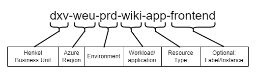

# Azure Naming Conventions

## Background

Following a standard Naming Convention helps organizing resources and identify them in a better way.

The generic pattern to be followed while creating Azure resources in Henkel is as follows:

Each component of the resource name is separated by a dash (`-`). The value of each component should consist only of lowercase letters, `a-z`, and numbers, `0-9`.

The last component (label/instance) is optional and can in most cases be left out.

### Examples

#### 1. Resource with name `c-weu-prd-covidtrac-aks`

| Component       | Description                          |
| --------------- | ------------------------------------ |
| `c`             | Henkel Consumer Brands Business Unit |
| `weu`           | Azure West Europe Region             |
| `prd`           | Production Environment               |
| `coviddtracker` | Workload name (Covid Demand Tracker) |
| `aks`           | Azure Kubernetes Service             |

#### 2. Resource with name `dxv-gwc-dev-pvtdns-vm-2`

| Component | Description                       |
| --------- | --------------------------------- |
| `dxv`     | Henkel dxv                        |
| `gwc`     | Azure Germany West Central Region |
| `dev`     | Development Environment           |
| `pvtdns`  | Workload name (Private DNS)       |
| `vm`      | Virtual Machine                   |
| `1`       | Instance Number 2                 |

## Components

The table below presents each component.

| Component                             | Description                                                                                                                                                                                                                               | Examples                  | Required | Constraint   |
| ------------------------------------- | ----------------------------------------------------------------------------------------------------------------------------------------------------------------------------------------------------------------------------------------- | ------------------------- | -------- | ------------ |
| Business Unit                         | The Business Unit that owns the resource or workload.                                                                                                                                                                                     | `dxv`, `dxs`, `c`         | Yes      |              |
| Azure Region                          | The Azure region where the resource is deployed.                                                                                                                                                                                          | `weu`, `gwc`, `eus`       | Yes      | 3 characters |
| Environment                           | The stage of the development lifecycle for the workload that the resource supports.                                                                                                                                                       | `dev`, `tst`, `prd`       | Yes      | 3 characters |
| Project, application, or service name | Name of a project, application, or service that the resource is a part of.                                                                                                                                                                | `coviddtracker`, `pvtdns` | Yes      |              |
| Resource Type                         | An abbreviation that represents the type of Azure resource. See [Recommended abbreviations for Azure resource types](https://learn.microsoft.com/en-us/azure/cloud-adoption-framework/ready/azure-best-practices/resource-abbreviations). | `app`, `vm`, `rg`, `kv`   | Yes      |              |
| Label or Instance Number              | A label or instance number for a specific resource, to differentiate it from other resources that have the same naming convention and naming components.                                                                                  | `frontend`, `001`         | No       |              |

### Henkel Business Units

| Henkel Business Unit             | Abbreviation                     |
| -------------------------------- | -------------------------------- |
| Henkel Consumer Brands (HCB)     | `c`                              |
| Henkel Adhesive Technology (HAT) | `a`                              |
| Cross-functions (HR, SSC,F)      | `f`                              |
| Shared                           | `s`                              |
| Digital Transformation           | `dx` + area, eg. `dxv`, or `dxs` |

### Azure Regions

| Regions              | Abbreviation (3 letters) |
| -------------------- | ------------------------ |
| West Europe          | `weu`                    |
| North Europe         | `neu`                    |
| Germany West Central | `gwc`                    |
| East Asia            | `eas`                    |
| South East Asia      | `sea`                    |
| West US              | `wus`                    |
| Central US           | `cus`                    |
| East US              | `eus`                    |
| East US2             | `eu2`                    |
| Australia East       | `eau`                    |

### Environments

| Environments            | Abbreviation (3 letters) |
| ----------------------- | ------------------------ |
| Development             | `dev`                    |
| Test                    | `tst`                    |
| User Acceptance Testing | `uat`                    |
| Staging                 | `stg`                    |
| Production              | `prd`                    |
| Internal                | `int`                    |

### Project, application, or service name

| Application/workload      | Short Name (keep it short and meaningful) |
| ------------------------- | ----------------------------------------- |
| e.g. SomartSmart          | `ssmart`                                  |
| e.g. Video Analytics      | `vanalytics`                              |
| e.g. Private DNS          | `pvtdns`                                  |
| e.g. Covid Demand Tracker | `coviddtrack`                             |

### Resource Type

Microsoft maintains a list of recommended abbreviations which is continuously updated with new resource types. See [Recommended abbreviations for Azure resource types](https://learn.microsoft.com/en-us/azure/cloud-adoption-framework/ready/azure-best-practices/resource-abbreviations).

Here is a list of some of the most common resource types:

| Resource Type    | Abbreviation |
| ---------------- | ------------ |
| Resource Group   | `rg`         |
| Storage Account  | `st`         |
| Key Vault        | `kv`         |
| Virtual Machine  | `vm`         |
| Private Endpoint | `pep`        |
| App Service Plan | `asp`        |
| App Service      | `app`        |
