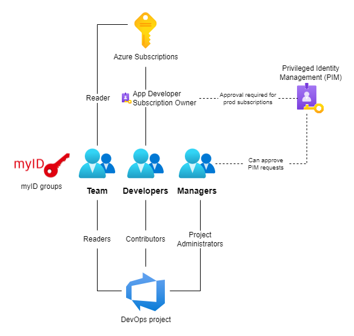
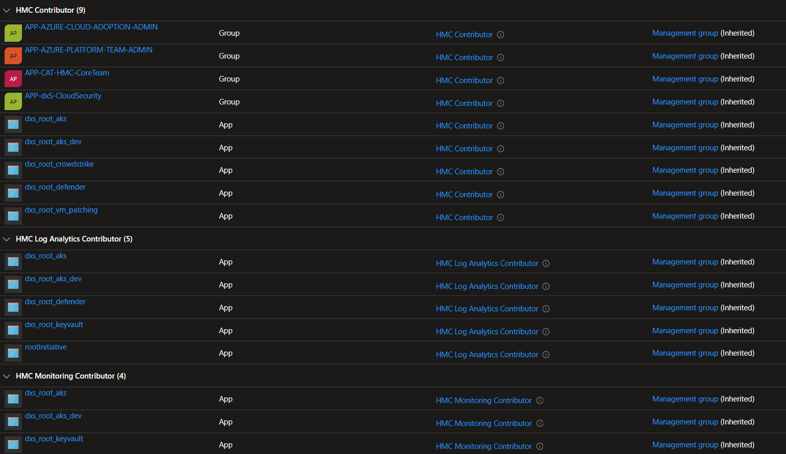
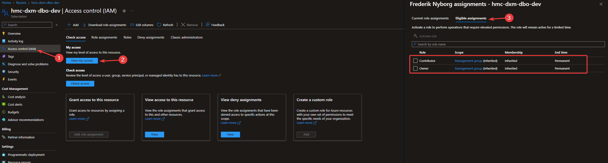

# Access Management

## Introduction

A shared access model has been defined for the Azure Landing Zones. It ensures that all application teams follow the same principles,
which can help to maintain consistency and reduce the risk of errors or misconfigurations. The shared access model can help to improve
collaboration and communication between different application teams, as they are all working within the same framework and following the same principles.

The shared access model includes access to Azure Subscriptions and Azure DevOps Projects through myID groups that are managed by the individual application teams.



## myID Groups

!!! tip

    All team members should be added as a member to the myID group `APP-ALZ-<LZ>-team` which provides Reader access. This acts as a foundation for the subsequest more privilged developers and managers group. 

Three myID AAD Groups are created for each Landing Zone.
The groups can be used by the application teams for managing access to their Azure subscriptions and Azure DevOps project.

| MyID AAD Group Name       | Description                                                |
| ------------------------- | ---------------------------------------------------------- |
| `APP-ALZ-<LZ>-team`       | A group for all **team** members.                          |
| `APP-ALZ-<LZ>-developers` | A group for **developers** and DevOps engineers.           |
| `APP-ALZ-<LZ>-managers`   | A group for **managers** that can approve access requests. |

Here `<LZ>` represents the name of the Landing Zone.

## Azure Subscription Access

The table below describes the active and eligible role assignments for the myID Groups on the Azure subscriptions in a Landing Zone.

Active role assignments are permanent while eligible role assignments can be activated for a limited time period using [PIM](#privileged-identity-management-pim).

Members of the `APP-ALZ-<LZ>-managers` group can approve the PIM requests for prod subscriptions where approval is required.

| myID Group                | Role               | Non-Prod Subscriptions    | Prod Subscriptions         |
| ------------------------- | ------------------ | ------------------------- | -------------------------- |
| `APP-ALZ-<LZ>-team`       | Reader             | Active                    | Active                     |
| `APP-ALZ-<LZ>-developers` | App Developer      | Active                    | Eligible approval required |
| `APP-ALZ-<LZ>-developers` | Subscription Owner | Eligible without approval | Eligible approval required |

!!!info "Managed Landing Zones"
    Some subscriptions are currently in a managed model where the application team has more restrictive access.
    This model is deprecated and over time the access above will apply for all subscriptions.

## Azure DevOps Access

Members of the myID groups will have the following access to the Azure DevOps project:

| myID Group                | Azure DevOps Groups    |
| ------------------------- | ---------------------- |
| `APP-ALZ-<LZ>-team`       | Readers                |
| `APP-ALZ-<LZ>-developers` | Contributors           |
| `APP-ALZ-<LZ>-managers`   | Project Administrators |

Please refer to the [Azure DevOps documentation](https://learn.microsoft.com/en-us/azure/devops/organizations/security/permissions-access) for details on the permissions.

!!!info "License Requirement for Azure DevOps"
    Azure DevOps licenses need to requested from the DevOps team.
    Please refer to [Access Level changes](../../../howto/request-azuredo.md#access-level-changes).

## Custom Azure Roles

A number of custom Azure Roles have been created to prevent application teams from making changes to network resources that are managed by the platform. The roles are based on built-in roles, but some permissions have been removed.

| Role               | Description                                                                                                                                                                                                                                                                                  |
| ------------------ | -------------------------------------------------------------------------------------------------------------------------------------------------------------------------------------------------------------------------------------------------------------------------------------------- |
| App Developer      | Based on the built-in **[Contributor](https://learn.microsoft.com/en-us/azure/role-based-access-control/built-in-roles#contributor)** role in Azure, but without network permissions. The role grants full access to manage all resources, but does not allow assigning roles in Azure RBAC. |
| Subscription Owner | Based on the built-in **[Owner](https://learn.microsoft.com/en-us/azure/role-based-access-control/built-in-roles#owner)** role in Azure, but without network permissions. Grants full access to manage all resources, including the ability to assign roles in Azure RBAC.                   |

The following `notActions` have been added to **App Developer** and **Subscription Owner** as compared with the **Contributor** and **Owner** roles, meaning that those actions are not allowed.

```
Microsoft.Network/expressRouteCircuits/*
Microsoft.Network/networkSecurityGroups/*/delete
Microsoft.Network/networkSecurityGroups/*/write
Microsoft.Network/networkSecurityGroups/delete
Microsoft.Network/networkSecurityGroups/join/action
Microsoft.Network/networkSecurityGroups/write
Microsoft.Network/routeTables/write
Microsoft.Network/virtualNetworks/*/delete
Microsoft.Network/virtualNetworks/*/write
Microsoft.Network/virtualNetworks/delete
Microsoft.Network/virtualNetworks/peer/action
Microsoft.Network/virtualNetworks/subnets/prepareNetworkPolicies/action
Microsoft.Network/virtualNetworks/subnets/unprepareNetworkPolicies/action
Microsoft.Network/virtualNetworks/write
Microsoft.Network/vpnGateways/*
Microsoft.Network/vpnSites/*
```

### Custom Roles Used by the Platform

A number of custom roles have been created that are used by the Platform for access on Management Group scope:

- HMC App Compliance Automation Administrator
- HMC Contributor
- HMC Log Analytics Contributor
- HMC Log Analytics Reader
- HMC Managed Application Contributor Role
- HMC Managed Application Operator Role
- HMC Managed Applications Reader
- HMC Monitoring Contributor
- HMC Monitoring Reader
- HMC Owner
- HMC Reader
- HMC Resource Policy Contributor
- HMC Role Based Access Control Administrator
- HMC User Access Administrator

The roles are not meant to be used by the individual application teams.

Role assignments for some of these roles can be found on the Azure subscriptions:



The role assignments are needed by the platform for automation tasks and Azure Policies, and for members of the platform team
to provide assistance during handling of support requests and incidents.


## Disallowed Roles

Role assignments for the following roles are blocked by an Azure Policy as they contain permissions that are not permitted.

{{ read_json_if_exists('docs/cloud/azure/data/policies/prod/DisallowedRoleDefinitions.json') }}

## Privileged Identity Management (PIM)

Some users are eligible for increased privileges/roles in a limited time frame through the [Privileged Identity Management](https://learn.microsoft.com/en-us/azure/active-directory/privileged-identity-management/pim-configure) service. The groups with the eligible role assignments are described in the [Azure Role Assignments](#3-azure-role-assignments)

This can be achieved for the given resource through the `Access Control (IAM)`, `View my access`. Then under `Eligible Assignments` are the roles that is achievable. Check the role wanted and press the activate role. This will open the request/activation window for the given role.



In the request window it's required to input the `reason` for the increased privileges.
