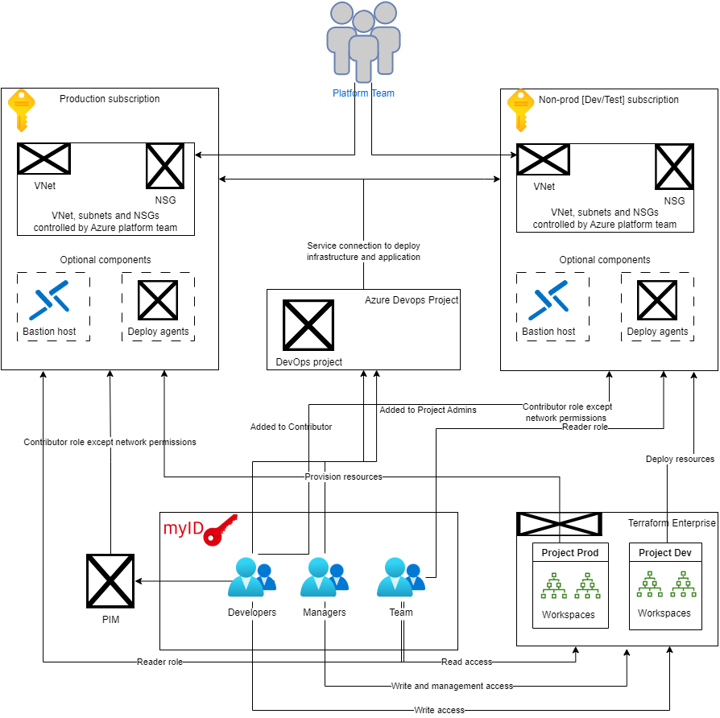

# What's a Landing Zone?

A Landing Zone is an Azure environment that's provided upon request with most things preconfigured and ready for use in an automated manner. The below diagram illustrates the various components that make up the landing zone.

More information regarding landing zones in general can be found in the [Cloud Adoption Framework for Azure](https://learn.microsoft.com/en-us/azure/cloud-adoption-framework/ready/landing-zone/).

Below, we will explain the details of a Landing Zone in the context of Henkel.

## Henkel Azure Landing Zone

Overall, the following parts are provided as part of a Henkel Azure Landing Zone:

- Azure Subscriptions
- Service Connections within an existing or a new Azure DevOps Project
- [Access Management](./platform-guide-access-management.md)
- Networking
- Central Logging
- Guardrails

### Azure subscriptions

A number of Azure subscriptions are provided together with the Landing Zone.

Our recommendation is to have at least two subscriptions, one for development and another for production to follow good development practices.

The platform consists of two overall environments: _Non-Prod_ and _Prod_. All non-production subscriptions (dev, test) are placed in the Non-Prod part, while production and production-like subscriptions (staging, prod) are placed in the Prod part.

The idea behind this split is two-fold:

1. Access to the subscriptions in Non-Prod is less restrictive than in Prod.
2. Changes to the platform are first deployed to Non-Prod and only later promoted to Prod. This reduces the risk for platform changes to interrupt critical workloads.

### Service Connections within a DevOps Project

You can request that a Landing Zone is integrated with an existing Azure DevOps project along with Service Connections connected to your landing zones, enabling you to create
infrastructure and deploy applications via pipelines. 

New Azure DevOps projects requests under the organizations managed by dxT DevOps team at Henkel should be requested only through the official [ServiceNow form](https://henkelprod.service-now.com/sp?id=sc_cat_item&sys_id=e46475d41b5cf89097eaea836b4bcb11).

### Networking

A virtual network is provided together with a Landing Zone. The virtual network can be peered with the regional hub providing access to other workloads in Azure and with on-prem services.

In general, resources in Azure should be integrated with the virtual network and having public access turned off, so that they are only accessible from the Henkel internal network.

#### DNS Integration for Private Endpoints

Private Endpoints are automatically integrated with the centrally managed Private DNS Zones and can be resolved using the on-prem DNS server, zScaler and SSL VPN.

Read more in the [Private Endpoint page](./azure-network-private-endpoints.md).

### Central Logging

A central Log Analytics workspace has been set up to collect security-related logs from certain services. Policies are in place that will automatically set this up.

For application logs, the individual teams need to set up their own Log Analytics workspace.

### Guardrails

For helping to keep the workloads in Azure safe and in compliance with the Henkel security standards, we have set up guardrails on the Landing Zones in the form of Azure Policies. These policies might deny certain actions and resources.

Please read through the following sections to learn which guardrails are in place as this can have an impact on the architecture of workloads.

#### Exemptions

Exemptions can be made for individual workloads in exceptional cases if it's not possible to follow a specific rule. Please reach out to the dxS Edge and Cloud Security team to discuss this.

#### Allowed Services

Each service available on the Henkel Azure Platform must undergo a Service Enablement Framework review. The review is in place to ensure that services allowed on the Azure Platform live up to Henkel Security requirements, can be configured in a compliant manner, and lives up to operational requirements put forward by the Platform Team. Please refer to the [Service Enablement Framework](../sef/introduction.md) for details.

Each service enablement follows a minimum configuration baseline and Azure Policies which guardrail critical configuration options for a service. Under the subpages of the Service Enablement documentation page, follows the guidelines for each enabled service. There can be a delay in the enablement of service and publication of the guidelines. In such cases reach out to the dxV Platform Team for concrete guidance.

A list of services currently allowed under the Henkel Azure Platform is maintained continuously on the [Approved Services list](../sef/enabled-services.md). On the subsequent sub pages to the approved services list are guidance and policies for already approved services.

Enablement of new services can be requested through the Hybrid Cloud Portal.

#### Allowed Regions

Resource groups can be deployed to the following regions:

{{ read_json_if_exists('docs/cloud/azure/data/policies/prod/AllowedRegionsForResourceGroups.json') }}

Resources can be deployed to the following regions:

{{ read_json_if_exists('docs/cloud/azure/data/policies/prod/AllowedRegions.json') }}

Resources that use the _global_ region are allowed as well.

#### Disallowed Role Definitions

The following role definitions cannot be assigned:

{{ read_json_if_exists('docs/cloud/azure/data/policies/prod/DisallowedRoleDefinitions.json') }}

#### Defender for Cloud

The following policies are in place as part of Defender for Cloud:

{{ read_json_if_exists('docs/cloud/azure/data/policies/prod/defender.json') }}

#### Network

{{ read_json_if_exists('docs/cloud/azure/data/policies/prod/network.json') }}

#### Other Policies

These policies are also in place:

{{ read_json_if_exists('docs/cloud/azure/data/policies/prod/Other.json') }}

In addition, please see the list of enforced policy for specific resources under the [Service Enablement on Azure](../sef/introduction.md).

### Requesting changes

Changes to landing zones can be requested in one of two ways. The first method is to create a new Cloud Portal ticket with the desired changes. This process can take a while and as such it is also possible for BizDevOps teams to contribute to the Landing Zone configuration themselves in Azure DevOps. The process to get started contributing is as follows:

1. Developers request an Azure DevOps license to the `hmanagedcloud` organization through a Cloud Portal request.
2. Members of the developers group will be automcatically added to the [landing zone repository](https://dev.azure.com/hmanagedcloud/AzurePlatform/_git/landing-zones) as a limited contributor.
3. Developers create a Pull Request with the desired Landing Zone changes such as vnets, subnets, NSG rules, etc.
4. The Azure Platform team reviews the Pull Request and deploys the changes once any issues have been resolved by the requester. 

> **_NOTE:_**  It can take up to 24 hours from the creation of the landing zone to the developers being added as limited contributors to the landing zone repository.