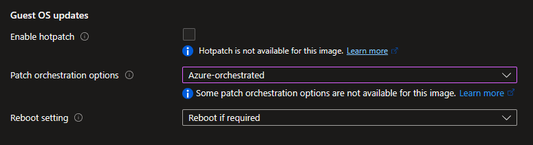
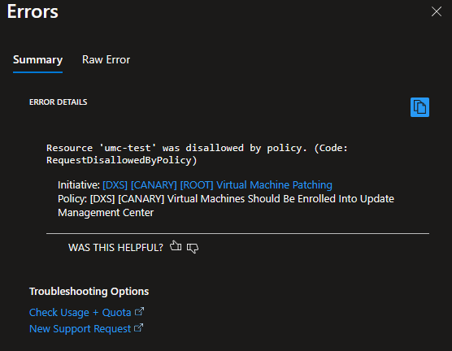
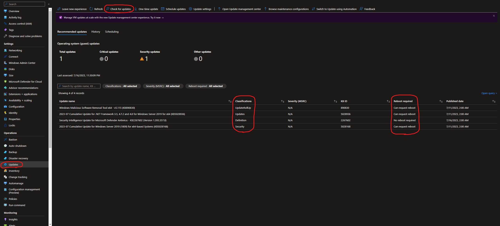
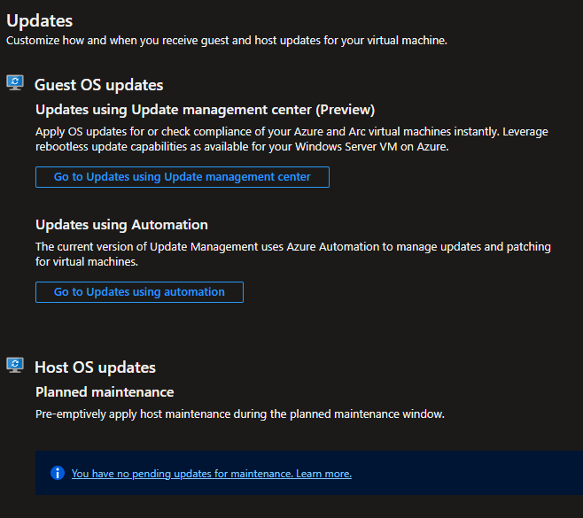

# Automatic OS patch updates for Virtual Machines

## Introduction

The Azure Update Management Center is a patch orchestration system to ensure that Virtual Machines (VM) on Azure have the latest security updates installed. All supported existing and new VMs on Azure are on-boarded to it using Azure Policies. More information regarding Update Management Center (UMC) can be found on [Microsoft Learn](https://learn.microsoft.com/en-us/azure/update-center/overview?tabs=azure-vms).

When on-boarded to Update Management Center, a virtual machine will **automatically receive OS updates marked as Critical, Security or Service Pack**. Applications installed by users are not updated by Update Management Center, thus the owner of the VM is expected to keep this software updated.

Update Management Center is available for standard Windows and Linux images in existing Azure subscriptions and new Azure Landing Zones. Certain variants of Windows and Linux distributions are not supported by Update Management Center. See most recent list of supported OS images [Supported Operating Systms](https://learn.microsoft.com/en-us/azure/update-center/support-matrix?tabs=azurevm%2Cazurevm-os#supported-operating-systems). Unsupported systems are expected to be patched by the responsible application team.

## Configuration of new Virtual Machines

When setting up a new Virtual Machine in the Azure Portal make sure to set the _Patch orchestration options_ to _Azure-orchestrated_ within the _Management_ section. Similarly, for Terraform deployments the `patch_mode` property must be set to `AutomaticByPlatform`.

Failure to comply with these configuration requirements will lead to the provisioning request being blocked by Azure Policies (see below error).

## Default Update Schedules

By default virtual machines will follow a global update cycle (schedule). Updates to the Operating System and built-in OS applications are installed **every Sunday between 3 AM - 6 AM (CET time)**.

!!! warning "Virtual Machine reboot"

    If an OS update requires a reboot, the virtual machine will be restarted during the update schedule time window. This may cause application outage or business impact in case your application binaries are not configured to start at OS reboot. You are required take appropriate action based on the business criticality of your application running on virtual machine.

Besides the default schedule, a number of other schedules are offered to accommodate the primary Henkel time zones and to allow updates on days other than Sunday. To use these schedules, the `MaintenanceSchedule` tag can be added to the virtual machine. The value of this tag will determine the schedule according to the following table:

|              | CET          | EST          | Update Window |
| ------------ | ------------ | ------------ | ------------- |
| **Sunday**   | cet-sunday   | est-sunday   | 3 AM to 6 AM  |
| **Tuesday**  | cet-tuesday  | est-tuesday  | 3 AM to 6 AM  |
| **Thursday** | cet-thursday | est-thursday | 3 AM to 6 AM  |
| **Saturday** | cet-saturday | est-saturday | 3 AM to 6 AM  |

!!! info "Missing tags"

    A Virtual Machine without the tag `MaintenanceSchedule` will follow the default schedule for Patch updates and will therefore receive updates every Sunday between 3 AM - 6 AM (CET time).

## Custom Schedule and Exemptions

Some virtual machines require a different update schedule or configuration than the default ones due to operational concerns or application requirements. For such use cases, one or more virtual machines can be assigned a custom schedule.

To receive an exemption for a virtual machine to receive updates using a custom schedule, an exemption must be granted by Henkel Endpoint & Cloud Security Security team. To initiate the exemption process, send an email to Henkel Endpoint & Cloud Security Security at [mail-DL-dxS-CloudSecurity@group.henkel.com](mailto:mail-DL-dxS-CloudSecurity@group.henkel.com) with the following information:

- Which virtual machines should be exempted? I.e. Subscription Id, Resource group and name of the virtual machine.
- Which types of updates should the virtual machine receive? I.e. Critical, Security, etc.
- When should the virtual machine receive updates? I.e. time of day, time zone and how often.
- Why should the virtual machine be exempted? I.e. located in a different time zone, critical workload, needs additional updates, etc.

## Overview of Pending Updates

The Azure Portal can be used to check if any updates are pending using the _Updates_ blade on the virtual machine. This will display a screen like the one below:

Please note that the list of updates may not be up-to-date. To ensure that it is up-to-date you can perform a manual assessment by clicking the _Check for updates_ button.

If the previous screen is not shown and you are instead shown the following prompt, then select _Go to Updates using Update management center_.

