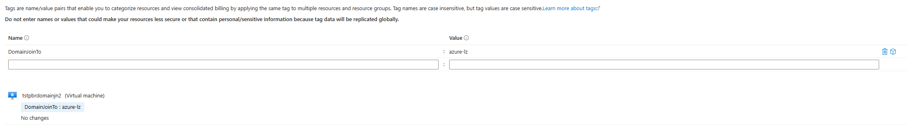
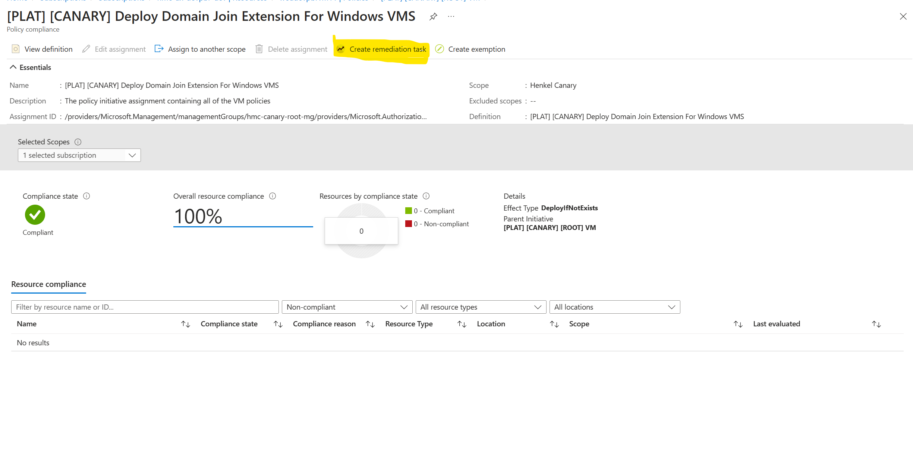

# Active Directory Domain Join for Windows VMs

Windows Virtual Machines should be joined with Henkel Active Directory and accessed using t1 accounts only. Excluded are indirectly publicly exposed Virtual Machines.

The Henkel Azure Platform supports domain joining a Virtual Machine to Henkel Active Directory as a Platform feature through Policy Automation to ease the process. The policy automation is based on the existence of tags on the VM. The policy automation is available to Landing Zones only.

!!! info "Prerequisites"

    The policy automation requires certain prerequisites to be in place:

    - The VM must be using a Windows OS
    - The VM must use one of the domain join tags
    - The Virtual Network must be peered with the hub to have connectivity to Henkel's on-premise network, where the domain controller is located. A landing zone can toggle if a Virtual Network should peer with the hub, which is a prerequisite for the domain join to work.
    - No computer or unit with the same name can exist in the domain controller

    Assuming the criteria are followed the policy will automatically Domain Join the VM to Henkel's on-premise domain controller.

## Activating/Triggering the Domain Join policy automation

The Domain Join policy is conditionally based on the existence of tags. The policy is of type `DeployIfNotExists`, thus the policy is run after a VM is successfully created or when a VM is updated.

The Virtual Machine must be tagged with the `DomainJoinTo` tag

- When the value of the tag is `azure-lz`, the VM will be joined to Azure Landing Zone OU path (`AZDC/Servers/NewWL`)
- When the value of the tag is `azure-kyndryl` the VM will be joined to the Kyndryl migrated VMs OU path (`AZDC/Servers/kyn_mig`). Only Kyndryl migrated VMs are allowed use this tag value

### Retrigger the domain join policy

To retrigger the domain join policy a remediation has to be executed for the policy definition on the scope of the VM. This can be done in the [Azure Portal](https://portal.azure.com/) by navigating to the "Policy" menu from the VM page. Then navigate to the Policy Initiative named `[PLAT] [{environment}] [ROOT] VM`. Choose the policy definition `[PLAT] [{environment}] Deploy Domain Join Extension For Windows VMS` from the list.
In the ribbon, a button should be available to create a remediation task. When creating the remediation make sure to change the Scope and target to the specific VM resource.

## Windows Distributions

Currently, the Domain join policy only supports Windows VMs with the following distributions (SKU):

- Datacenter-Core-1803-with-Containers-smalldisk
- datacenter-core-1803-with-containers-smalldisk-g2
- Datacenter-Core-1809-with-Containers-smalldisk
- datacenter-core-1809-with-containers-smalldisk-g2
- Datacenter-Core-1903-with-Containers-smalldisk
- datacenter-core-1903-with-containers-smalldisk-g2
- datacenter-core-1909-with-containers-smalldisk
- datacenter-core-1909-with-containers-smalldisk-g1
- datacenter-core-1909-with-containers-smalldisk-g
- 2008-R2-SP1
- 2008-R2-SP1-smalldisk
- 2008-R2-SP1-zhcn
- 2012-Datacenter
- 2012-datacenter-gensecond
- 2012-Datacenter-smalldisk
- 2012-datacenter-smalldisk-g2
- 2012-Datacenter-zhcn
- 2012-datacenter-zhcn-g2
- 2012-R2-Datacenter
- 2012-r2-datacenter-gensecond
- 2012-R2-Datacenter-smalldisk
- 2012-r2-datacenter-smalldisk-g2
- 2012-R2-Datacenter-zhcn
- 2012-r2-datacenter-zhcn-g2
- 2016-Datacenter
- 2016-datacenter-gensecond
- 2016-datacenter-gs
- 2016-Datacenter-Server-Core
- 2016-datacenter-server-core-g2
- 2016-Datacenter-Server-Core-smalldisk
- 2016-datacenter-server-core-smalldisk-g2
- 2016-Datacenter-smalldisk
- 2016-datacenter-smalldisk-g2
- 2016-Datacenter-with-Containers
- 2016-datacenter-with-containers-g2
- 2016-Datacenter-with-RDSH
- 2016-Datacenter-zhcn
- 2016-datacenter-zhcn-g2
- 2019-Datacenter* (all Windows Server 2019 with the prefix 2019-Datacenter in the image SKU)
- 2022-Datacenter* (all Windows Server 2022 with the prefix 2022-Datacenter in the image SKU)