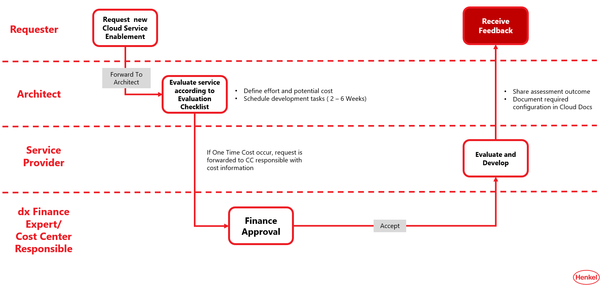

# Service Enablement Framework

The Azure platform currently consists of more than 200 services to build your applications. Instead of allowing each service in each configuration by default, we assess requested services based on [Microsoft's Service Enablement Framework](https://learn.microsoft.com/en-us/azure/cloud-adoption-framework/ready/landing-zone/design-area/service-enablement-framework). The goal of the evaluation is to decide whether we can support the service and provide guidelines on how the service must be operated in compliance with Henkel's guidelines.
A service that has been assessed once, can also be used in other projects, following the mentioned guidelines. If you want to use a service that has not been assessed yet, you can request the assessment in the [Hybrid Cloud Portal](https://cloudportal.henkelgroup.cloud) ticket you use for your demand.
The list below contains the already assessed services along with guidelines how to operate them.

## Requesting a new Service Enablement on Azure

The starting point is with a request by a user, either as an outcome from a sandbox development, unavailability in a landing zone or based on a business demand.

## Planned Services

The following services have been assessed and can be used in your projects:

Will be listed soon here.
