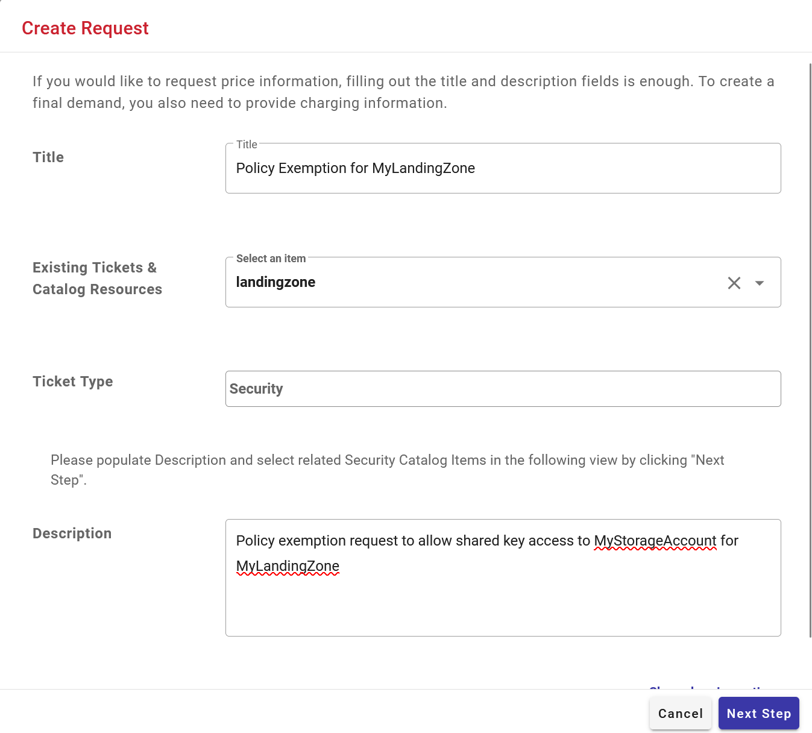
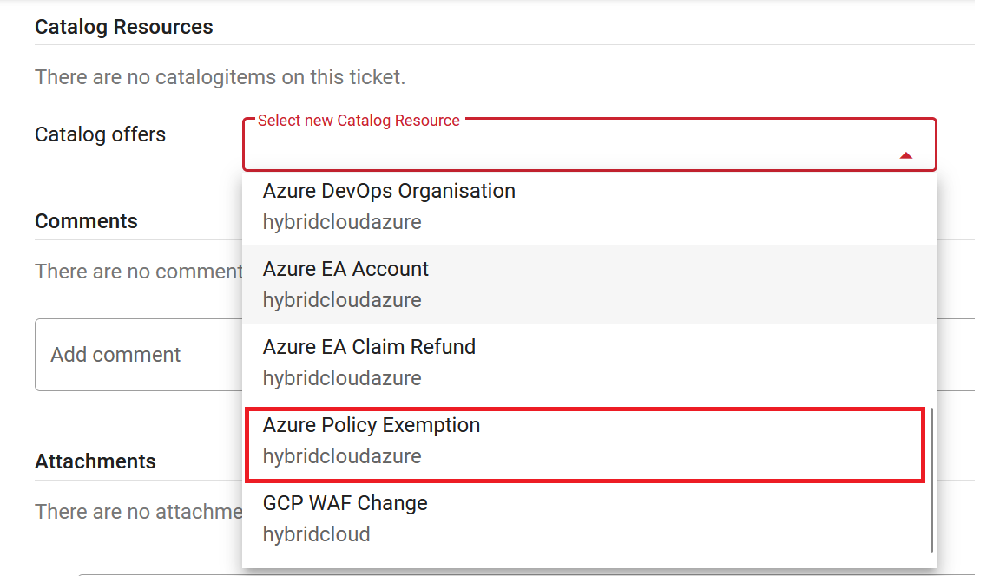
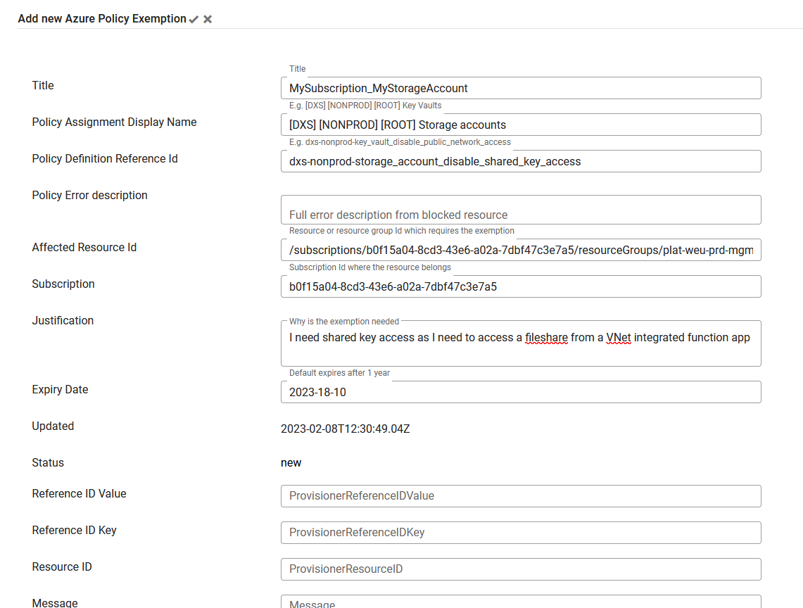

# Requesting a Policy Exemption in Azure

Requesting a Policy exemption for a specific resource is done through the [Cloud Portal](https://cloudportal.henkelgroup.cloud/#/).

When creating a new ticket select related parent id and ticket type Security, give it a **Name** and **Description** and then click **Next Step**.

Once the ticket has been created, and is now in draft mode, you need to add an Azure Policy Exemption Catalog item. Do so by expanding the catalog item list and then fill out the catalog item with the required fields. The catalog item needs a unique **Title** across the Cloud Portal, you could e.g. use `<subscriptionName>_<resourceName>` as a title. When all the relevant fields are filled out, save the catalog item by clicking the checkmark. Some of the fields are mandatory and enforces a specific format. 

Once one or more Policy Exemption catalog item(s) have been added to the ticket, the ticket can be sent to the Security team who will review the request, do so by clicking the **Forward to Security** button.

 

Example of a Policy Exemption CatalogItem with the required fields:

