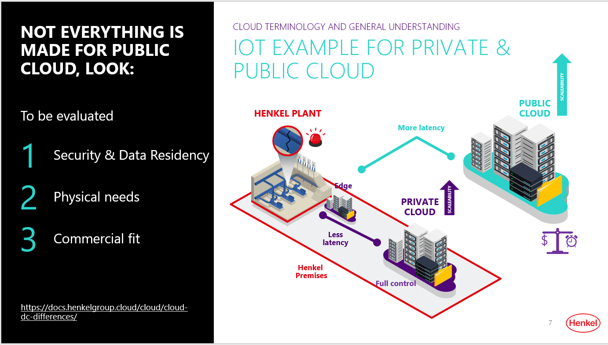

# Hyper-scaler vs Private Cloud

A major portion of IT workloads and applications of Henkel are currently being operated from either our Data Center (by Kyndryl) or other vendor-managed (non-Henkel) platforms. Some are also *business-managed IT*. As part of Henkel's continuous improvement on Technology and Infrastructure area and its adoption, Henkel is working with Public Cloud platforms for quite some time for hosting both existing and new workloads that comes out of Business demands of all kinds.

Visit the [dxAcademy Cloud intro](dxacademy/) and learn more about on how to differentiate between Public, Private Cloud as well as Edge Cloud.

## Why and When Cloud Computing

The IT industry has seen a major boom on Cloud Computing adoption over the last decade, though the industries across the globe were a bit reluctant to cope up with this adoption at the very early stage, suspecting data security and intellectual property loss. Over the period, the major Cloud providers have proven that they follow necessary measures to ensure IT security on data and Infrastructure and thus gain customer confidence. Cloud Provider do so by certifying themselves towards independent authorities. However Henkel follows a strategic share for commercial and technical reasons. A placement will be a case by case decision along a hybrid Cloud strategy framework carried out by cloud experts.

### Good cases for Public Cloud

- Customer-facing public applications like apps or web apps with dynamic user load
- Applications which leverage modern interface technologies e.g. REST APIs or SAP CPI
- Internal applications which can be replaced by Software-as-a-Service e.g. Office365 or ServiceNow
- Pilot-light standby systems, autoscaling systems, immutable sytems, systems with high peaks or massive computation requirements

### Cases for the Private Cloud or Data Center

- Applications with critical or a high number of interfaces to other Henkel on-premise applications (Unisys or IBM/kyndryl)
- Applications that do not need to be reachable outside
- Application relies on older or cloud incompatible compute & network technologies ("legacy", case by case decision)
- Applications data have a high degree data criticality (secret data)

## Placement  Strategy

Please approach the DC & Cloud Team to experience how we locate the correct target platform. For any questions to this wiki, please contact the [DC & Cloud Architecture Team](mailto:cloud@henkel.com)

!!! info

    Starting from July 2022, the usage of Google Cloud is favored over Microsoft Azure for generic workloads.
    However, this does not apply to BI and HDP-based workloads.
    Classical workloads that cannot decomposed into shall be placed into the Private Cloud.
    Kubernetes workloads shall also be placed into OpenShift in Private Cloud. 
