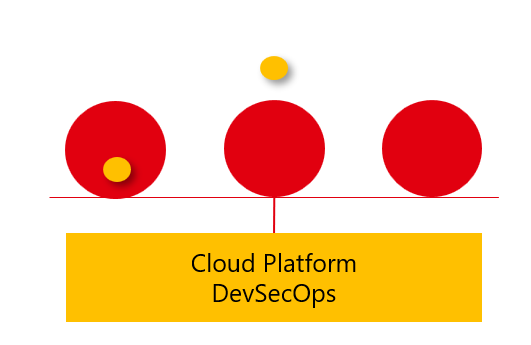
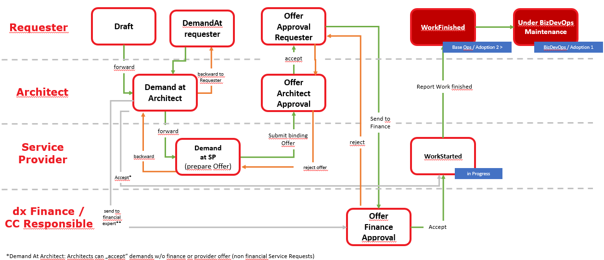

# Cloud Adoption team

Adopting Azure and using Azure in a cost-effective and compliant manner can be a challenging endeavour. Azure has a vast range of services, such as computing, storage, networking, security, and so forth. It's important to understand these services as they vary in complexity, maintenance and compliance.

The Henkel Cloud Adoption teams offer infrastructure development and consultancy for Henkel businesses to achive a successful adoption of Azure Cloud. The Adoption team is based out of Henkel dxV under the Azure Cloud Architects team and is staffed by Cloud Engineers and Architects specialized in Azure.

The Cloud Adoption team provides several offerings for Henkel businesses

- **Architectural guidance** Reviewing and guiding teams in deciding on and using Azure services
- **Infrastructure development** Engineering support for the development of Azure infrastructure as code in Terraform and pipelines for application deployment and DevOps best practices
- **Full Adoption team** Cloud Engineering team developing a full Azure solution in a DevOps manner responsible for both infrastructure and application development

## What is it?

- Cloud Adoption is a framework narrative by the Cloud Hyperscalers
- The Adoption team works out of best practices and recommendations to organize a move onto Public Cloud
- One key aspect is the creation of a central Adoption engineering team
- One or more Team Members from the Adoption team can be acquired by Application teams
- Adoption Engineers work closely as a multiplicator on a Cloud Platform
- Adoption works in a strict DevOps organisation to ensure continuous improvement

## What the Adoption team does not offer

- Operations team for infrastructure operations
- Full project or App Team Member for an infinitive

## Getting started

The assistance of the Cloud Adoption team can be requested through the Henkel Cloud Portal and a Generic Request type. Please find in the below Cloud Portal section more details. A Cloud Adoption team member will reach out to schedule the first meeting. A typical Adoption project runs like this

1. Initial meeting to discuss the scope and align on requirements
2. Further design meetings. Depending on the scope of the task, the project might start with an investigatory effort to refine architecture and discuss solution designs
3. Cost approval
4. Development phase. One or more Cloud engineers are assigned to the project and work closely with the team to deliver the agreed solution
5. Project handover
6. Project wrap-up

In the first meeting an architect from the Cloud Adoption team will participate, review the scope of the task and align the first activities of the project, whether that is workshops to clarify design and architecture further or if requirements are clear estimate the development effort.

The outcome of the first meeting(s) will be a solution architecture, a backlog of a high-level set of features and an estimate of the cost of developing the solution. The cost estimate will be added to the Cloud Portal and forwarded to the requester who should take it through financial approval before the project can start.

During the development phase, one or more Cloud Engineers will work on developing the agreed solution in close collaboration with the requesting team. The Adoption team usually works in a Kanban-like manner where tasks are prioritized and picked in alignment with the requester. A shared Teams chat will be created to facilitate communications among relevant project members.

## Billing and costs

The cost of a project with the Cloud Adoption team is billed as time and material. The first meeting is not billed but the following activities, whether the investigation, refinement of architecture or development are billed as time and material based on an aligned budget. The monthly status of the cloud adoption costs is reported in the Cloud Portal and can also be requested through the Adoption team.

Cloud adoption is a project support engagement between the requester and the Cloud Adoption team. Environments that are supported by Cloud Adoption are labeled as "BizDevOps Maintenance" and firmed under the operations responsibility of the App Owner or Requester. This demarcation is required to determine liability and contract terms when it comes to security, compliance and operations governance. Cloud Adoption is no managed service.

## Cloud Portal Request for Adoption Support

1. Click "Create Request" and enter your demand details
   - Enter the Service Provider and Generic Request as Ticket Type
   - Enter App-ID and App-name as well as the App Owner Name (Henkel Employee) in the left oriented "App Info" section
   - A shared Emailbox or ServiceNow Group as the acting application operations team
   - publish your draft to the architect with the button in the right top corner
   - Consider to deploy a [Sandbox](../cloud/azure/platform-guide/platform-guide-sandbox.md) initaily if you are not familar with the Henkel Cloud Platforms in practice
2. Receive an Architect Approval
   - We recommend you to go through an extended set of questions [here](./questionnaire.md)
   - With the answers we will drive a initial target architecture draft
   - We determine the right Cloud Service Model [Cloud Service Model](./azure/az-service-model.md)
3. Wait for binding offer of Service provider
   - Requests based on templates like an Azure VM are treated potentially fast-track, check Catalog Items
   - Custom infrastructure demands instead require an individual offer of a provider, find more details such as costs [here](cost-governance.md).
4. Architects review the offer first
   - The architect may ask you to schedule a review meeting
   - For custom offers the architect ensures the provider offers appropiate architecture  
5. Review the offer as requester
   - You acknowledge (proceed with next steps) or reject the providers offer
6. Receive an Financial Approval
   - The assigned financial approver checks the budget estimation and cost details
   - The ticket will be forward to the Service provider to fulfil if approved or rejected for correction
7. Wait on Service Provider fulfilment (in progress)
   - The service provider will reachout to you or your contact as requestee, to provision and configure the requested services
   - The demand will return back as completed, once all resources are provisioned
8. Target Service Model
   - The fulfilment is provided and the target service model that is BizDevOps or PlatformOps (Base mainteannce) is signaled in the ticket.(see [Service Model](./azure/az-service-model.md))
   - 

