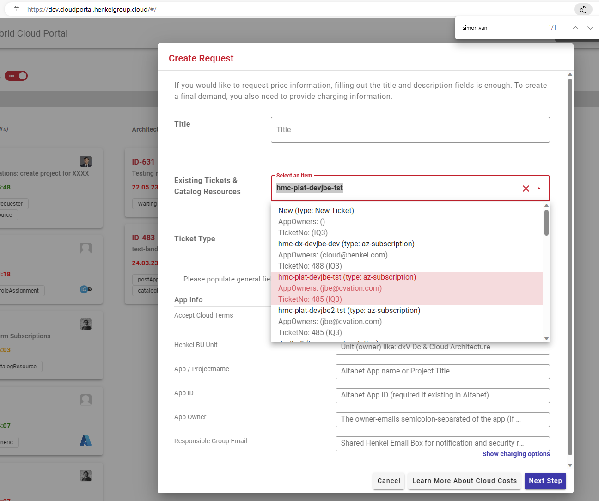

# Change Requests

We allow to nest tickets in order to support different charging options of your cloud setup or simply to let you raise a specific service demand that is based on an earlier created cloud resource. This can be for example an Cloud Adoption request to add Cloud VMs into an existing Cloud account. 

Further Child Tickets types that can be opened in the ticket detail page once the ticket state turns into Base- or BizDevOps maintenance:
   - ChangeCharging - Changes the Clarity order of running Cloud resources
   - AddCatalogItem - adds Cloud resources to exiting Resourcing as Sub items
   - Add Generic Service  - Adds Managed Services such as Custom Maintanance to the resources