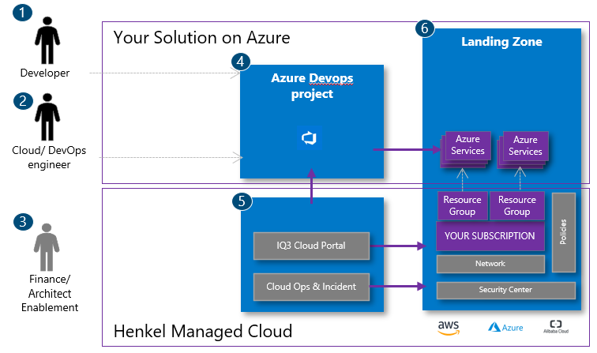
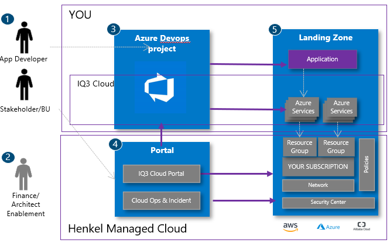

# Cloud Service Model

First to decide is where you are with your solution thinking and where you want to go:

All below Service Models A. and B. on managed Cloud require different role and team setups from you.

## A. BizDevOps Managed- You build it, you run it

This matches ideally if you, as someone in Henkel, have development and native cloud skills which require maximum access to the cloud via API or the portals. This model also takes place whenever the Managed Cloud Platform cannot provide an template for ease use.

Figure 1 HMC Develop and Operate your own

### Details of the Setup in A

1. App Developer (you)
   - can be an back-end/API or frontend developer
   - 3rd party developing and operating the application / business logic
2. BizDevops/ Ops Team (you)
   - Responses to security incidents and due diligence tasks. No response can lead into service shutdown for security reasons
   - Automating the setup with Terraform and Azure Devops/ Github (App Config, Scaling, Security Controls)
   - Collaborate with central cloud team in terms of network and security changes
   - Collaborate with your team mates, Product owner and developers to etablish the right service configuration
   - Ensure the app can be deployed automatically and the infrastructure is interacting seamlessly
   - All security Standards are adhered as listed under Security > Infrastructure > Azure Checklists
3. Finance and Architect Enablement (us)
   - Hooks-in particularly when a project is initiated and first time on managed Cloud
   - Finance officers check if initial cost estimate can be covered (please read further as continuous cost optimization is in your responsibility)
   - Central Cloud Architects supporting and helping find the right target design (read further [Cloud Architecture Team](cloud-arch-team.md))
   - Find costs tags and cost governance [here](hmc-costs.md)
4. Azure Devops (Solution)
   - Is the right tool for development and deployment to Cloud ([Azure Devops](../devops/azure-devops.md))
   - You will get an Azure Devops Project with a Service Connection to your Subscription in 6.
   - You can add further users into it
5. IQ3 Cloud (Solution)
   - You request an Azure Subscription via IQ3 Cloud portal [Getting Started](getting-started.md)
   - Central PltformOps is limited to Subscription Managed and Security center Altert handling, everthingelse by BizDevOps
   - Please find IQ3 Cloud service details [here](cloud-service-details-raci.md)
6. Landing Zone (Solution)
   - The landing Zone provides a central cloud account wherein all resources as your Subscription are running
   - Billing and money charge-back of cloud consumption costs is managed by us
   - Central security is managed by us

### Your Activities in A

- Cost Governance is in your responsibility as cost are reported to Product Domain Manager and arrive in the SLAM System in monthly cadence
- The detail security on the Azure Services you have created, changed or delete must follow our general practice (find guardrails [Security](../security/security.md))
- **Security treats which are caused by misconfigured services are in your responsibility**
- The automation and reflection of the azure services in infrastructure-as-code and its automation
- The detail access concept on Azure resources on Azure Subscription, resource group, azure Services and within Azure Services as for end users  

## B. Custom Mainteannce (PlatformOps) - You operate the app, we manage the cloud infrastructure

This works best if:

- You have no or missing cloud experienced developers working on native cloud solutions
- We can provide and deploy a cloud template to your solution (e.g. a bare Virtual machine on cloud or pure Database instance)

Usual this takes more time to be setup before start solutioning and prototyping. It is depending on our external partner IQ3 Cloud as also contractural arrangement have to be made beforehand.

Figure 2: HMC Develop and Operate by IQ3 Cloud

### Details of the Setup in B

1. App developer (you) - find above
1. Stakeholder (you)
   - You as a stakeholder defines the overall goal
   - You have an technical representative or at least an app development party onboard
   - You continuously assessing cloud consumption costs either with the Billing and Cost controls, find [here](hmc-costs.md)
   - Workout a suitable Access Control Concept with the ServiceProvider
1. Finance and Architect Enablement (us) -find above
1. PlatformOps (IQ3 Cloud team) - Based on individual contract and target Design as per offer or a Standard Azure Service with Base Maintenance
1. IQ3 Cloud (Solution) - find above
1. Landing Zone (Solution) - find above

### Your Activities in B

- Application logic and source code along with its CI/CD pipelines
- Cost Governance is in your and our responsibility in shared manner as cost are reported to Product Domain Manager and arrive in the SLAM System in monthly cadence
- The detail app access concept (ACC)  

## What can not be done by myself?

- Creation and changes on virtual networks in cloud
- Firewalls changes and virtual network peering to corporate network (on-prem)
- Azure Policies changes
- Azure Security Center insights and management
- Subscription changes as tagging changes
- Azure RBAC changes
->these changes must be requested at IQ3 Cloud, find details [here](cloud-service-details-raci.md) how to request

## Further links

- [Cloud Cost tags and governance](hmc-costs.md)
- [Service Details and RACI](cloud-service-details-raci.md)
