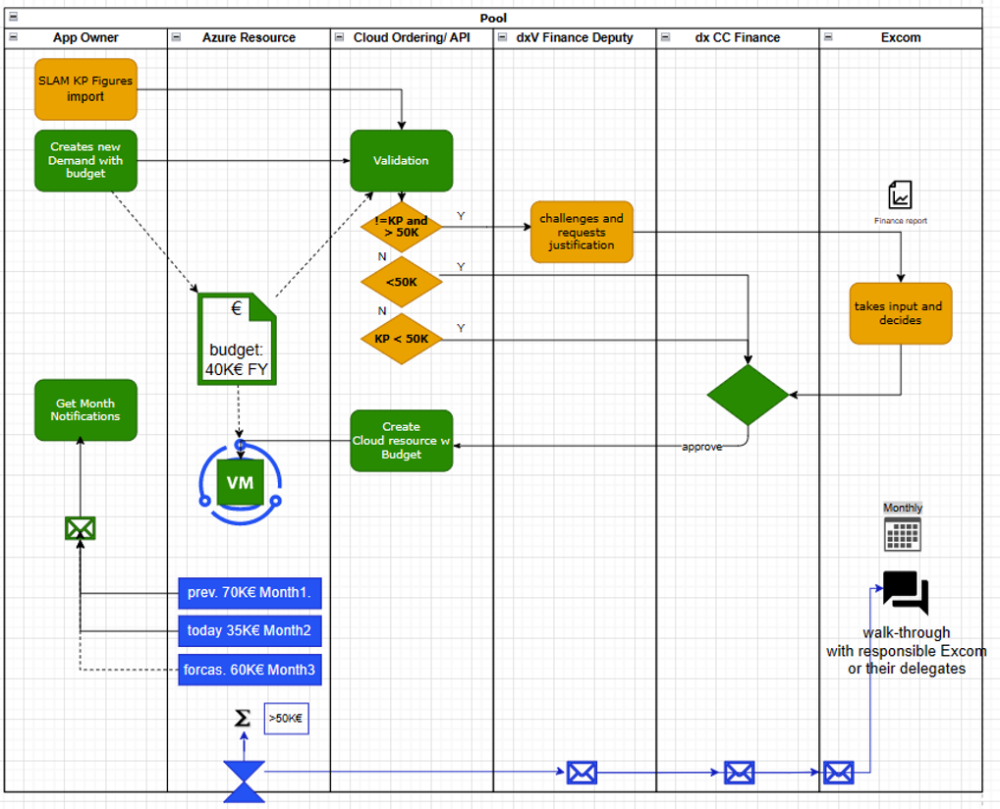

# Cost Governance

The Cost Governance describes the understanding of the cost control masures and cloud billing of the cloud platform to the tenant user through a [cloud landing Zone](../cloud/getting-started.md)

The document is complimentary to the [Cloud Landing Zone Governance](../cloud/cloud_governance.md).

## Cost components

You will need to consider following costs components on Cloud

| Title |Desciption | Platform | Type   |
|-------------|----------------------|----------|--------|
| Cloud Adoption, OTC | Only applied if no standard cloud template is ordered and Infrastructure is delivered through a 3rd party provider (GTC/ cVation)   | Azrue, GCP | one-time upfront   |
| Cloud Cost (Consumption)   | Occurs as soon as services running on public cloud. This can be estimated upfront with the pricing calculators |All  |monthly   |
| Maintenance Fees |Maintenance Fee is calculated based on your individual CSP consumption | All    |monthly   |

## Billing

This information is used to bill against your project as CSP run costs and maintenance will occur.

| No. | Field Name| Example Value | Comment |
|-----|-----|-----|-----|
| 1  | Sandhil or dx Clarity code | C0, P0, M0, DB |  | |

Cost are centrally billed regardless of the Region of the Cloud Provider

!!! Warning
    Direct Ordering from Business is not supported. Please refer to respective dx DIO/ former KAM of your business unit. For non-Henkel KGaA order (outside Germany) please reach out to [cloud@henkel.com](mailto://cloud@henkel.com)

## Cloud Billing

We explain the cost cost charging process along an example as follows.

### Example Case 

In last month Liz got 25€ charges reported by the the platform in SAP Slam. The cost contain three types of cost, 1. Project Cost from Cloud Adoption, 2. Management Fee and 3. the actual Cloud costs. 

There of, Liz consumed 10€ Cloud costs. And here keep in mind that Henkel had 100€ overall cloud costs and the last months overall management cost was at 100€.

Lastly she gets 10€ of 100€ Management Cost charged, that is 10%, Likewise the 10 of 100€ overall Henkel Cloud Consumption.

Liz has 5€ T&M cost reported by the Cloud Adoption tea, on her project.

!!!info
     The Cloud Adoption is a one-time cost type and an monthly fee. This is on project support option and not mandatory. 

## Cost Governance

Cost governance mainly lies with you as a user. Whenever you are requesting cloud resources or developing on your own, we provide the minimum controls for you as follows

Cost are initially approved as budgets.  Budgets are an amount of estimated monthly cost, either predicted by the platform team or the Henkel App team before resources are provisioned. Eventually two approval are required depending on the amount or KP planning. In any case the dx Tower Finance Expert approves on any new workload, thereafter a dxV finance expert approve in the case budgets are exceeding 50K as well as if the costs are not covered in the KP planning.

Cloud Resource Costs are monitored and tracked by its budget. When cost overrun the budget, the platform potentially reports this to the dx Excom and Cost Center owner. 

Azure and Cloud Cost Reporting is shared by dxV to Azure Users and dx Management.

- Initial demands are funneld through Henkel ordering tool and get prefiltered
- Demands are entered with an estimated monthly budget of the cloud consumption costs
- The demand along with the budget gets assessed by either dx CC responsible or Excom depending on the budget volume
- A monthly budget control and a notification feature is assigned to the actually requested cloud resource (in development)
- The monthly budget threshhold is tracked and a notification is send to the cloud resource owner if the budgets is about to overrun (in development)
- If budgets overrun consequively a certain threshold, dx Excom members are informed via email including a report, too. (in development)

### Legend 

- Amber: In Development - Release 2023 Aug.
- Green: Available Feature
- Blue:  New Runtime Cost Governance
- 

