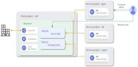
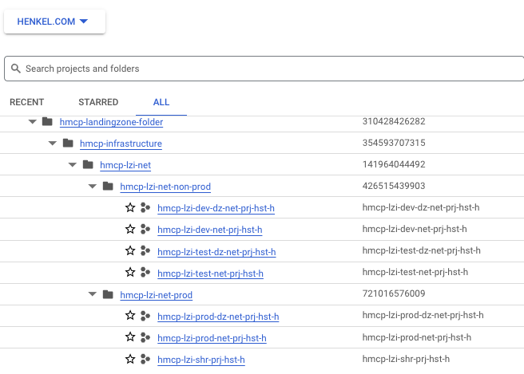
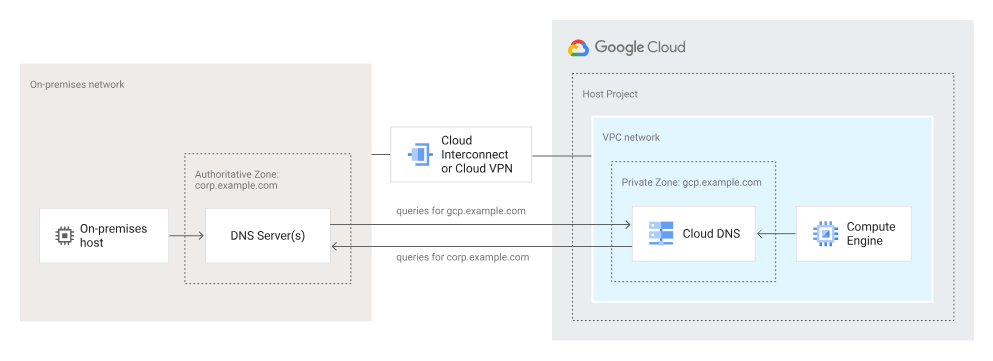
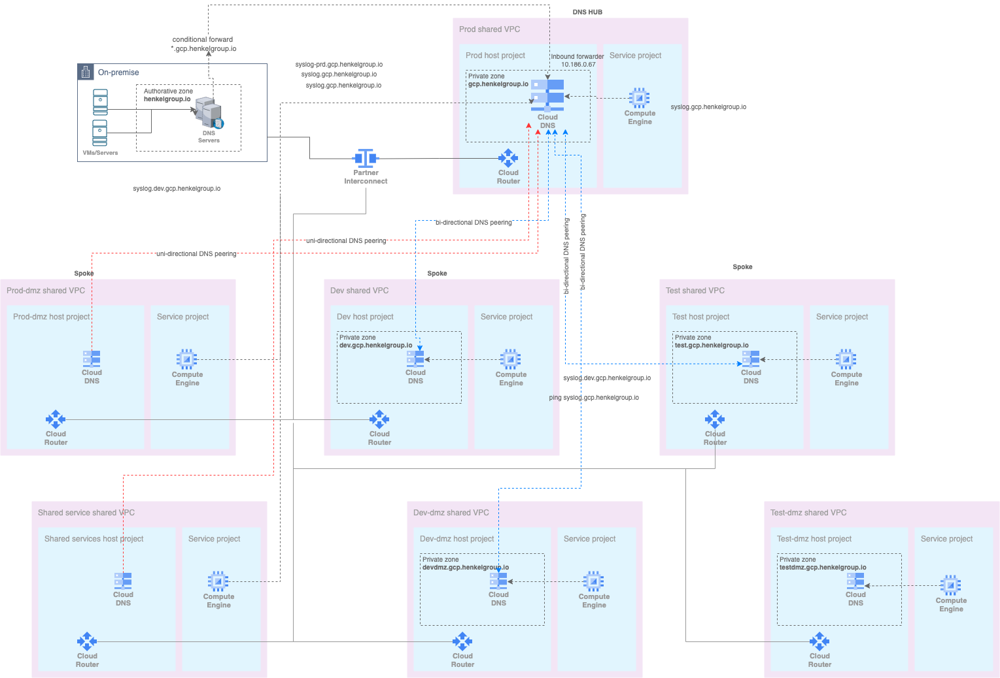

# Networking on Google Cloud

## Shared VPC

We follow GCP native [Shared VPC](https://cloud.google.com/vpc/docs/shared-vpc) concept. We dont have/allow standalone VPCs. Henkel's landing zone consist of six shared VPCs for workloads. 

 

- Shared VPC allows to connect resources from multiple projects (service projects) to a common Virtual Private Cloud (VPC) network, so that they can communicate with each other securely and eficiently using internal IPs from that  network.
- A Shared VPC network is a VPC network defined in a host project and made available as a centrally shared network for eligible resources in service projects.
- A host project contains one or more Shared VPC networks. A Shared VPC Admin must first enable a project as a host project. After that, a Shared VPC Admin can attach one or more service projects to it.
- A service project is any project that has been attached to a host project by a Shared VPC Admin. This attachment allows it to participate in Shared VPC. It's a common practice to have multiple service projects operated and administered by different departments or teams in your organization.
- Centrally manage – routes, firewalls, subnet IP ranges, VPN connections, VLAN attachments and cloud routers for an interconnect connection and more. 
- Using Shared VPC is preferable if you need to create many projects and would like to prevent individual project owners from managing their connectivity back to on-premises network.  

Below are Henkel Prod Host Projects and Respcticve Shared VPCs
    

## Reserved IP Ranges for Henkel GCP
We have reserved below IP ranges for Henkel GCP environment networks/VPCs. Ranges are reserved per env per region basis.  
| Region | IP Address Allocation |         |        |       |       |        |                   |
|--------|-----------------------|---------|--------|-------|-------|--------|-------------------|
|        | Prod                  | Prod Dmz| Dev    | Dev Dmz| Test  | Test Dmz| Shared services   |
| Europe | europe-west3          | 10.187.128.0 | 10.186.128.0/20, 10.186.144.0/20 | 10.187.0.0/22 | 10.187.64.0/22 | 10.187.128.0/22 | 10.187.160.0/22 | 10.187.254.0/25 |
| NA     | us-east4              | 10.186.32.0/20, 10.186.48.0/20 | 10.186.160.0/20, 10.186.176.0/20 | 10.187.4.0/22 | 10.187.68.0/22 | 10.187.132.0/22 | 10.187.164.0/22 | 10.187.254.128/25 |
| APAC   | asia-southeast1       | 10.186.64.0/20, 10.186.80.0/20 | 10.186.192.0/20, 10.186.208.0/20 | 10.187.8.0/22 | 10.187.72.0/22 | 10.187.136.0/22 | 10.187.168.0/22 | 10.187.255.0/25 |

    
## DNS

- We have implemented private DNS on google cloud via native CloudDNS service.private DNS Zone is setup with internal domain **gcp.henkelgroup.io** Records (A, CNAME etc) entries isnide it are centrally managed by the platform team. 

- We use a hybrid approach with two authoritative DNS systems.In this approach:  

    -  Authoritative DNS resolution for  private Google Cloud environment is done by Cloud DNS.  
    - Authoritative DNS resolution for on-premises resources is hosted by existing DNS servers on-premises.

    Below figure shows this arrangement.
    

    Below figure shows Henkel's GCP Hub-Spoke model for hybrid approach with two authoritative DNS systems.

    

