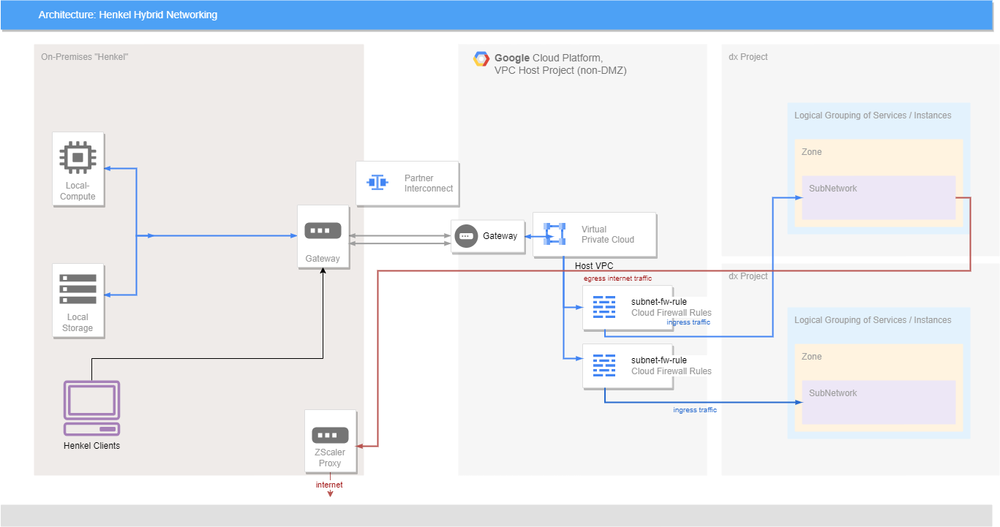

# GCP Landing Zone details

In this section we describe some generic details on the Landing Zone for people interested, especially architects and engineers who work on GCP@Henkel.

## GCP Organizations

The henkel.com organization is the main organization for all Henkel workloads. Projects are managed under folder `hmcp-workloads`. Depending on the size of your project, we recommend to have one project per application or per cluster. Do not go with projects per organizational unit (except region), as they change very often.
We reserve the right to check and change your naming convention for those.

## Naming conventions

!!! info "Henkel organization"
    We work on the organization henkel.com for all applications.

- hmc**p** - Henkel Managed Cloud **Production**, includes all workloads (nonproduction inplied). Further naming conventions are listed in the document for labeling and naming conventions (please ask Cloud Team).
- hmc**d** - Henkel Managed Cloud **Development**, is only used for usage of Landing Zone development and usually only accessible to the LZ team. A separated organization/tenant, thus not intended for workload placement but to test new LZ features.

For naming conventions of your workload, reach out to Henkel team to obtain a naming convention list (i.e. cloud resources, VM instance names).

## Identity Management

In production, regular identities such as `firstname.lastname@henkel.com` can reach production workloads. All users for henkel.com organization can use Henkel's SSO to log in. System identity and shared identities (from MyID) are currently not allowed.

Henkel Azure AD **B2B guest identities** can reach also our GCP platform. For some work, you might require a proper Henkel ID ("manage external contractor" in MyID) for contractors, especially when you want to reach a service from internal resolution when using the SSL-VPN service (Pulse).

Permissions are granted based on Azure AD groups, so let us know which groups you have.

!!! warning "Group naming convention"
    The groups must follow this naming convention: `APP-GCP-<stage>-<project/team>-<role>`, for example: `APP-GCP-PROD-TDS-EDITOR`

We usually not hand out the *Owner* permission on a project. You can get the *Editor* permission or specific roles on request.

We **expect** you to set up most of the infrastrucure using **Infrastructure as Code** and use service accounts to deploy. The service account can obtain *Owner* permissions, which we will tailor down per stage (test, production).

For Projects which use IaC, we recommend not hand out any `Editor` permissions to *users* to discourage manual drifts, and only `Viewer` permissions to make sure no one can touch your infrastructure.

## Security

Make sure you regularly check your workloads on security findings, threats and vulnerabilites that Google Security Command Center detects. Henkel has activated [Security Command Center Premium](https://cloud.google.com/security-command-center/docs) to help you remediating findings and threats on your workloads. It is available for all projects and should be checked regularly.

Typical issues:

- too wide IAM permissions
- open, unused firewall ports (incl. RDP, SSH)
- container images and packages on your VM are old/vulnerable
- recommended settings on your resources are not set

Please approach the Platform or Security Team via [Hybrid Cloud Portal Ticket](https://cloudportal.henkelgroup.cloud/#/), if you need consultation in navigation, configuration or usage of Security Command Center.

### OS Login

For logging into a Compute Engine, [OS Login](https://cloud.google.com/compute/docs/oslogin) is enabled by default. This allows to use your Google Identity to log into it using the [Identity Aware Proxy](https://cloud.google.com/iap/docs/concepts-overview) (IAP). Google Cloud creates SSH Keys on the demand so you do not need to distribute your public SSH key to the VM.

For this, the firewall ports to IAP need to be allowlisted and requested.

Find further information on process, setup and usage of OS Login [here](https://docs.henkelgroup.cloud/cloud/gcp/gcp-os-login/)

## SSH Keys

SSH keys are organizationally **deactived**. In order to reach e.g. a VM on GCP, use the [IAP Proxy tunnel](https://cloud.google.com/iap). The Identity Aware Proxy creates SSH keys on runtime and distributes them to the VM usinng your federated Henkel identity to log on.

A tunnel then is built up, making a bastion host and permanent SSH Port opening obsolete (except the the IAP service CIDR range). For Windows, use the [IAP Desktop](https://github.com/GoogleCloudPlatform/iap-desktop). That logs you on with your Henkel ID. Additionally, you need the [IAP tunnel user permission](https://cloud.google.com/iap/docs/managing-access).
In order to apply for [IAP tunnel user permission](https://cloud.google.com/iap/docs/managing-access) follow the depicted process [here](https://cloud.google.com/compute/docs/oslogin).

## Service Accounts

Service accounts are technical identities to perform actions on a project on behalf of e.g. a CI/CD pipeline. Roles can be attached in order to create resources. We have **disallowed** service keys per organization policy.

Workload Identity Federation shall be used to control those. We are currently working on providing identity pools for WIF on project rollout. For assistance ask the landing zone team.

## Infrastructure

### Compute Engine

We do only support a set of Virtual Machine OS images:

- Debian and Ubuntu derivates
- Rocky Linux (CentOS replacement)
- Google Container-optimized OS Images (COS)

furthermore:

- RedHat Enterprise Linux
- Windows Server 2019

Reasons:

- VM images must be hardened out of the box
- We require Henkel CA, Proxy, Endpoint Scanner
- maintaining a zoo of OS types is against our dxV Technology Roadmap

### VPC host concept

Inside Google Cloud and due to global VPCs, we separate between a host project and a service project (see [here](https://cloud.google.com/vpc/docs/shared-vpc)). When we refer to a Service Project, this is our project hosting an application. The host project contains components from the Landing Zone, e.g. VPCs

!!! Warning
    Since the network concept is based on strict separation and requried upfront design, you need to elaborate your application before we start to provision a project. Start to answer three questions:

    1. Does my application require to be reached from the internet, i.e. internet ingress?
    
    2. How many IP addresses do I need in total?
    
    3. Do I need to reach other projects?

VPCs are centrally managed under the infrastructure and network folder. The central VPCs are called **Host VPCs**. VPCs are **shared between projects**, but every project has its own subnet. VPCs are located in *host projects* under control of the Landing Zone and Security team. There will be three stages VPCs and two types:

- Stages: Development, Test and Production - cannot be reached from internet by default
- DMZ VPCS: Development, Test and Production within DMZ - can be reached from internet

In summary, the GCP landing zone has in total 6 global VPCs in separate host projects that are shared with your project. All VPCs are peered with Henkel's SDWAN network (Equinix Fabric via Google Partner Interconnect) to build a *virtual private cloud* between GCP and Henkel.
Thus, the usage of publicly facing endpoints can be largely reduced by that. In each project, a subnet is part of one of those VPCs. Thus, firewall rules are centrally controlled and the creation of own subnets is disallowed.

For Production, there are 2 Partner Interconnect endpoints (50Mbps - 1Gbps), while for dev and test there is only one partner interconnect.

There is no connectivity between environments by default (i.e. dev can not reach test). If required, a Cloud VPN needs to be set up to bridge subnets.

Internet egress is allowed. Traffic goes to Henkel WAN and egeressing to Henkel perimeter. For HTTP/S, use the henkel default proxy `proxy.henkelgroup.net:80`. It will be later replaced by the ZScaler app connector to filter all egress traffic, preventing malicious traffic to take over other resources and prevent events such as botnets, cryptomining, data leaks.

Internet facing workloads use `shared DMZ` VPC network to allow incomming traffic. Incoming traffic must be protected by Google Cloud Load Balancer and App Armor (or other DDoS attack prevention).

#### Subnets

While VPCs are global and have no region, a subnet does have a region. A subnet is part of the host VPC and thus centrally deployed.

#### Firewall

Firewall rules are applied on the subnet and can be scoped to the subnet or a service account. Rules have a priority number and can be either on ALLOW or DENY.
Preapproved firewall rules can be set, while for custom firewall rules this needs to go through dxS Network Security approval.

Example for preapproved firewall rules:

- Connection from IAP Tunnel to a Compute Engine
- Allowing an NFS/SMB connection from a Google VM to Henkel onpremise 
- Internet egress via Port 80 and 443


#### No DMZ Network

In case of no inbound internet access needed, your project's subnet will be located in the dev, test or prod VPC.



The project is part of a shared VPC network and obtains an IP range. This subnet has firewall rules on it, which allow service to be reached. By default, all firewalls are closed and no traffic from Henkel is possible (cloud best practice - allow no connection by default). Henkel resources can only reach GCP resources if firewall rules allow a service to be accessed (blue route).

Egress traffic to the internet is always possible, using Henkel's proxy settings (red route). A Cloud NAT is not to be used.

#### DMZ Network

In case of a DMZ network, internet ingress is possible, but requires security measures to prevent DDoS attacks, IP spoofing and other malicious activities against your resources, that could harm the entire network. A subnet would be placed into another dedicated VPC network.

### Private Service Connect

Applications can not use the public internet to reach GCP resources. Thus, Private Service Connect is allowing a tunneled connection to a resources such as Cloud SQL. This concept is similar to Private Endpoints / Private Link on *Azure* and PrivateLink on *AWS*.
Private Service Connect is also used to abridge two subnets to communicate between each other.

### Firewall rules

Firewall rule changes **must be centrally managed** by the Platform team. Cloud Architecture Team and Security team will check and co-approve changes and roll out after it has been approved. This applies to connections inbound from the internet and also connections to Henkel WAN. Still, there might be the need to request a firewall opening for Henkel WAN resources using ServiceNow to Network Oprations Team. Therefore, at the beginning of the project it is very important to name all network connections that are required.

Outbound internet access is usually no issue, the entire traffic will be forwarded to the onpremise proxy as there is no direct internet breakout with a NAT device.

- You need to set the Henkel proxy on VMs to reach out to the internet. (proxy.henkelgroup.net:80)
- You also need to allow the IAP tunnel for OS Login and IAP

Refer to [VPC network overview](https://cloud.google.com/vpc/docs/vpc) for more details.

## Resource Management

In the henkel organization, you will notice global Folders for Network, Operations, Security, Bootstrap. Those are managed by Cloud Team. Shared Services are managed as well containing Image Factory, Shared Application Services (GitLab), private DNS and Security Command Center.

## Project account

By default, a project account will have following items included:

- Billing account link to Henkel AG
- Labels for your project
- Attachments to network and firewall rules
- a default service account
- groups
- security controls
- enabled APIs for services

Example on required labels:

```yaml
labels:      
project            : "dxt-tds"          # REQUIRED - Henkel Policy
owner              : "dxaisp@henkel.com" # REQUIRED - Henkel Policy
app-id             : "app-40381"        # REQUIRED - Henkel Policy
clarity-id         : "p029973"          # REQUIRED - Henkel Policy - Default values added
cost-center        : "6757550001"       # REQUIRED - Henkel Policy - Default values added
team               : "dxa-innovation-software-platform" # REQUIRED - Henkel Policy
environment        : "dev"              # REQUIRED - Henkel Policy
criticality        : "na"
classification     : "na"
shared             : "false"
creator            : "project-factory-terraform"
responsible-group  : "cloud-at-henkel-dot-com"
ticket-id          : "610"
requestor          : "singhr15"
```

Depending on the use of Infrastructure as code, we will codeploy a second IaC Project. If there is an IaC project, we will not allow you to obtain editor permission on production as infrastructure management will be done by Terraform. For dev and QA environments, the rules may vary.

## Organization Policies

Following organization policies are enforced:

- Service Account Keys are deactivated
- Public Access to Storage Accounts deactivated
- SQL Instance cannot have a publiv IP.
- Only trusted compute images can be used (currently: Image Factory Images, Container OS, ML Images, Serverless VPC images)

```yaml
constraints/sql.restrictPublicIp
constraints/storage.publicAccessPrevention
constraints/compute.trustedImageProjects
```

## Internal DNS

For Google Cloud, we are using the internal DNS zones

**gcp.henkelgroup.io**:

- *.dev.gcp.henkelgroup.io
- *.devdmz.gcp.henkelgroup.io
- *.test.gcp.henkelgroup.io
- *.testdmz.gcp.henkelgroup.io
- *.gcp.henkelgroup.io for PROD and PROD-DMZ

Above names are not resolvable on the internet and not intended (no split DNS).

## External DNS

All external reachable domains go via subdomain of **henkelgroup.cloud**

## TLS Certificates

Private certificates can be issued upon request.
Public TLS requests take the known way via NOC.

Wildcard certificates are not allowed.

## Workload Identity Federation

Whenever you require [Workload Identity Federation](https://cloud.google.com/iam/docs/workload-identity-federation), we can add a WIF Pool with standard settings preconfigured to your project. Usually, only the connected service accounts and settings for the scope andn the Azure app id need to be set to enable federation from external.


## Further features (list)

fully working: 

* Resource Hierarchy and Org Structure
* Resources naming and label conventions
* Central Billing
* Organization Policies
* Identity Management using Henkel AAD
* Project Factory - provides projects using IAC and YAML
* Host VPCs
* VPC Private Service Connect
* Private Google Access
* Network connectivity – Partner interconnect established in all 3 regions​
* Auto DNS for Compute Engines
* Compute Image Factory – Up & Operational​
* Gitlab – Setup completed. LZ - Project Factory migration to Gitlab complete
* Container build factory (in GitLab)
* Gitlab CI runners for Google Projects
* Default Terraform pipelines in Gitlab
* Security Command Center Premium
* OS Patch Management schedules
* VM Manager Patching
* Migrate to Virtual Machines
* Terraform module registry in GitLab

in progress:

* Firewall Factory
* Hierarchical Firewall policies
* VPC Service Controls
* Internet Ingress (generally working) + Cloud Armor
* Oracle databases on GCP (decision and implementation)
* Renovate Bot (in Gitlab)
