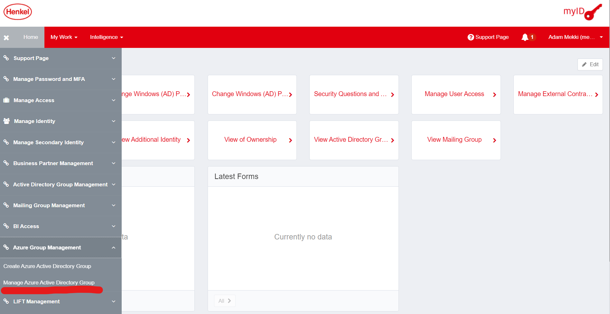
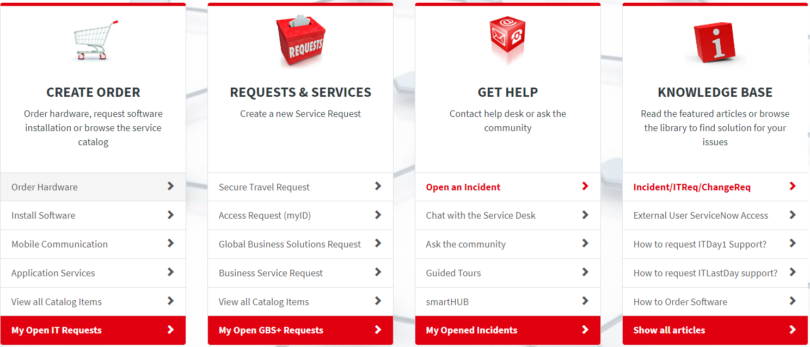
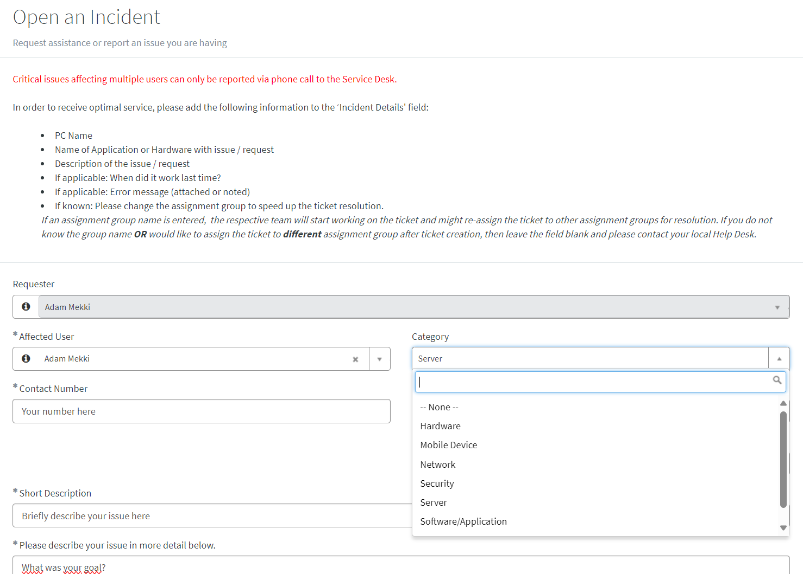
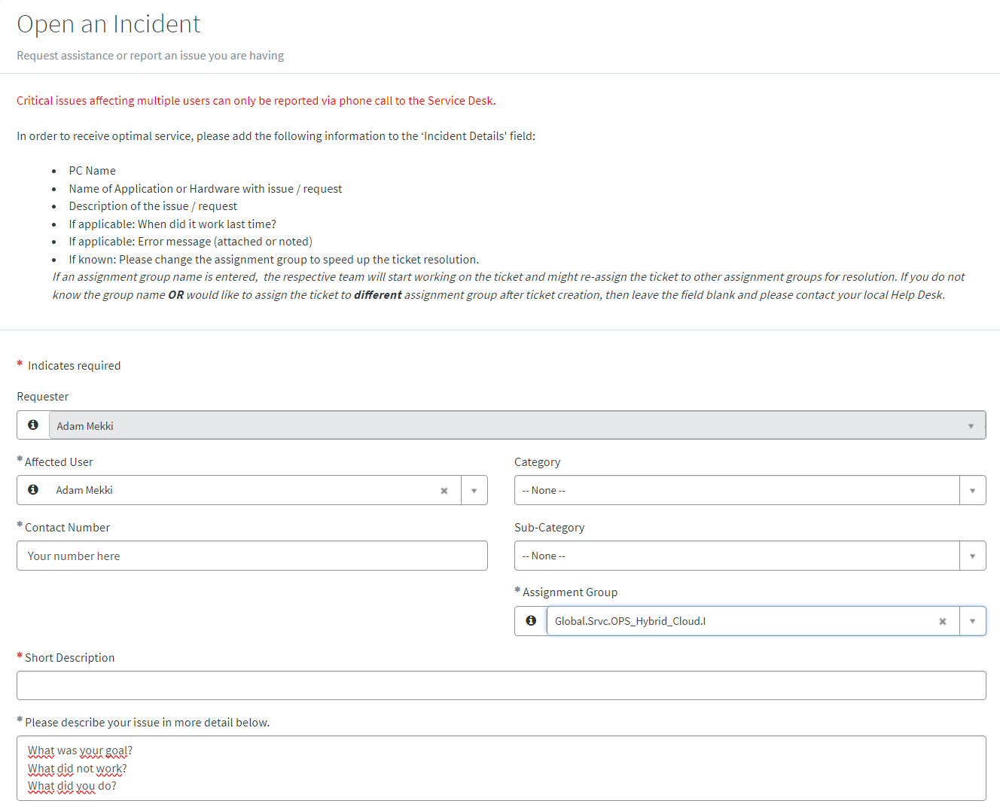

## Application Users Onboarding 


**Scope:** Application migrated to GCP as part of Skywalker Program.  

**Purpose:** The document contains information on how to:  
- Access application specific target GCP project where application GCE instances/VM is deployed.  
- Connect (SSH/RDP) to target GCE instances/VM.  

**Target Audience:** Application Teams/MSOs whose application have been migrated to HMC (Henkel Managed Cloud)´s GCP (Google Cloud Platform) 


## **Required myID groups for Application Team**

On the migrated GCE instance, "MyID groups" are used to administer permissions and access to Application Team on GCP projects- The respective "MyID group" will be managed and owned by Application team/MSO. 
By default, while project setup via [Project factory](../guides/platform-features-idps/01-gcp-idp-gcp-project-factory.md), three "MyID groups" are created as below. "MyID groups" will be created with 1 Owner and 2 Admins and optionally members based on supplied information in Project factory project setup (yaml file).

```
APP-GCP-<<YOUR-PROJECT>>-developers  
APP-GCP-<<YOUR-PROJECT>>-managers  
APP-GCP-<<YOUR-PROJECT>>-team
```  
example:  
```
APP-GCP-asti-de-developers  
APP-GCP-asti-de-managers  
APP-GCP-asti-de-team
```

You can, also, use existing "MyID groups", already in use, for your GCP project.

Manage, add and remove access via MyID as visible below
**(Only for Group Owners/Admins).**
If you are unsure who your project owner is, please reach out to: IOC (Henkel-GTC-IOC@henkel.com) or Platform team(mail-dxv-hybridcloud-gcp-platform-team@group.henkel.com). 





## **Access your migrated Virtual Machines**

In GCP terms, a Virtual Machine is GCE (Google Compute Engine).

You are supposed to login to the migrated GCE instance and test the required functionalities before you accept your Application as migrated. 

Follow this guide to login (SSH/RDP) to your GCP instances. [gcp-compute-console-login](../guides/gcp-compute-console-login.md)


## Workloads Operations
After the successful migration, the operation and maintenance of your migrated GCE instance will be taken care by GTC IOC Team, their responsibility is as follows on high level
1. Monitoring and remediate issues in the migrated GCE instance
2. OS Patching
3. Instance High availability and scaling
4. Instance backup

Your contact point is, mail-Henkel-GTC-IOC <Henkel-GTC-IOC@henkel.com>


## **Incident Flow: App Team**

In the event of a (critical) issue (P1/2/3/4 Ticket) in your environment hosted on GCP Platform follow this manual to approach support and resolution. 

For critical issues like a **P1 or P2** issue please use 
**Global.Unisys.Service-Desk.EN.X**
Depending on dimension and criticality of resolution process, "Bridge Calls" are initiated.


**Things to explain**

Service Now 
Setting up a Service Now Request
Service Now Assignment Groups


**Service Now**




**Setting up a Service Now Request**
Please, as descriptive and applicable as possible, line out the issue you are dealing with.




**Service Now Assignment Groups**
Please, as descriptive and applicable as possible, line out the issue you are dealing with and use Assignment Group
Global.Srvc.OPS_Hybrid_Cloud .I 





