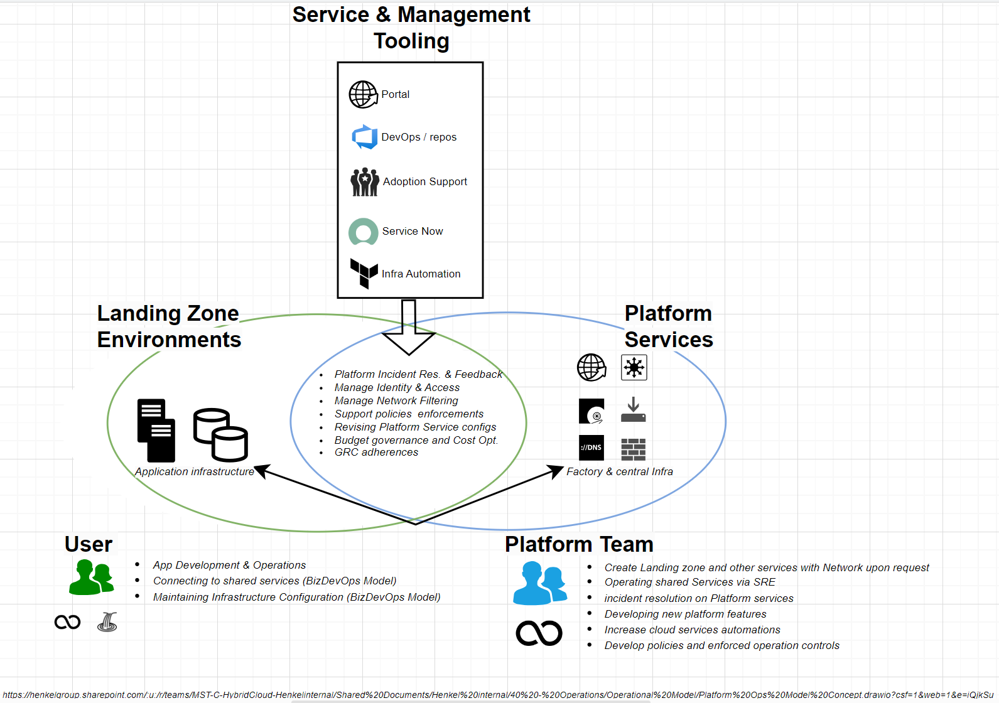

# Getting Started
You are eager to get started on your cloud journey and the cloud team is happy to help but before you jump into it then there are a few things to consider to prepare yourself.

The main aspect of Cloud at Henkel is the Cloud Platform and its Landing Zones. These components are further linked below and explained per Cloud Serivce Provider.

The Cloud Platform is meant to be the enabler for application related infrastructure development and operations. The platform is created and operated by the Global infrastructure team with supporting dx departments. The platform is hosted on the actual Cloud Service Provider (CSP’s are Azure and Google Cloud Platform). The platform contains Landing Zones as the largest charging and contract item, served to the user. The Platform contains shared services to offer basic and common functionalities which are needed to run application related infrastructure in the Landing Zones. Landing Zones are automatically created by the platform services upon a cloud portal request. Landing Zones are provided with a three or four tier model from dev, test, prod and sanbox per Application. The core purpose is to ease the integration of applications to the cloud platform. The App Infrastructure is managed by the tenant user by default. The platform offers services that support application infrastructure creation or maintenance.

## Access to the Cloud Portal

Access the portal to manage tickets and your inventory please visit [Cloud Web Portal](https://cloudportal.henkelgroup.cloud/#/), see [Portal Documentation](./cloud-portal.md)

If you need to access the cloud or in case of question please contact [cloudrequests@henkel.com](mailto://cloudrequests@henkel.com)

## Checklist

We suggest to pre-read important arcticles to the overall governance and support offers and to collect answers to below questions which can occur.

1. Cloud User Governance is read  [Cloud Landing Zone Governace](./cloud_governance.md)
2. You understand the [Service Models](../cloud/azure/az-service-model.md) to run Cloud Services with different support options
3. Security Setup and Landing Zones are understood [Security](../security/security.md) 
4. Understand Cost Governance and Cloud Charging [Cost Governance](../cloud/hmc-costs.md) 
5. Do you have sufficient information about your demand on cloud? 
   - What is your use case?
   - Do you need to reach Henkel internal systems?
   - Do you need inbound connection from the internet? 
   - Do you have Cloud Services in mind that are not yet enabled in the platform [Service Enablement](../cloud/azure/sef/introduction.md)?
   - Where are your users located?
   - What does your architecture look like?

!!!info 
    If you are unclear about the above questions, governance details or perhaps you are in an ideation phase, you require a [Sandbox Environment](../cloud/azure/platform-guide/platform-guide-sandbox.md) instead of a prodution landing Zone Environment. For these cases we have Sandbox environment. In all other cases we suggest to get further architect and Cloud enginnering support called [Adoption](../cloud/azure/adoption.md) and request this support via the portal. See "Access to Cloud" 
