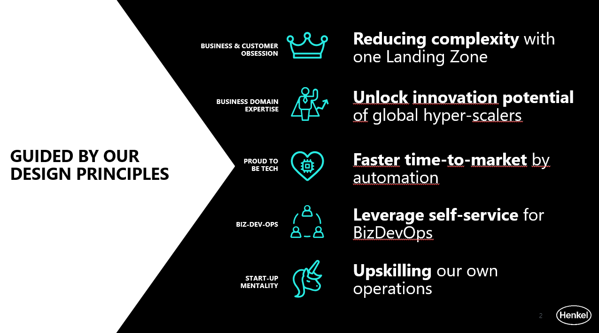
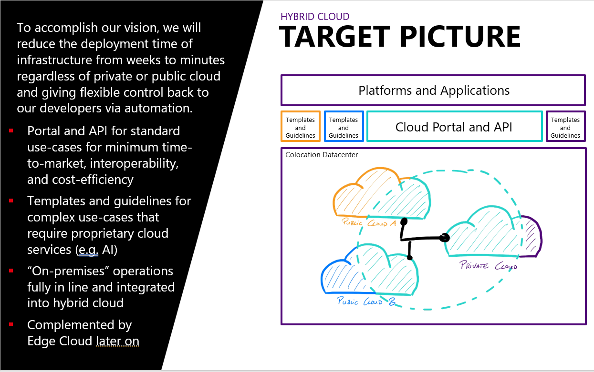

# Hybrid Cloud Strategy Program

We are creating the next generation Henkel cloud infrastructure platform to leverage the innovation potential and scalability of global hyper-scalers, to build a foundation for our BizDevOps teams, and to radically modernize our existing infrastructure landscape.

If you would like to learn more about Hybrid Cloud or to collaborate, please reach out to us via [Hybrid Cloud Strategy](mailto:hcs@henkel.com)

{: style="height:400px;width:700px"}

Global Infrastructure set a vision on how we merge the current disjoint infrastructure into a Hybrid Cloud Platform.

{: style="height:450px;width:700px"}

To accomplish this vision, we will reduce the deployment time of infrastructure from weeks to minutes regardless of private or public hyperscale’s are used and giving flexible control back to our developers via automation. This finally results into the below shown long-term target design.
To get this established, the roadmap is drafted accordingly, consists of multiples waves and various work packages.
