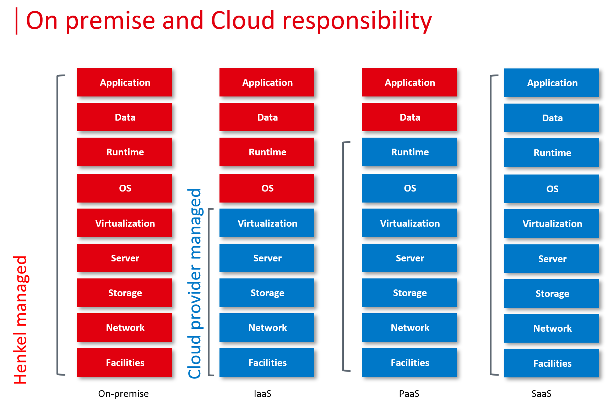

# Welcome to Henkel Managed Cloud v.1

Usually, there are more than one way of bringing an application to the cloud. When you think of terms such as IaaS, PaaS, SaaS, the level of control is where you can start very early in the process. This applies to private cloud (on-premise) as well as public cloud (off premise).

Typically, the architecture between traditional data centers and cloud differ significantly. While there might still be servers and different ISO layers present, they are not managed by the consumer (Henkel teams) anymore, but by the platform provider. Ideally, in a SaaS model nothing is managed by Henkel anymore, but customization and data control are limited.

DC & Cloud Architecture is the process of designing computer systems for distributed systems. As with traditional software architecting, you define your requirements, you create your logical architecture and go into the detailed design later on. Just being in the cloud does not mean we do not keep on architectural standards and It guidelines.

The DC & Cloud Architecture team helps business to leverage solutions on public cloud platform such as Private Cloud or in hyper-scalers such as Microsoft Azure, Google Cloud and Alibaba Cloud (Aliyun, 阿里云). We leverage a managed cloud service provider to provide a platform for multiple workloads and cloud projects on it.

## What is Henkel Managed Cloud?

Henkel Manage Cloud Version v.1 is purely based on the public cloud and accompanied by IQ3 Cloud for reliabable operations

Henkel Managed Cloud (*short* HMC) is the product of the Henkel's *DC & Cloud Architecture Team*. It is the foundation for all public cloud based offerings in an enterprise context at Henkel.

Henkel Managed Cloud Platform offers you a secure environment to place your cloud workloads in order to leverage hyperscaling technologies and elasticity for different use cases.

Our goal is to support Henkel Dx and the core business in order to gain speed, create IP and deliver continuous value.

Henkel Managed Cloud v.1. is run by the external Provider Skaylink and its IQ3 Cloud.

For any questions to this wiki, please contact the [DC & Cloud Architecture Team](mailto:cloud@henkel.com)
