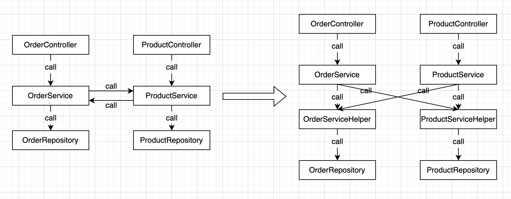

# Code Styling Best Practices

The best practices are based on the Official Site and the Community of Nest.js. It's inspired by Angular.

## Naming Conventions

### 1. File Naming Convention

Use lowercase letters and across the dot, use hyphen to separated words.

Examples:

user.service.ts

```
export class UserService {
}
```

user-role.service.ts

```
export class UserRoleService {
}
```

More examples:

create-article.dto.ts

user.entity.ts

user.controller.ts

### 2. Naming Conventions for variables, constants, functions and classes

Follow the Nodejs Best Practices.

## Database Conventions with TypeORM

### 1. RDBMS (PostgreSQL, MySQL, etc.)

It's common practice to use SQL style defined in [Joe Celko's SQL Programming Style](https://www.oreilly.com/library/view/joe-celkos-sql/9780120887972/) for the database. This advocates for snake_case for the column names.

The common practice to name variables in camelCase when programming in JavaScript. TypeORM provided the functionality for custom [naming strategy](https://orkhan.gitbook.io/typeorm/docs/naming-strategy). You can create your own naming strategy or use this [opensource project](https://github.com/tonivj5/typeorm-naming-strategies) directly.

Examples:

column name: id, article_id, created_by, created_at.

table name: resource, resource_group.

database name: project_name_whatever.

### 2. NoSQL (MongoDB, etc.)

NoSQL database store json document, so we use camelCase that we can map the document to entity directly.

### 3. Database Migration

Don't use auto sync to migrate database, use migration scripts to do it. This is [the discription link](https://typeorm.io/migrations).

## Circular dependency

A circular dependency occurs when two classes depend on each other. For example, class A needs class B, and class B also needs class A.

Much of the time we need call another service in one service, the common solution is to add a new layer.



Nestjs also provide [the official solution](https://docs.nestjs.com/fundamentals/circular-dependency) for this.

## Versioning

Use versioning to allow your application support different versions of your endpoint. There are 4 types of versioning that are supported. [Link](https://docs.nestjs.com/techniques/versioning).

|                       |                                                                                                                            |
| --------------------- | -------------------------------------------------------------------------------------------------------------------------- |
| URI Versioning        | The version will be passed within the URI of the request (default)                                                         |
| Header Versioning     | A custom request header will specify the version                                                                           |
| Media Type Versioning | The Accept header of the request will specify the version                                                                  |
| Custom Versioning     | Any aspect of the request may be used to specify the version(s). A custom function is provided to extract said version(s). |

## Project Structure

[Nestjs GraphQL Best Practice](https://github.com/chnirt/nestjs-graphql-best-practice)

[Nestjs Restful Best Practice](https://github.com/chnirt/nestjs-restful-best-practice)
