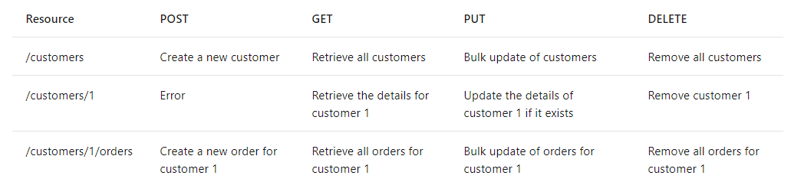

## RESTful API

The content refers to [Henkeldx dbp wiki RESTful API](https://dev.azure.com/henkeldx/dbp/_wiki/wikis/DBP%20Wiki/364/RESTful-API)


## Goal

Define and start following RESTful application standard.

External Resources / Blogs / Articles:

[Sookocheff When to Use HTTP PUT and HTTP POST](https://sookocheff.com/post/api/when-to-use-http-put-and-http-post/)

[Vinay Sahni Best Practices for Designing a Pragmatic RESTful API](https://www.vinaysahni.com/best-practices-for-a-pragmatic-restful-api)

## Formal description

## General

### Methods
| Http Method | URL | Description |
|:--:|--|--|
| GET | `/api/v1/collection` | Returns all items inside collection | 
| GET | `/api/v1/collection/{id}` | Returns item from collection with specified ID |
| POST | `/api/v1/collection` | Creates inside the collection a new item with data from request body |
| PUT | `/api/v1/collection/{id}` | Replaces inside the collection the item with specified ID with the one in the body without changing ID |
| PATCH | `/api/v1/collection/{id}` | Updates inside the collection the specified properties inside the body for the item with specified ID |
| DELETE | `/api/v1/collection/{id}` | Deletes from collection the item with specified ID |

### Status Codes
Minimal expected status codes
- `200 OK`
- `201 CREATED`
- `404 NOT FOUND`
- `500 INTERNAL SERVER ERROR`
- `400 BAD REQUEST`
- `401 UNAUTHORIZED`
- `403 FORBIDDEN`
- others could be added depending on case

## Product Example
Assuming that we have a Product entity with the following structure:
```json
{
 "id": "PR1234",
 "name": "Shampoo",
 "price": 15.35,
 "currency": "euro"
}
```

### `GET /api/v1/products`
Request Body - not present since GET does not allow it

Response - a product array
```json
[
 {
  "id": "PR1",
  "name": "Shampoo One",
  "price": 15.35,
  "currency": "euro"
 },
 {
  "id": "PR2",
  "name": "Shampoo Two",
  "price": 13.95,
  "currency": "euro"
 }
]
```

Response statuses:
- when product found: `200 OK`

### `GET /api/v1/products/PR2`
Request Body - not present since GET does not allow it

Response - a product for the provided ID
```json
{
 "id": "PR2",
 "name": "Shampoo Two",
 "price": 13.95,
 "currency": "euro"
}
```

Response statuses:
- when product found: `200 OK`
- when product not found: `404 NOT FOUND`

### `POST /api/v1/products`
Request Body - entity to be created without ID field
```json
{
 "name": "Shampoo Forty-two",
 "price": 19.95,
 "currency": "euro"
}
```

Response - a product with assigned ID
```json
{
 "id": "PR10",
 "name": "Shampoo Forty-two",
 "price": 19.95,
 "currency": "euro"
}
```

Response statuses:
- when product created: `201 CREATED`

### `PUT /api/v1/products/PR2`
Assuming initial product in the Database being
```json
{
 "id": "PR2",
 "name": "Shampoo Two",
 "price": 19.95,
 "currency": "euro"
}
```
Request Body - entity to be applied over existing one without ID field
```json
{
 "name": "New Shampoo Two",
 "price": 20.95,
 "currency": "euro"
}
```
Response - updated product
```json
{
 "id": "PR2",
 "name": "New Shampoo Two",
 "price": 20.95,
 "currency": "euro"
}
```
Response statuses:
- when product updated: `200 OK`
- when product not found: `404 NOT FOUND`

### `PATCH /api/v1/products/PR2`
Assuming initial product in the Database being
```json
{
 "id": "PR2",
 "name": "Shampoo Two",
 "price": 19.95,
 "currency": "euro"
}
```
Request Body - object containing just the properties to be updated (ID in URL)
```json
{
 "name": "New Shampoo Two"
}
```
Response - updated product
```json
{
 "id": "PR2",
 "name": "New Shampoo Two",
 "price": 19.95,
 "currency": "euro"
}
```
Response statuses:
- when product updated: `200 OK`
- when product not found: `404 NOT FOUND`

### `DELETE /api/v1/products/PR2`
Request Body - not present since DELETE does not allow it

Response - the deleted product information
```json
{
 "id": "PR2",
 "name": "New Shampoo Two",
 "price": 19.95,
 "currency": "euro"
}
```
Response statuses:
- when product updated: `200 OK`
- when product not found: `404 NOT FOUND`

## Rules

1. Container name should be the plural of entity name. For example if entity is **Product** the collection should be **products**
2. Versioning - after "first release" (v1) all the changes should be backwards compatible. If the need rises for more complex updated we could think of a next version.
3. ...

Some snippets from MS Docs and other places:
- Resource URIs should be based on nouns (the resource) and not verbs (the operations on the resource).
- Resources don't need to be a one to one mapping of entities from the database but can be grouped together if it makes sense i.e. customers api endpoint canget orders like in screenshot below
- Always have resources in a plural format if it's a collection of items
- Use the correct methods for the type of action you want to do e.g. POST for create and PATCH for update
- Use filtering and paging where the resource you are looking for has lots of data (in a database for example)
- Use a versioning strategy where applicable for future potential breaking changes e.g. /api/v1/customers


Longer read here in MS Docs:
[Microsoft Docs RESTful web API design](https://docs.microsoft.com/en-us/azure/architecture/best-practices/api-design)

# Discussion
## Request responses
- Should the responses be simple? Only the status?
- Should the responses contain minimal information? Example for `POST` / `PUT` / `PATCH` / `DELETE` only `ID` returned
- Should `DELETE` return `NOT FOUND` or `OK` when item is missing / deleted already?

## Nested Routes
- How should they behave?
- Should we allow routes like: `/api/v1/order/123456/products`?
  - Are there any alternatives or is there just one way to go with this?

## For GET request
- How should we handle GET requests that need to return a subset given by a list of IDs? Example: Retrieving product details for a cart.
  - Proposal: Since this approach is not future prove we should use POST instead. 

## Versioning
- How do we want to approach the versioning? (`/api/v1/`)

## Performance
- Caching: 
  - An e-tag is created and compared against whenever data is exchanged. 
  - Generating and comparing e-tags is not cheap and thus we should disable the caching for routes which return dynamic data.   

