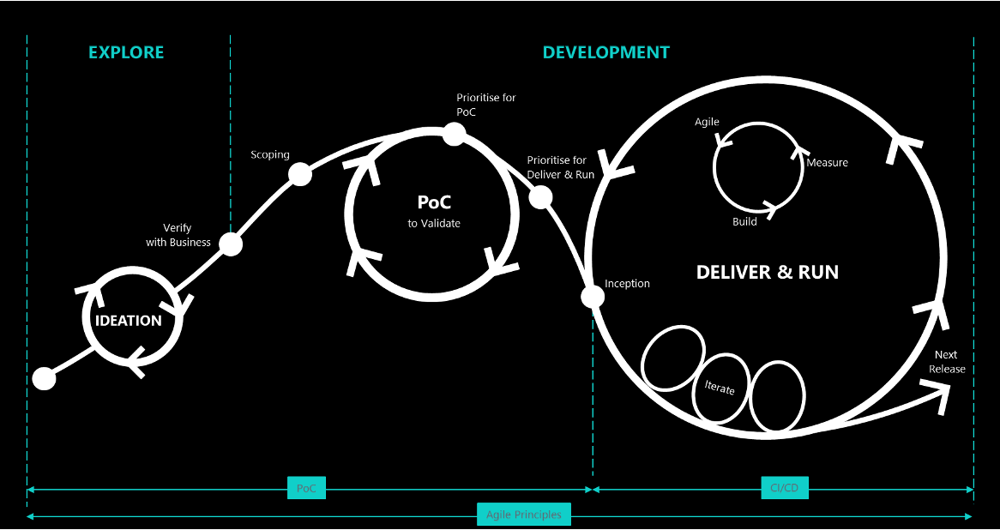

## Overview 

## Responsibilities

### Product Owner

- Communicate with the customer and act as the spokesperson of customer in the product group.
- Writes User Stories and Acceptance Criteria.
- Prioritize and refine the Product Backlog continuously.
- Accept or reject the Product Backlog item.
- Decide the release date and the content.
- Cancel the Sprint if the goal is redundant.
- Responsible for the Return on Investment (ROI) of the product.
- Production Release Approval.
- Business change requests and issues support.

### Dev Team
- Build the product that the Product Owner indicates.
- Include all the expertise necessary to deliver the potentially shippable product each Sprint.
- Develop, test and release the product increment.
- Decide how many items to build in a Sprint, and how best to accomplish that goal.
### DevOps Engineer
- Implement the CI towards separate systems.
- Implement the CD towards separate systems and environments.
- Ensure the stability for DEV/TEST/PROD environment.
- Code version alignment with Dev Team.
### DevOps Operation 
- Daily monitoring and service requirement fulfillment
- Ensure functionalities and stabilities of PROD environment
- Create incidents on ServiceNow 
- Maintain known issues and solutions list

### Quality Assurance Team
- Prepare test script and set-up Automation Testing for the product.
- Build and complete test plan
### Scrum Master
- Helps the product group learn and apply Scrum to achieve business value.
- Remove impediments, protect the Team from outside interference, and help the Team to adopt Agile development practices.
- Educate and guide the Product Owner, Team and the rest of the organization in the skillful use of Scrum.
- Concurrently being acted by Senior Developer is efficient.