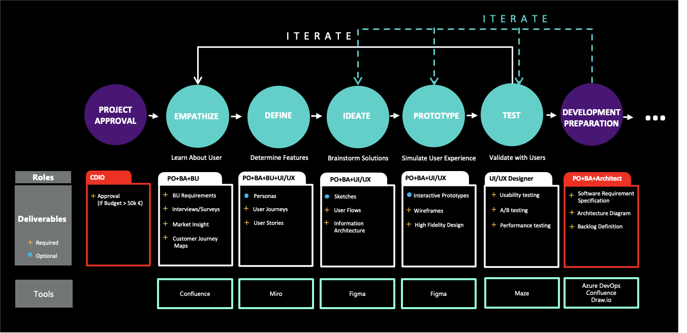
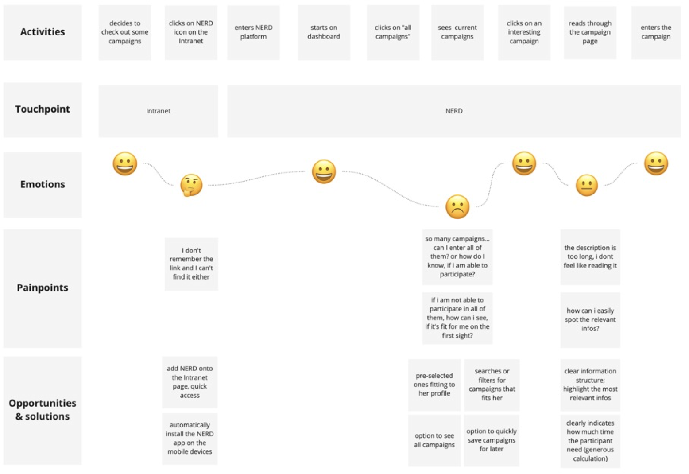
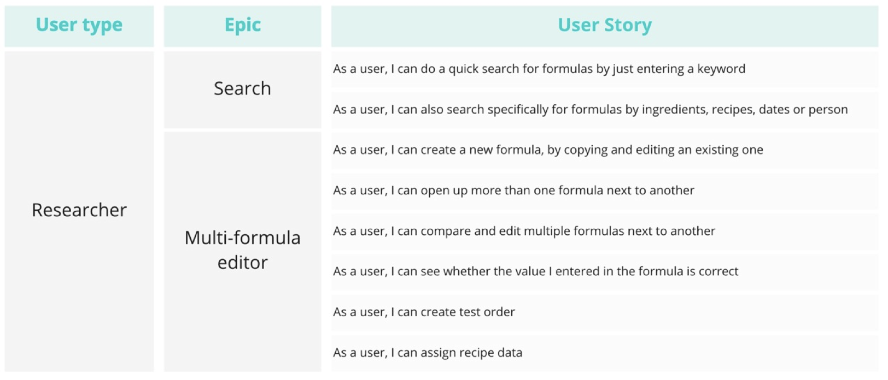
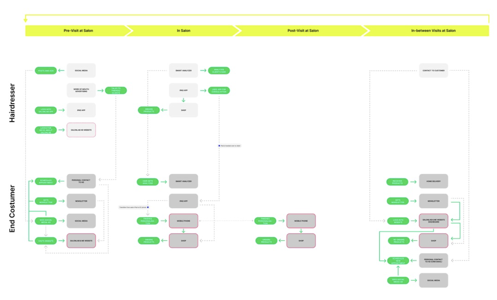
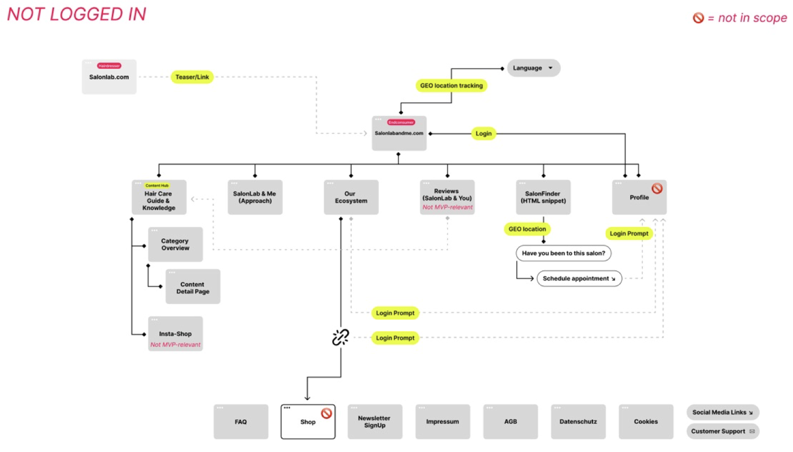
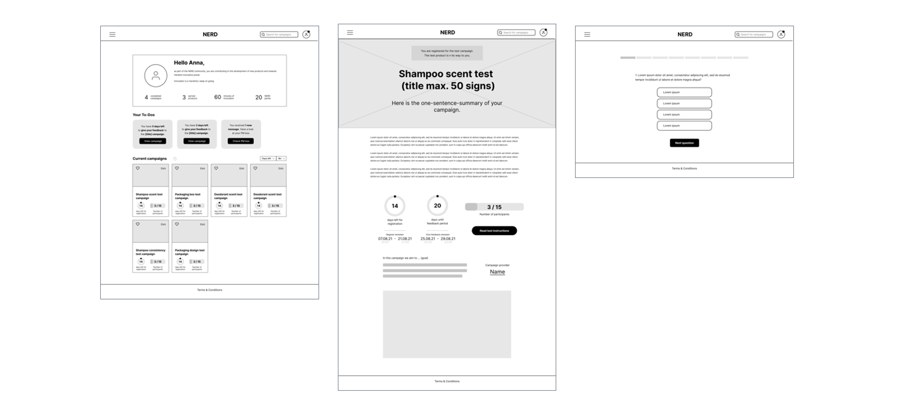
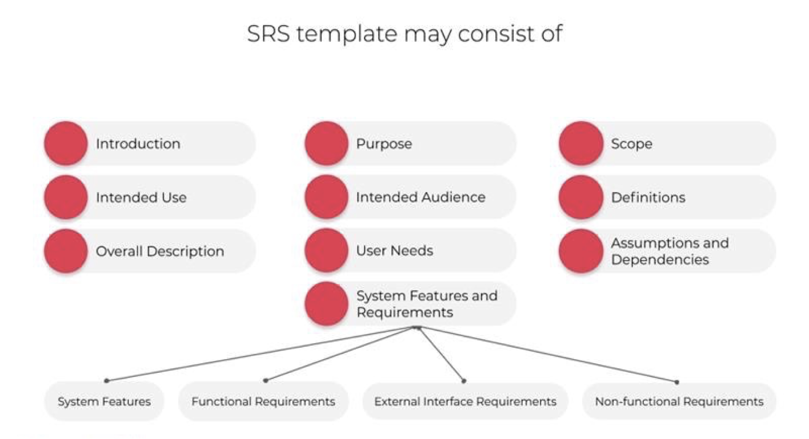
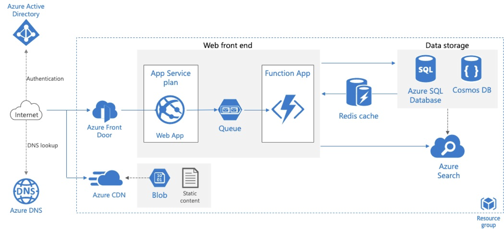
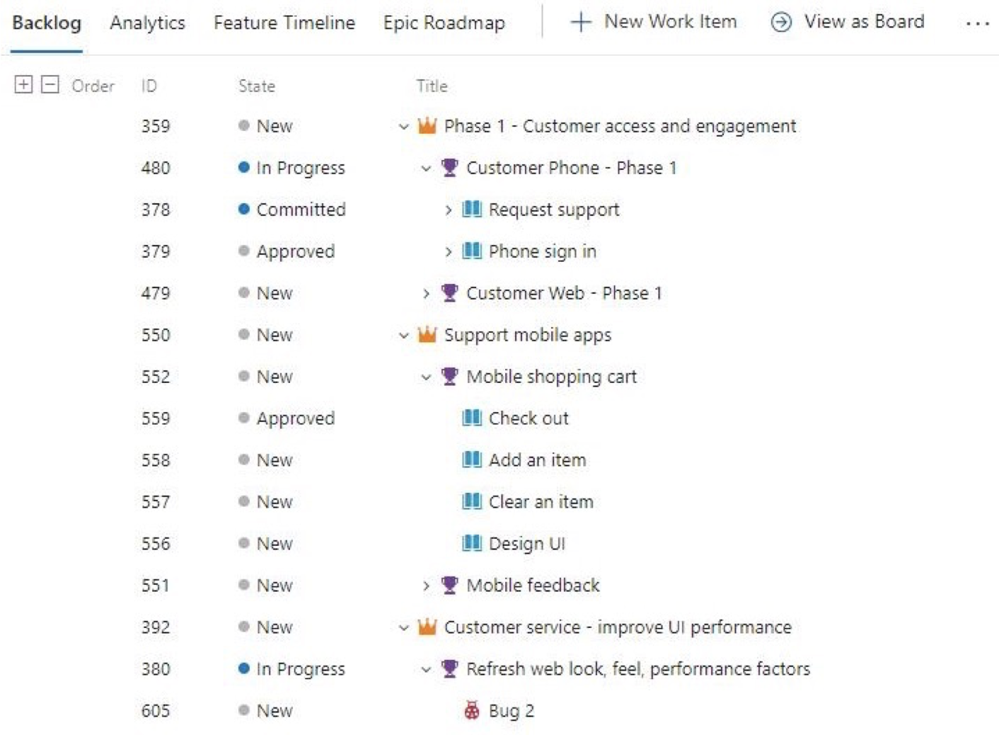

## Project Tracking & Documentation

Project documentation is to make sure project reqirements are fulfilled and to establish tracability concerning what has been done by who and when.

Here are some exaples what we are documenting the project and recommend some tools for project documentation.

## Requirement Analysis With Design Thinking 

## User journeys

## User stories

## User flows

## Information architecture

## Wireframes

## Software requirement specification

## Architecture Diagram

## Backlog Definition

