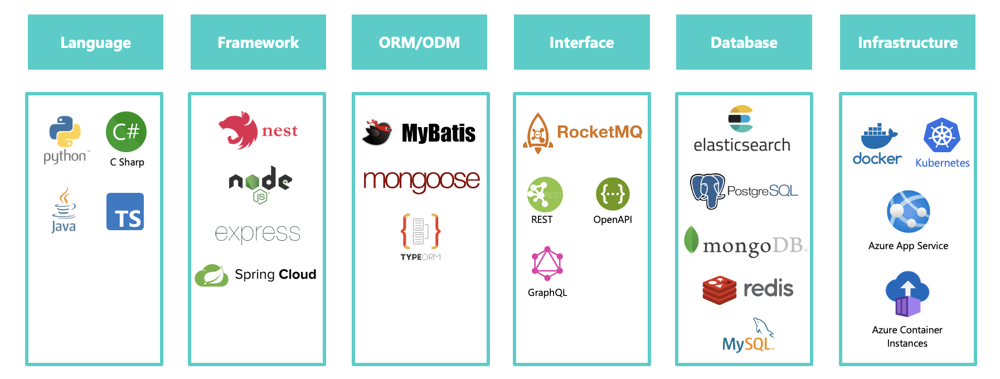
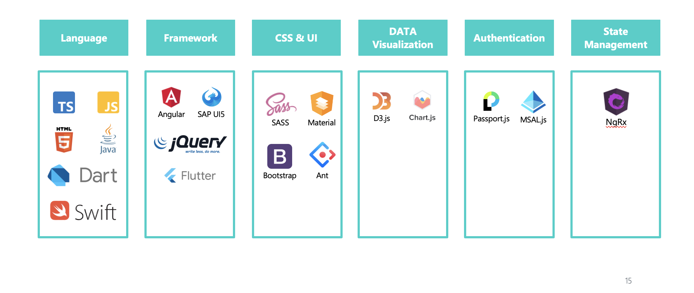

## Tech Stack

A tech stack is defined as the set of technologies that are used to build a web or mobile application. The tech stack are categoried as two: frontend and backend.

## Backend

## Frontend

