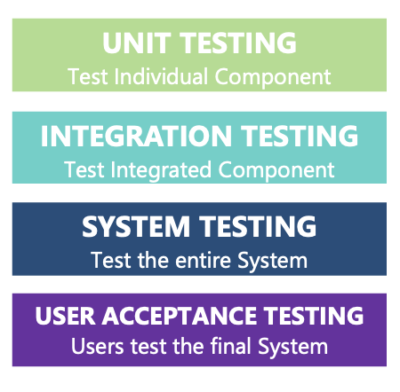
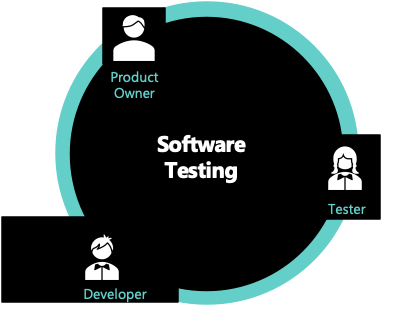

## Testing

Software testing is the process to verify that software works as it is supposed to be. Benifits of testing include assuring software quality, improving performance, and reducing development cost. 

The module introduces the testing concept, automation testing concept, best testing pratices in Azure Devops and Testing process in Henkel.

[[_TOC_]]
## Testing Of Different Levels

Testing every unit or component of a software, to make a software with quality assurance.

This is the level of testing:

## Unit Testing

Testing smallest testable parts of a software.

## Integration Testing

The phase in software testing when individual software modules are combined and tested as a group.

## System Testing

Testing is conducted on a complete, integrated system. It evaluates the system’s compliance with its specified requirements.

## User Acceptance Testing (UAT)

Testing happens in the final phase of testing before moving software applications to Market or Production environment. It is known as End-User Testing, and it is conducted by the client.

## Testing Of Different Scopes

Different scopes of software are selected to be tested for test plans. This is an efficient way for quality assurance with limited resources in software development and maintenance.

**Smoke Testing**

Very brief run-through of critical functionalities to ensure the software work roughly as expected. 

**Incremental Testing**

Testing for incremental functionalities in the release/sprint. 

**Regression Testing**

Retesting a software application to confirm that new features or bug fixes have no side effects on existing functionalities. 

## Roles In Test Process

Agile methodology in software testing involves testing as early as possible in software development life cycle. 

* Developers perform Unit Testing

* Testers mainly perform Integration/System Testing

* Product Owner is responsible for UAT

## Phases In Test Process

Testing on different phases of the Development phase, DEV environment, and QA environment. 

* Testing in Development Phase
  * Developers perform Unit Testing for implementing user stories/bugs locally.

* Testing in DEV Environment
  * Developers perform Integration/System testing.

* Testing in QA (Quality Assurance) Environment
  * Testers perform Integration/System testing for the planned release.
  * Product owners organize UAT testing for the final release.
