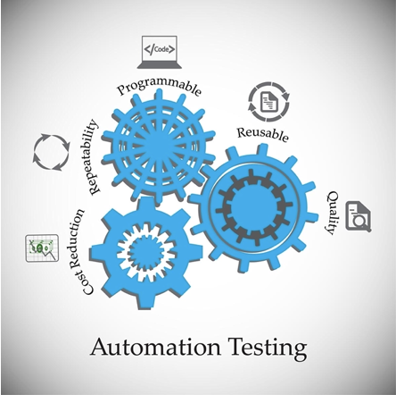
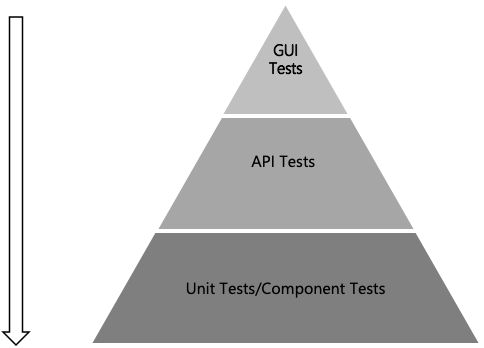
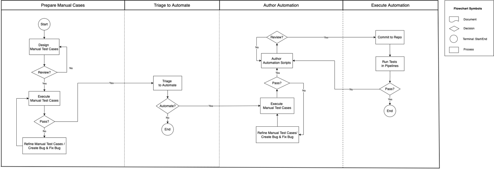

# Automation Testing Concept

## Why Automate? 

- Automated tests give continuous and fast feedbacks.
- Automated regression tests provide a safety net.
- Manual testing takes too long on smoke/regression test execution.
- Repeated manual testing is error-prone.
- Automation testing can save effort of programmers and testers from repetitive testing.
- Automation can be a good return on investment (ROI).

## Roi For Test Automation

### Projects suitable for automated testing: 

* Long-term projects

* Large and critical projects

### Projects that require frequently testing the same areas

* Requirements do not change frequently

* Budget time to implement and maintain test automation

### Projects that manual testing is sufficient:

* Short-term projects

* No budget time to implement and maintain test automation

## What To Automate? 

It is impossible to automate everything in a software. It is a good ROI to follow Test Automation Pyramid. 

### Unit Tests/Component Tests

* Fastest feedback, great value, and the most significant ROI among all types of test.

* Implement as many tests as possible on this layer. 

### API Tests 

- Include most of business tests.
- Verify that we are building the right thing.
- Cost less on writing and maintaining than GUI tests.

### GUI Tests

- Write GUI automated scripts after the code/function development is completed.
- These tests are still more expensive to write, although some tools/frameworks help reduce the investment. 
- UI tends to be changed frequently, and these tests are expensive to maintain.
- GUI tests should be the slightest automation effort because the tests generally provide the lowest ROI.

## Api/Gui Test Automation Process (Practice)

### Prepare Manual Cases

- Manual tests are reviewed and ready.
- Manual tests are executed.
- Refine manual test cases or wait for bugs fixing.

### Triage to Automate

- Impossible to automate everything.
- Decide which tests will be automated.

### Author Automation

- Automate tests, which have been planned.
- Peer-review test scripts.

### Execute Automation

- Automated tests are run in Pipelines.
- Fix test failure run in Pipelines.