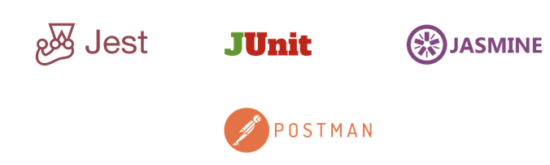
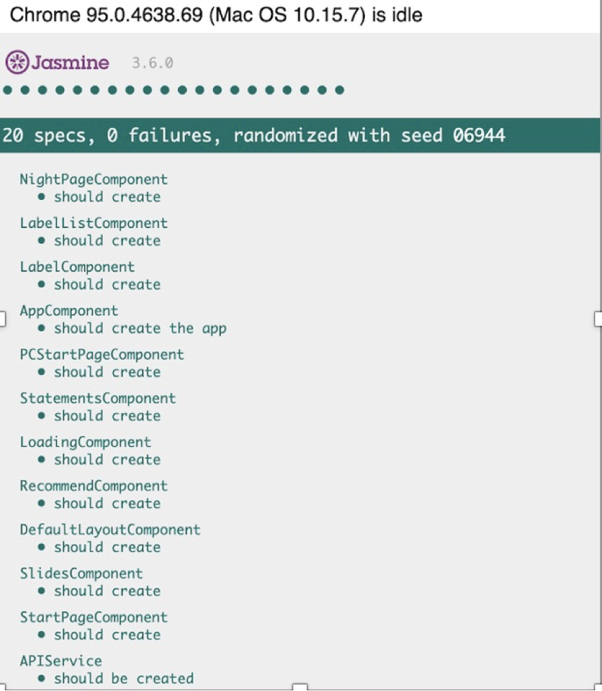
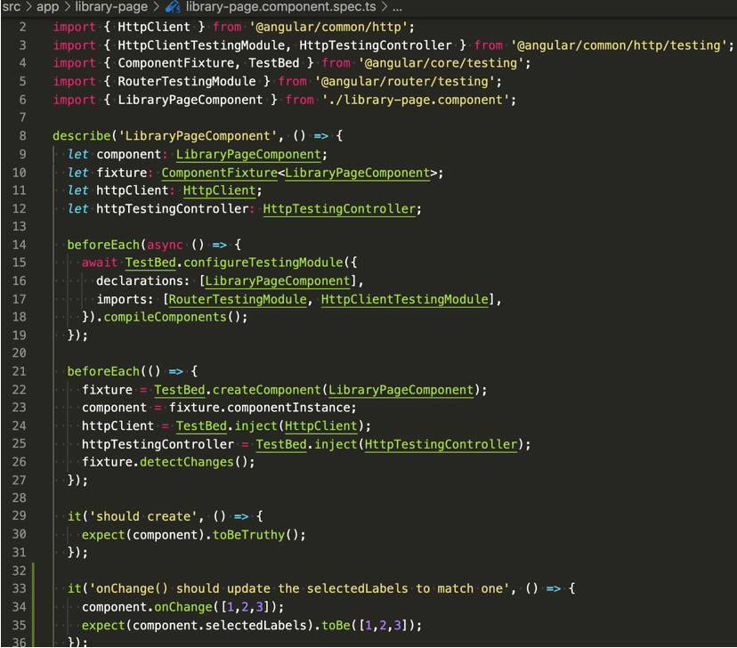
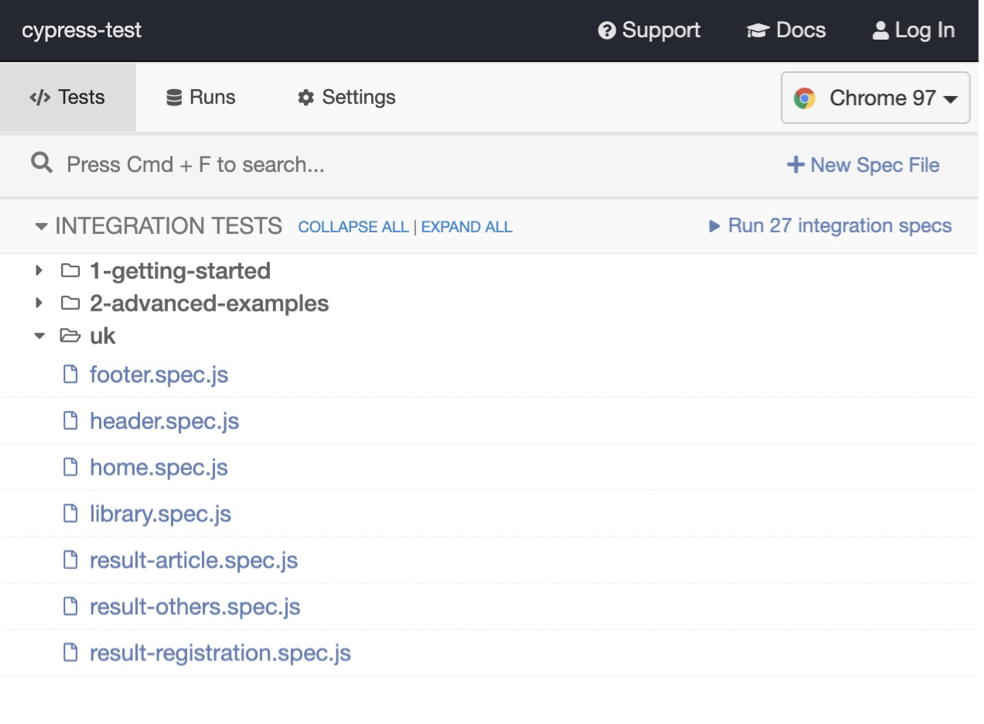
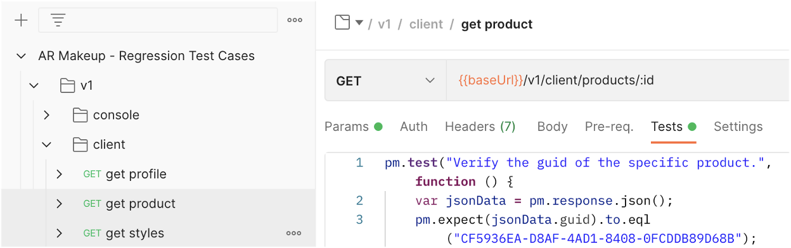
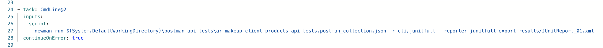
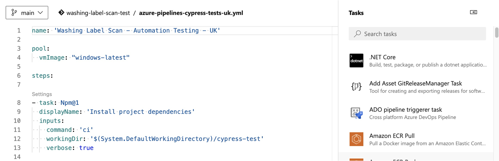
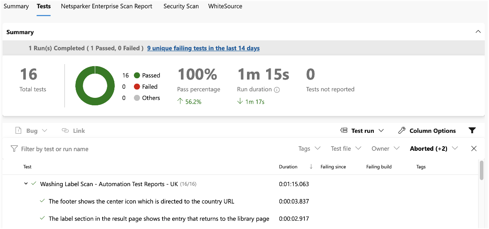

##  **Tools/Frameworks Selection for Test Automation**

-  Continuously research or choose appropriate tools/frameworks based on development tech stack for projects.

-  For Unit Testing and Integration Testing, test automation execution needs to be integrated into Azure Pipelines.

-  Need to check if tools/frameworks are supported by Azure DevOps.

-  Unit test frameworks like Jest, Junit, Jasmine work well with Azure Pipelines.

-  Integration test tools/frameworks like Cypress, Postman, Newman (Postman framework) work well with Azure Pipelines. 

  

##  **Automated Unit Testing**

* Unit test frameworks like Jest, Junit, Jasmine, etc.

* The selection of unit test frameworks depends on the respective development tech stack.

  

  ​		

  

  

##  **Automated Integration Testing**

* Test tools/frameworks like Cypress, Postman, Newman (Postman framework), etc.

* Selecting integration test tools/frameworks depends on the respective development tech stack and test technology.

* Examples

  * Cypress 

    

  * Postman 

    

  * Newman Command Line Runs Postman Test Case in Pipeline

    

    

##  **Run Test Automation In Azure Pipelines**

-  Configure YAML files in pipelines to run specific tests. The configuration depends on the selection of the framework and supporting by Azure DevOps.

-  View test report from Tests tab. The test results are published by the task in pipelines. Or test attachment is published to Azure Artifacts.

- Examples

  * Configuration File Of Pipeline

    

  * Test Report For Test Automation

    

    

##  **Test Code Review**

-  Create a pull request in Azure Repos to complete the code review process.
-  Peer review is needed.
-  Implement API/GUI test automation scripts based on the pre-designed manual test cases.