# 1. Test Management In Azure Devops

## 1.1 Test Documentation

Test documentation helps teams to organize their work, describe test coverage and make execution.

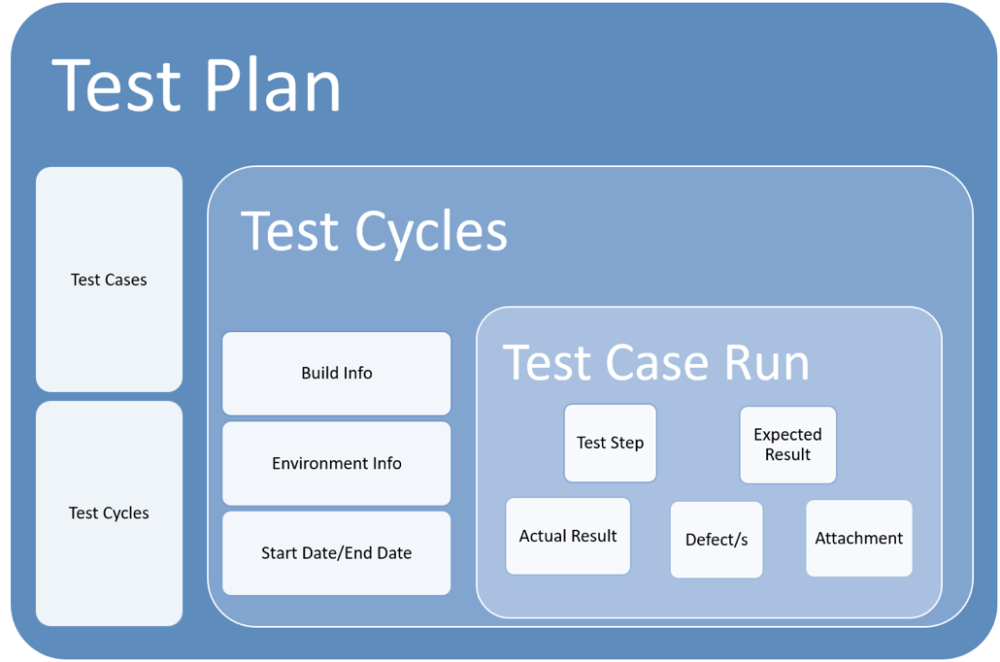

### Test Plan

A test plan outlines the strategy that will be used to test software, the resources that will be used, the test environment in which testing will be performed, the limitations of the testing and the schedule of testing activities.

### Test Case

Test cases involve steps, conditions, and inputs that can be used while performing testing tasks. The primary intent of this activity is to ensure that the software passes or fails functionally and otherwise. 

## 1.2 Testing Involved Services In Azure Devops

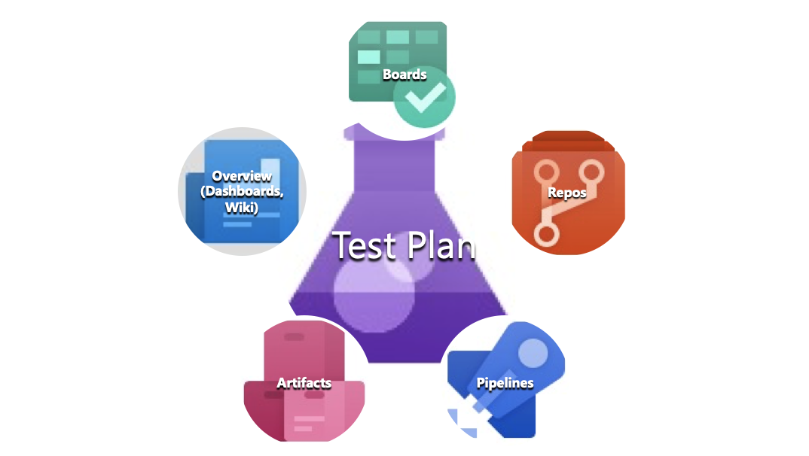

### **Azure Test Plans**

Test and ship with confidence for the code quality. The test plans/cases/execution/reports are recorded.

### **Azure Boards**

Plan, track, and discuss work across teams. Design test cases based on PBIs in boards.

### **Azure Repos**

Cloud-hosted private Git repos for projects. Automated scripts are stored in repos. 

### **Azure Pipelines**

Continuously build, test, and deploy environments. Automated Unit/Integration/System Testing is done in Pipelines.

### **Azure Artifacts**

Create, host, share packages with the team. Publish screenshots/videos to pipeline artifacts for test automation execution.

### **Additional Services (Overview** **-****> Dashboards** **&** **Wiki)**

Tailor dashboards to share test reports and monitor test progress. Use Wiki to share summarized test reports.

## 1.3 Test Plans

### **Test Plan Recommendation**

- Decide which test configuration is applied (web browsers, operation systems of windows/mobility, etc.).
- Include Smoke testing in the test plan.
- Focus on testing new features/bugs verification in the current sprint/release.
- Involve integration testing from middle phases of development sprints since more components are developed.
- Involve end-to-end test scenarios once functionalities are ready to test.
- Release candidate builds is limited to critical/high severity bugs fixing. 
- Critical/high severity bugs must be fixed for release candidate builds.

### **Test Plan Review**

- Test plans need to be peer-reviewed by tester/developer/BA.
- Test plans need to be reviewed before test execution is started.
- The PO/Test Lead needs to make a final decision/approval for the design of the test plans. 

## 1.4 Test Plan Practices

### **Configuration before Test Plan Creation**

- The administrator’s permission is required. 

- For the specific project, go to Boards -> Boards -> Configure Team Settings window, select Test tab.

- Create a new plan using area/iteration of the selected card

  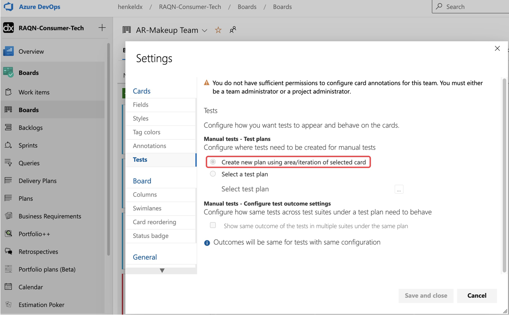

- Test cases created from Boards will be placed to test plan of the current area/iteration.

### **Create a New Test Plan**

* Create a new test plan by clicking “New Test Plan” from Test Plans -> Test plans page.

* Naming Convention: test plan can include keywords like projectName + moduleName + releaseVersion, in order to distinguish different releasing projects. 

* Test Plan To Be Executed for Sprint.

  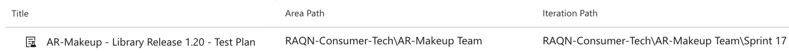

## 1.5 Test Cases

### Test Case Recommendation

- Test cases are derived from requirement specifications.
- Design negative test cases for user interaction. 
- Design the test cases based on tester’s experience on similar systems or tester’s intuition.
- Error Guessing
- Exploratory testing
- Other test case design techniques.

### Test Case Review

- Test cases need to be peer-reviewed by tester/developer/BA.
- Test cases need to be reviewed before test execution is started.

## 1.6 Test Case Practices

### **Create Incremental Test Cases from Azure Boards**

​    Create Test Case For The Product Backlog Item From Boards

​	

- Test cases are displayed for the PBI on Boards.

- The corresponding test suite is displayed in the test plan. 

  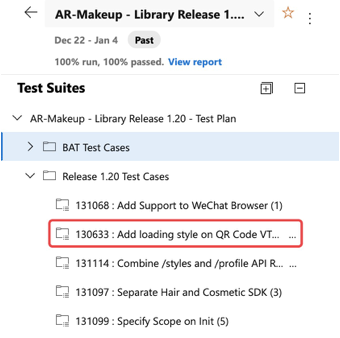

- Move the suite to the other static suite for better cases organization if needed.

### **Import Smoke and Regression Test Cases**

- Create a dedicated test plan as a test case library for the project when a project is started. Continuously maintain the Smoke and Regression test cases in the library.

  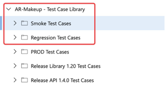

- Normally the full testing might not be completed by limited test resources, and timeline with more functionalities are delivered.

- The Smoke/Regression test cases could be fully or partially selected based on the new features or bug fixes of the sprint/release.

- Import Test Cases from Test Cases Library.

  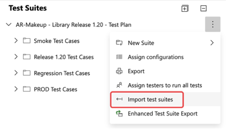

## 1.7 Test Configuration

### Create Test Configuration

- Create it from Test Plans -> Configurations.

- Configuration variables should be created before creating a test configuration.

  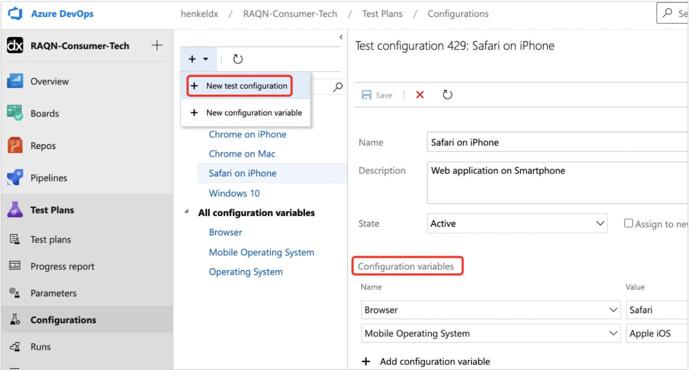

### Assign Test Configuration to Test Plan/Test Suite

- Select the test suite of the test plan, click “Assign configuration” from Action button, to assign the corresponding test configuration.

  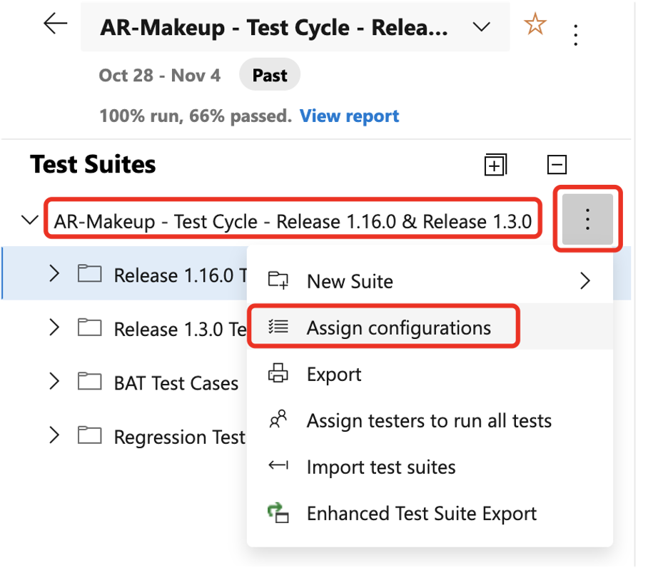

  

* **Test Configuration Assigned For Test Case**

  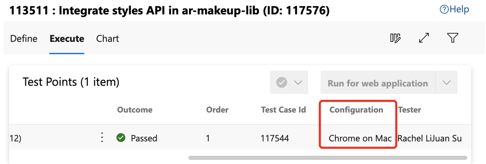

## 1.8 Test Execution

### **Log Outcome (Passed/Failed)** 

- It aims to record test results (Pass/Fail) for test cases.
- Attach test evidence for test cases if necessary.

### **Create Product Bugs**

- Create related product bugs for the failed test case.
- Title, Repro Steps (steps to reproduce), Actual Result, Expected Result, Severity are required fields to log a bug.

## 1.9 Test Execution Practices

### **Open Web Runner**

- Open Runner – Test Plans by clicking “Run from web application” of Execute tab.

  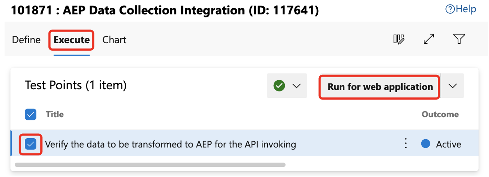

### **Execute Test Cases** 

- Mark outcomes (pass/fail) for each step.

- Mark overall result for the test case.

  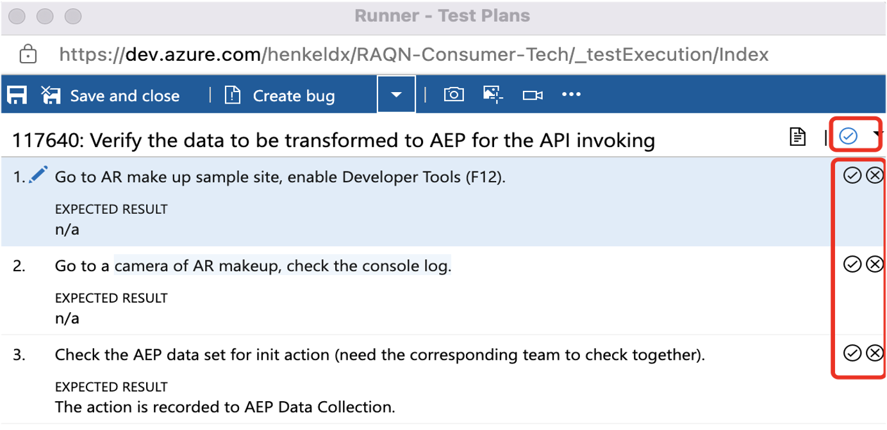

### **Create Bug**

- Create a new bug.

- Or add an existing bug (link a current bug to the test case).

  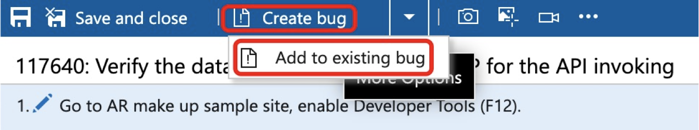

### **Attach Test Evidence**

- Add comments (add observation or investigation).

- Add attachments (add screenshots of test results), it is helpful to trace the quality of new feature development.

  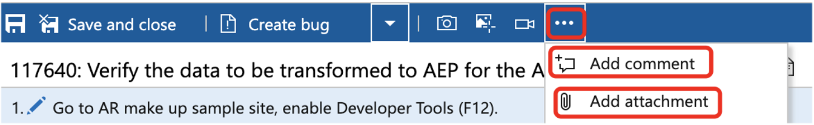

## 1.10 Test Report

### **Test Highlight**

Highlight summary and critical information, like any prioritized action from team collaboration, a new build is required, any critical/high issue should be fixed, etc.

### **Test Scope**

- Identity which test cases are executed in the current test plan. 
- Highlight information for the test scope, especially new feature/bug verification if necessary.

### **Bug Statistic**

- New bugs are logged for the testing with severity.
- Existing bugs impact the testing with severity 
- The latest update for bug status.
- Highlight information for a specific bug.

### **Test Execution Progress**

- The progress with execution rate, pass/fail rate.
- The progress of detailed modules.
- Test Report Practices
- Test Case Library Maintenance
- Test Case Library Maintenance Practices

## 1.11 Test Report Practices

### **Bug Statistic**

Filter bug list from Boards -> Queries. View the fields as below.

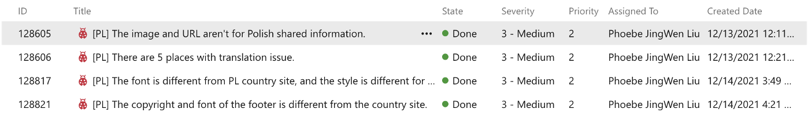

### **Test Execution Progress**

View progress report from Test Plans -> Progress report. The reports contain:

- Summary with test execution rate, pass/fail rate.
- Outcome trend for how many days are taken for the execution.
- Detailed progress for test Modules. 

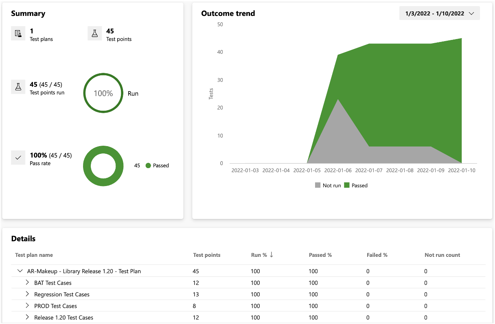

### Widgets for Test Plans from Azure Dashboards

- Add widgets from Overview -> Dashboards -> Edit -> Add Widget -> Chart for Test Plans. 

  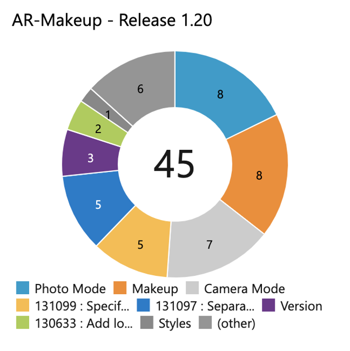

  

- Configure the widget from different perspectives.

  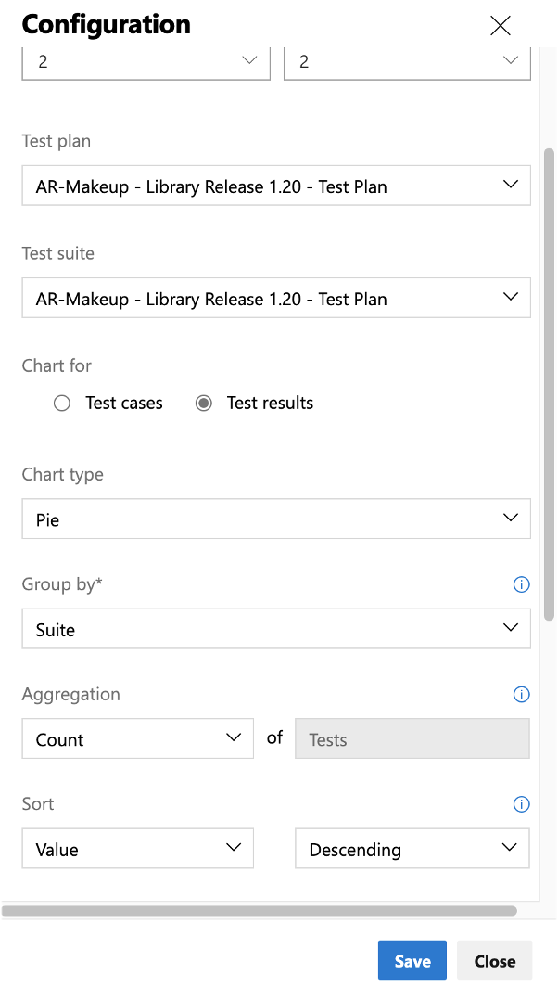

### **Test Report in Azure Wiki**

- Place test reports on the project Wiki page from Azure Overview -> Wiki.

- Use Markdown to edit the test report to be easy to read.

  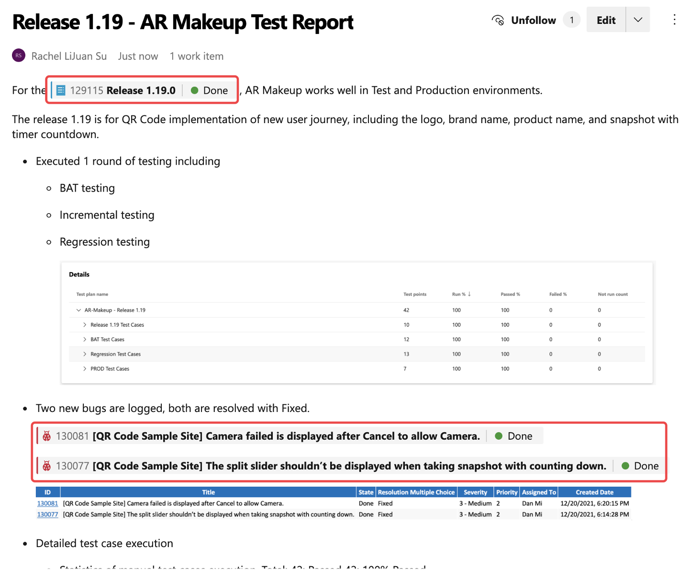

- Use #workItemId to refer to work items mentioned, which will synchronize the status of work items.

  

- Link a work item (release PBI) to the Wiki page, easy to know the test report from the release PBI, which contains all child PBI to be released.

  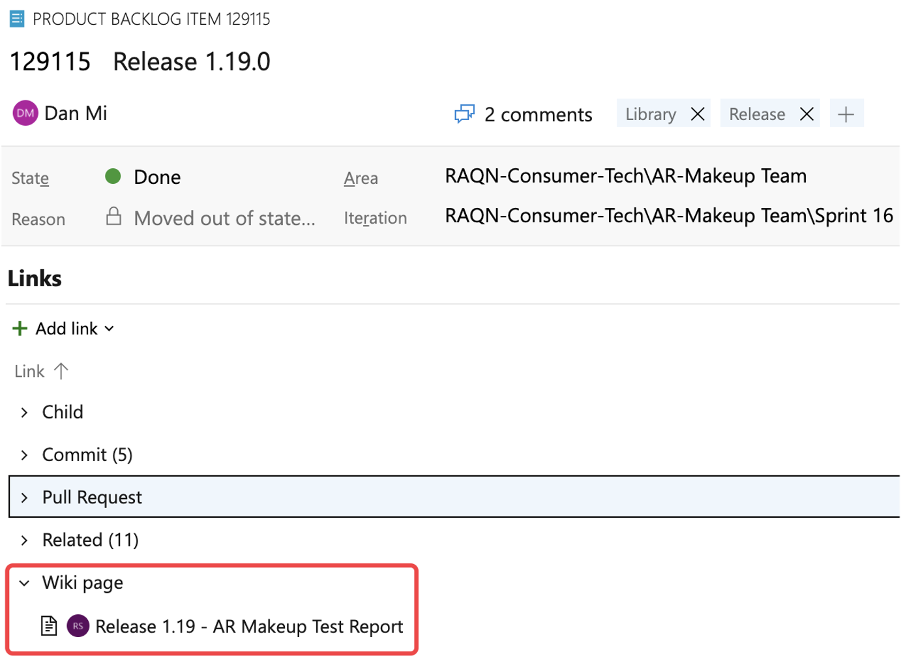

## 1.12 Test Case Library Maintenance

### **Dedicated Test Case Library**

- Name a test plan as a dedicated test case library to maintain it continuously. 

- Name Convention: the library can name as projectName +Test Case Library, in order to distinguish different project libraries.

  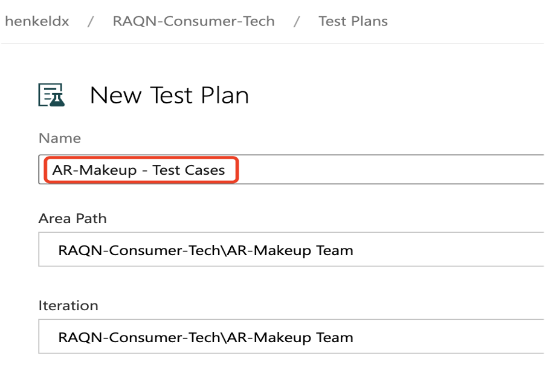

  ​		
  
  

## 1.13 Test Case Library Maintenance Practices

Smoke/regression test cases need to be added/modified/removed based on incremental functionalities from sprints/releases.

- Test case library contains smoke and regression test suites.
- Smoke and regression test cases are selected for test execution of sprints/releases.
- With incremental functionalities delivering, smoke and regression test suites need to be maintained to fulfill test coverage on further development.
- Maintenance can be conducted after testing is completed for every sprint/release.
- Only add critical test cases of incremental functionalities to the smoke test suite.
- Add basic test cases of incremental functionalities to the regression test suite.
- Modify existing test cases of smoke/regression test suite if the corresponding functionalities are changed by design. 
- Remove invalid test cases of smoke/regression test suite if the corresponding functionalities are excluded.