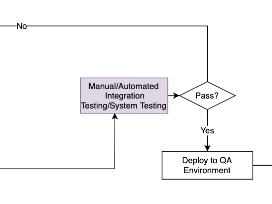
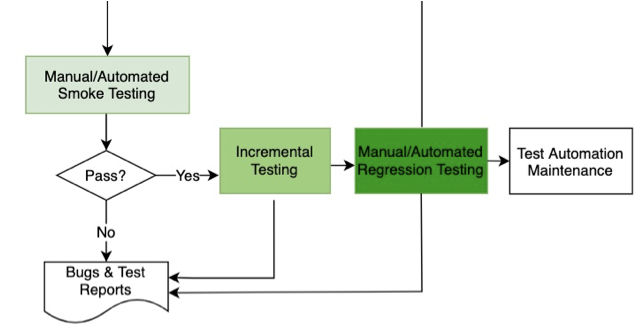
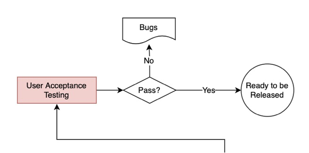

# Testing Process In Henkel (Proposal)

## Testing In Development Phase (Local Environment)

### Developer-Testing in Development Phase

- Design unit testing scripts when implementing user stories or fixing bugs
- Develop/execute unit testing
- Merge codes to develop branch by creating a pull request

## Testing In Dev Environment

### Developer-Testing in DEV Environment

* Execute manual/automated integration/system tests in DEV environment

* Merge codes to the release branch

## Testing In QA Environment

### Test Engineer-Testing in QA Environment

- Execute manual/automated smoke testing
- Execute incremental testing including new features and bugs fixing
- Execute manual/automated regression testing
- Create bugs and summarize test reports
- Maintain test automation scripts

### Product Owner - Testing in QA Environment

* Execute User Acceptance Testing (UAT)

* Create bugs if needed

* Approve to go production environment

