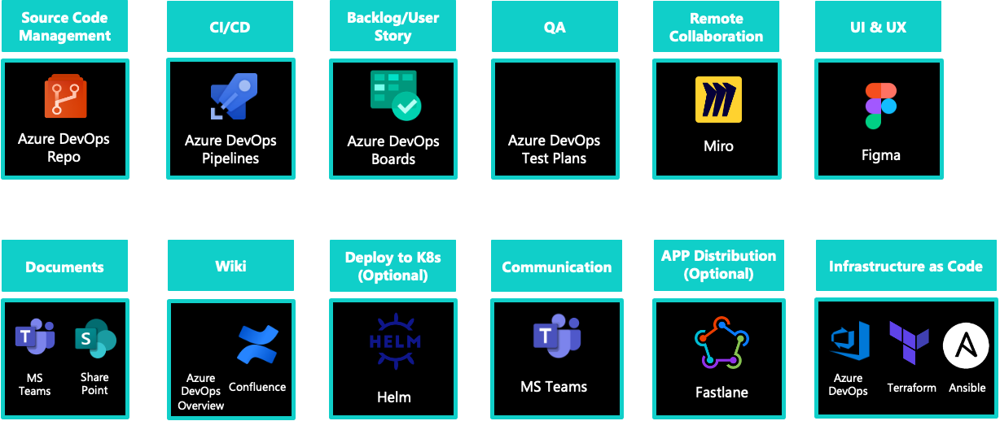
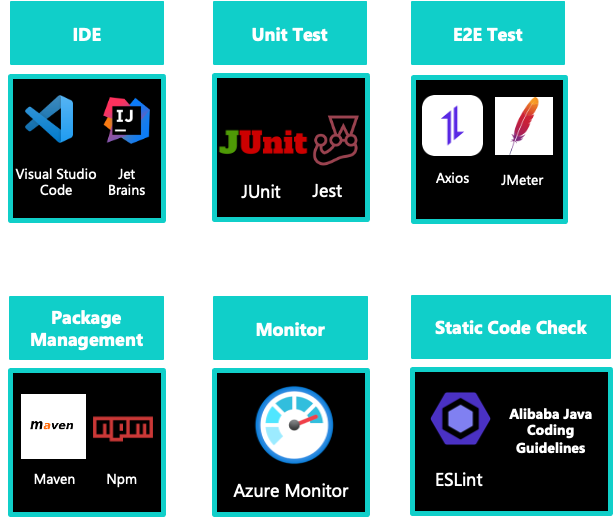
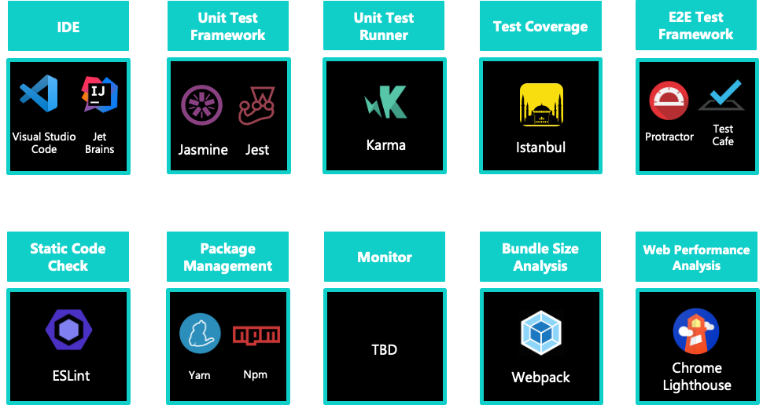
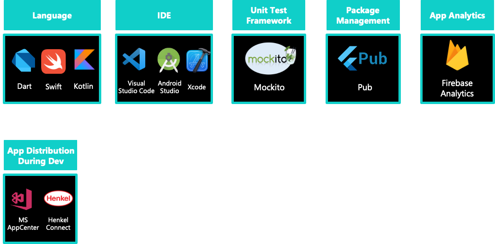

## General

## Graphical Tools

## Backend Development 

## Frontend Web Development

## Frontend Mobile Development

## Testing

## Recommended VSCODE EXTENSIONS
- Angular Language Service 
- Auto Complete Tag 
- Auto Import 
- Better Comments 
- Code Spell Checker 
- Color Highlight 
- Debugger for Chrome/Firefox!!
- Stylelint 
- ESLint 
- Git Lens 
- Material Icon Theme  (Quite useful visually - some specific folders (like shared, components, core, etc) are getting a custom icon)
- npm 
- npm Intellisense 
- Path Intellisense 
- Prettier 
- Project Manager 
- Rainbow Brackets 
- SVG Viewer 
- TypeScript Hero  -> ! Don't forget to go to VSCode settings -> Extenstions -> Typesript hero -> check Organize on save

