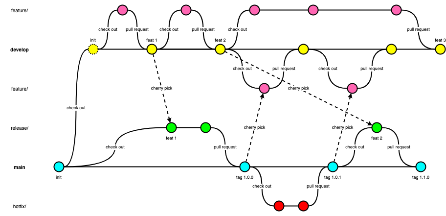
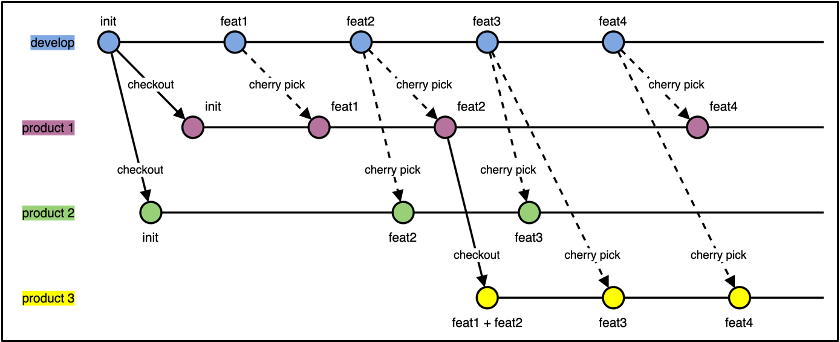

## Improved Gitflow
Improved Gitflow, which is integrated with the branch policy feature of Azure DevOps Repos. The key points are: 

- It is required to define Branch Policies on both develop and main branches. The branch cannot be deleted with the branch policies enabled, and changes must be made via pull request. Limit the merge type on develop/main branches to Squash.
- All commits on develop branch come from pull requests originating from feature branches; all commits on the main branch come from pull requests originating from release/hotfix branches.
- Direct code merging between develop and main branches is forbidden. Code changes are cherry-picked from the source branch to feature/release branches, then merged to destination branch via pull requests.

## Feature
- Create and check out a feature branch from the latest develop branch
- Commit changes on the feature branch
- Push the feature branch to remote
- Create a pull request from the feature branch to develop branch
- Merge the feature branch to develop branch by completing the pull request
- Delete the feature branch on both local and remote

## Release
- Create and check out a release branch from the latest main branch
- Pick desired commits from develop branch
- Tag the release branch with version number
- Push the release branch and tag to remote
- Create a pull request from the release branch to main branch
- Merge the release branch to main branch by completing the pull request
- Delete the release branch on both local and remote
- Create and checkout out a feature branch from the latest develop branch
- Pick commit from main branch
- Create a pull request from the feature branch to develop branch
- Merge the feature branch to develop branch by completing the pull request
- Delete the release branch on both local and remote

## Hotfix
- Create and check out a hotfix branch from the latest main branch
- Commit changes on the hotfix branch
- Push the hotfix branch to remote
- Create a pull request from the hotfix branch to main branch
- Merge the hotfix branch to main branch by completing the pull request
- Delete the hotfix branch on both local and remote
- Create and checkout out a feature branch from the latest develop branch
- Pick commit from main branch
- Create a pull request from the feature branch to develop branch
- Merge the feature branch to develop branch by completing the pull request
- Delete the release branch on both local and remote

## We use the following different types of branches:
- Working branches (e.g., feature/hotfix/release), exist in short-term. They are always checked out from and merged back to develop/main branches. Each of them shall be corresponding to a work item, like a Product Backlog Item or a Bug.
- The develop branch is the primary branch to hold all development commits.
- The main branch is the branch to hold all commits for production.

Usually, there is one main branch in one project, which means only one product line needs to support. But sometimes, we need to support multiple product line – which have most same but a few different features. In this case, we prepare a separate branch for each product lines. In other words, we still use one primary branch (e.g., develop) to hold all our development commits, but create multiple long-term branches for multiple product lines, as the figure shows on the next page.

## Support of multiple product line:
- A product line branch can be checked out from the primary develop branch.
- A Product line branch can be checked out from another product branch.
- All commits on product line branch are cherry-picked from the develop branch.
- No merge operation between develop branch and product branches.
- No merge operation among product branches.
