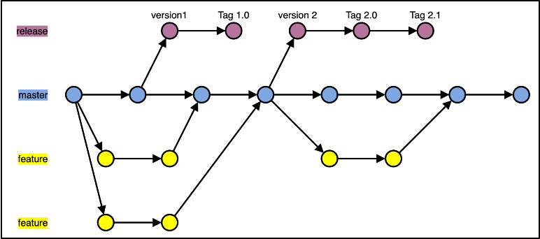

# Trunk-based-development (OPTIONAL-USED for Poc)
## Overview
In the trunk-based development model, all developers work on a single branch with open access. We create short-lived feature branches. Once code on their branch compiles and passes all tests, we merge it straight to the master branch. It ensures that development is truly continuous and prevents developers from creating merge conflicts that are difficult to resolve.

## Use trunk-based development when:
- Being just starting up
If you are working on a PoC or MVP project, this workflow might be correct. It offers maximum development speed with minimum formality. Since there are no pull requests, developers can deliver new functionalities at the speed of light.
- Need to iterate quickly
In contrast to the Gitflow having planned release, the TBD model is perfect for you when you need to change your product as quickly as possible.
- Work mostly with senior developers
If your team consists mainly of senior developers, this workflow gives them the autonomy they need and enables them to wield the mastery of their profession.
