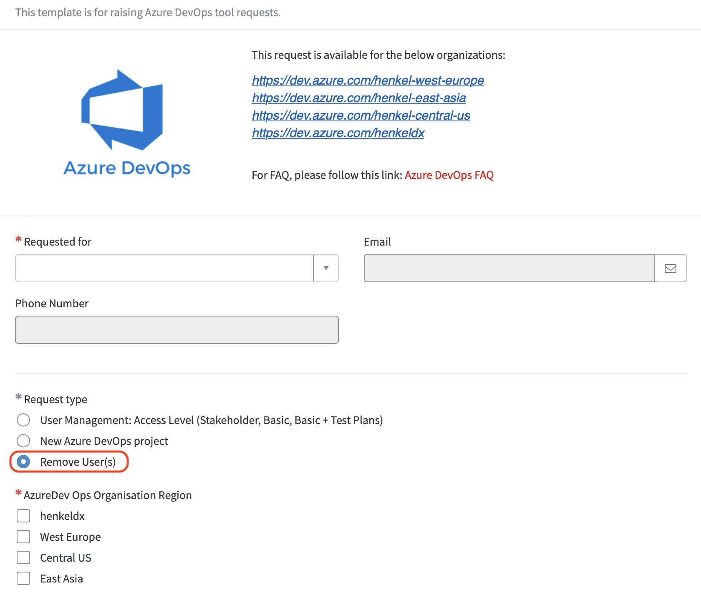

## How do I access Azure DevOps?

There are two different scenarios:

1. You want to start a new project and onboard to Azure DevOps for the first time.
2. You want to join an existing project.

### I want to start a new project in Azure DevOps and do not have access yet

Please see [How to Request a new Azure DevOps project, Access Level or organisation](https://docs.henkelgroup.cloud/howto/request-azuredo/) HowTo page.  
 
### I want to join an existing project

* If you are a **Henkel employee**, just ask one of the project administrators to add you to the project. 
  You might also be interested in [How to learn who is the project administrator for a specific Azure DevOps project?](#how-to-learn-who-is-the-project-administrator-for-a-specific-azure-devops-project)
* If you or the user to be added is an external user, please consult
  [How do external users access Azure DevOps?](#how-do-external-users-access-azure-devops)

## What is the difference between Stakeholder and Basic access levels and how do I know which one I need?
* **Access levels (e.g. Stakeholder, Basic, Basic + Test Plans) can only be changed in organization settings by DevOps team as there is a licence cost difference.** The Basic access level supports full access to project features. Stakeholder access level provides partial access to features, allowing users to view and modify work items, but not use all features. By default, when users are invited to a project by a Project Administrator, the access level is Stakeholder. The project administrator should know which access levels the project members need, and if users need Basic, request this change through an [Azure DevOps ServiceNow request](https://henkelprod.service-now.com/sp?id=sc_cat_item&sys_id=e46475d41b5cf89097eaea836b4bcb11).

!!! INFO

    NOTE: If the "Basic + Test Plans" or the "Basic" access level is not actively used for more than one month, the access level is considered unused and will be downgraded to the next lower access level to reduce costs.

## Why is the access level of certain project members set to '*Stakeholder*' and how can I change it to '*Basic*'?

If current user access level proves insufficient and needs to be changed to '*Basic*' from '*Stakeholder*', please open a ServiceNow request [here](https://henkelprod.service-now.com/sp?id=sc_cat_item&sys_id=e46475d41b5cf89097eaea836b4bcb11).

## How can I check the access level of a certain user? 

Open [https://dev.azure.com/henkeldx/_settings/users](https://dev.azure.com/henkeldx/_settings/users) in your browser. You can search
for the user there and check the access level. This link works for the 'henkeldx' organization. If you check the
same thing for another organization, just replace the 'henkeldx'
part of the URL with the name of the organization you'd like to
see the information for.

## How can I remove a user from Azure DevOps?

When a user who has access to Azure DevOps should not have that access any longer, it first needs to be decided what kind of access should no longer be granted:

### Removing access to a project

This may apply if a user is switching departments or just isn't working in that project anymore.  
In that case, project administrators can just remove the user from all project groups and, in case the user was an administrator, remove user from that list, as well.  

### Removing access from an Azure DevOps organization

This may apply if a user is leaving Henkel or the user is an external partner and the contract is ending. In that case please follow the MyID process for user removal at first. In the next step you need to initiate the license removal in Azure DevOps. For accomplishing that please use our [ServiceNow request form](https://henkelprod.service-now.com/sp?id=sc_cat_item&sys_id=e46475d41b5cf89097eaea836b4bcb11) and select "Remove User(s)":

As a project administrator you should proactively review the users you are responsible for to maintain a clean environment.

!!! warning
  	
    Please note that if you are using Active Directory groups to steer access to your projects
    and manage your projects groups, the user may still have access in case he is a member
    of one of these groups! Please take care removing him from these groups in [myID] then, as
    well.

## I am seeing an error that I don't have sufficient permissions to perform an action or there are features that are not visible to me, but visible to other colleagues. What should I do?

First, please contact your Azure DevOps project administrator to check if this is because of permissions in the security groups or if it is related to your access level of Stakeholder/Basic. 
If it is related to the access level, please use the ServiceNow information at the top of this page to request an access level change.
