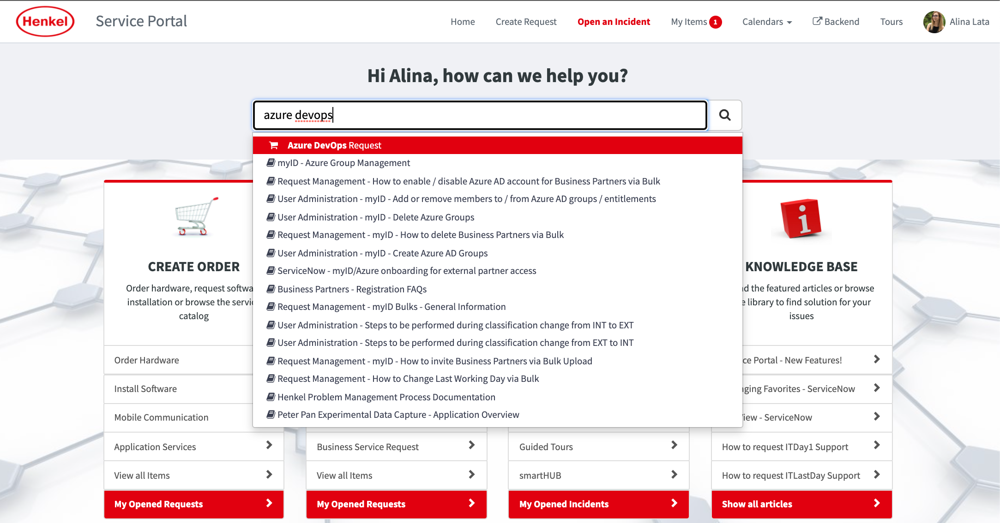

!!! INFO
    Please raise Azure DevOps requests only via ServiceNow - navigate to 
    [Henkel ServiceNow](https://henkelprod.service-now.com/sp?id=sc_cat_item&sys_id=e46475d41b5cf89097eaea836b4bcb11) and search for "Azure DevOps" in the main search field. Once you have selected the entry "Azure DevOps Request" you will be taken to the customized template for raising requests. 
    
    Check out our new MS Teams channel, just go to the Teams tab click "Join Team" and use the following join code: 8g5o95i

    Please note that all new Azure DevOps projects already include an optional template for Product Backlog Items/User Stories which should be considered for operational readiness.
    
    Note: No VPN connection needed to access ServiceNow. 
    

## Azure DevOps FAQ

This page provides a list of frequently asked questions (FAQ) about [Azure DevOps](https://dev.azure.com/henkeldx/) at Henkel. Please note that this FAQ page applies to the Azure DevOps organizations managed by DevOps team at Henkel: 

- [https://dev.azure.com/henkel-west-europe/](https://dev.azure.com/henkel-west-europe/) - region West Europe

- [https://dev.azure.com/henkel-east-asia/](https://dev.azure.com/henkel-east-asia/) - region Southeast Asia

- [https://dev.azure.com/henkel-central-us/](https://dev.azure.com/henkel-central-us/) - region Central US 

- [https://dev.azure.com/henkeldx/](https://dev.azure.com/henkeldx/) - region West Europe

In case you feel an important topic is missing from this documentation space, feel free to reach out to us by mail using our team mailbox: [devops_support@henkel.com](mailto:devops_support@henkel.com).
You can find the start pages of the 4 different organizations via the links above. If you are a member of a project in Azure DevOps, you should already see the projects that you are a member of. 
If you can't see any projects, you need to contact the corresponding project administrators for each project to invite you as a project member.

## What is DevOps, Azure and Azure DevOps?

DevOps is a software engineering culture and practice that aims at unifying software development *(Dev)* and software operation *(Ops)*.
It accelerates business by faster implementation of new IT solutions through full accountability of joint development and
operation teams using agile and lean practices based on automation tools.

Azure and Azure DevOps are two separate entities in the Microsoft environment.

Azure is a platform by Microsoft, which focuses on storage solutions,
machine learning, virtual machines (virtual computers), Azure SQL, Azure Cosmos DB, Azure Active Directory and much more.
All offered services can be viewed [here](https://azure.microsoft.com/en-us/services/).

Azure DevOps, on the other hand, is a tool by Microsoft, which provides services to support teams
to plan work, collaborate on code development and build and deploy applications
and its main features include Boards, Wiki, Dashboards, Repos, Pipelines, Test Plans and Artifacts.

## What is the main difference to Confluence?
Section | Azure DevOps | Confluence
:-------- | :-------- | :--------
Wiki/Documentation   | 	&#x2714;   | 	&#x2714;
Dashboards   | &#x2714;   | -
Boards   | &#x2714;   | -
Repos   | &#x2714;   | -
Pipelines   | &#x2714;   | -
Artifacts   | &#x2714;   | -
File sharing   | limited  | &#x2714;

Azure DevOps consists of different subtools, which allows agile working between departments with different needs in just one tool. 

Confluence is primary an information library to document projects or team relevant data and processes.

## Do I need to pay for Azure DevOps?

No, the cost is centrally covered for Azure DevOps organizations managed by dxT DevOps team.

## I'm new to Azure DevOps. How can I get training?

We have a variety of Azure DevOps trainings available for registration in the
 [Supercharger Academy - Expert Boost - Agile - Azure DevOps](https://henkel.csod.com/catalog/CustomPage.aspx?id=221000479&page=agile).

**In-depth trainings led by an instructor (webinars):**

- [Azure DevOps Basics Training](https://henkel.csod.com/ui/lms-learning-details/app/event/20831859-fa48-476c-999c-6e3fbc9f29ab) 

- [Azure DevOps Technical Training](https://henkel.csod.com/ui/lms-learning-details/app/event/c60b603b-5a94-40b8-873f-2afc77f7fa17) 

**Recorded Training Modules:**

- [Azure DevOps Basics (Recorded Training Modules)](https://henkel.csod.com/ui/lms-learning-details/app/course/75f7f7bc-2da5-44f5-9e84-07ef71843ca4) 
- [NEW! Azure DevOps: Managing Project Permissions for Project Admins (Recorded Training Modules)](https://henkel.csod.com/ui/lms-learning-details/app/course/234ab568-604e-4d10-a1c1-a1df3b40e452) 

**On-demand trainings:** 

- We need a minimum of 10-15 participants to organise a session. Contact us at devops_support@henkel.com and we will define the training details together.

**Self-paced learning:** 

- [Azure DevOps official documentation](https://learn.microsoft.com/en-us/azure/devops/?view=azure-devops)
- [Azure DevOps Hands-On Labs](https://azuredevopslabs.com/)
- [LinkedIn Learning: Azure DevOps](https://www.linkedin.com/learning/search?keywords=azure%20devops&u=60321153)
- [Azure DevOps Guideline (dx)](https://docs.henkelgroup.cloud/devops/AdoGuideline/ado-guideline/), input from different teams in Henkel 

## How can external users register to Azure DevOps trainings?

We want to ensure that external users are aware of Azure DevOps training sessions and are able to attend them 
without any issues. Here are a few important points to keep in mind for the Henkel responsible of external users:

* External users cannot open the training links directly in the Learning Portal. Therefore, it is essential that you inform your users of the existing planned sessions
* If external users will use the Business Account, please invite users beforehand in myID - Business Partner Management
* To register for a training session, please send an email to devops_support@henkel.com with user email address and training session. Before sending the email, kindly check 
 the number of available seats and the deadline for registration
* GTC registration: external GTC colleagues get access upon nomination. Please refer to Mithun Kumar.

