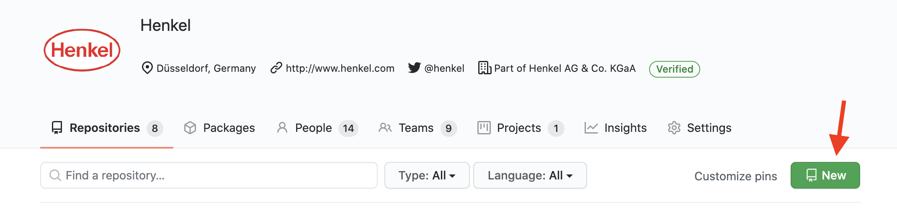
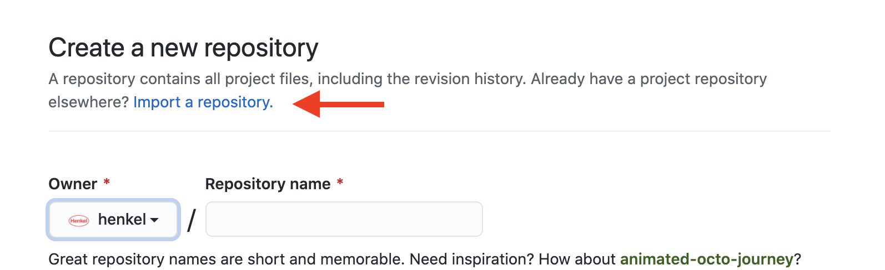
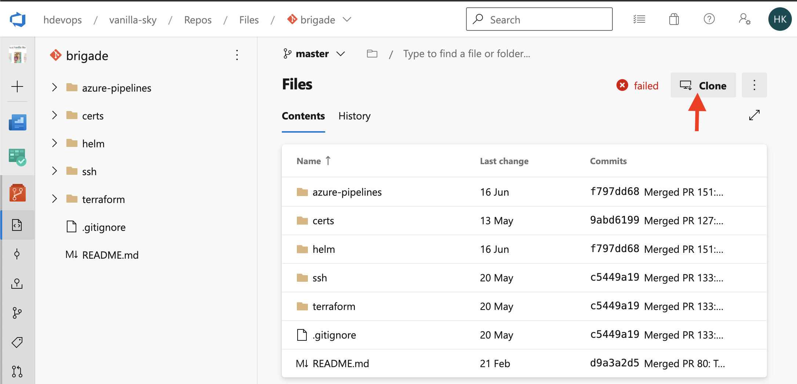
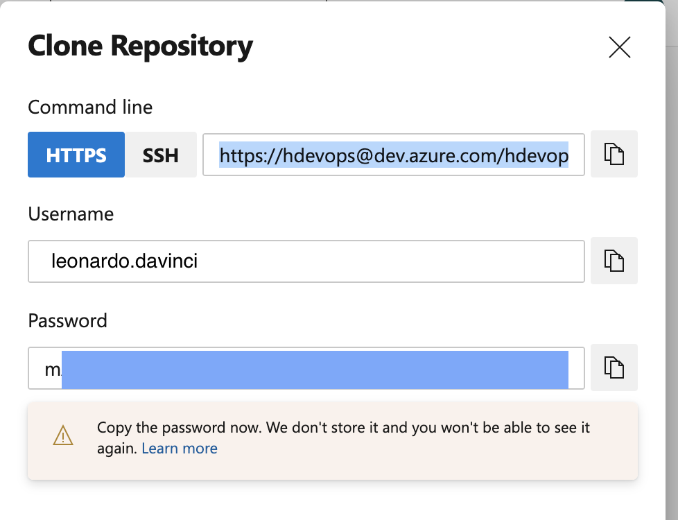
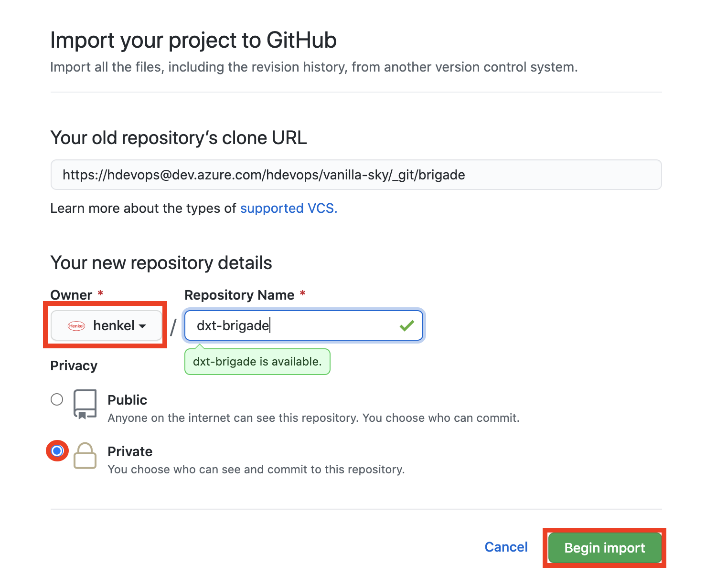

# Migrate Git Repos to GitHub

## Migrate arbitrary Git Repositories

This guide describes how to migrate any Git repository (like hosted on [Henkel GitLab], for example) to [GitHub]. This also works for migrating Azure DevOps Repositories, but for this case a graphical alternative is available (see below).

Basically, the steps are:
 
1. Create a new repo on GitHub.
2. Mirror clone the old repo from its current location to your local workstation:  

        git clone --mirror git@your-gitlab-site.com:mario/my-repo.git
        
3. Mirror push to the new repo on GitHub with pre-commit hooks skipped:

        # Change into newly created repo directory
        $ cd ~/my-repo.git
        
        # Push to GitHub using the `--mirror` option. The `--no-verify`
        # option skips any hooks.
        $ git push --no-verify --mirror git@github.com:mario/dxt-repo.git

That's it!

## Migrate Azure DevOps Repositories

You can proceed with Azure DevOps Repositories in the same way as described before.
Additionally, you have another alternative, which does not involve the command line and storing the repo on your local workstation temporarily:

1. Navigate to the GitHub project which the existing Azure DevOps Repository should be migrated to and click the "**New**" button in the Repositories section of your GitHub dashboard to create a new, empty Repository:  

    

2. On the next page, click the "**Import a repository**" link:  

    
    
3. Go to your Azure DevOps Repo on the left side menu (orange icon) and click the "**Clone**" button:

    

4. Click on "**Generate Git Credentials**" button. This will create a username and password which we will need to enter when importing the Repo at GitHub:

      
    
    
5. Copy the URL and navigate to [GitHub]. Then paste the URL copied before into the "*Your old repositoy's clone URL*" field.  
Next, ensure that "*henkel*" organization is selected as owner and enter a name for the repo (please check [naming conventions](https://github.com/henkel/dxt-guidelines). Select "*Private*" from the privacy section and click "**Begin import**":

6. Copy and paste the values generated for "*Username*" and "*Password*" in Azure DevOps previously into the "*Login*" and "*Password*" boxes and then click "**Submit**".

GitHub now copies the entire Repository over, just like we did before, directly from Azure DevOps.  
If you have a hosting solution which is reachable from the public internet without VPN in place, this import feature of GitHub works for Git repositories stored somewhere else than Azure DevOps as well.

Once you have validated that everything works and is available, you may delete the former Git repository to prevent irritations with the old and new location and to prevent your users to accidentially push changes into the old location.  
**It is highly recommended to create a fresh clone somewhere in case it turns out that anything is missing or hasn't worked, afterwards!**

[Henkel GitLab]: https://git.henkelgroup.net
[GitHub]: https://github.com