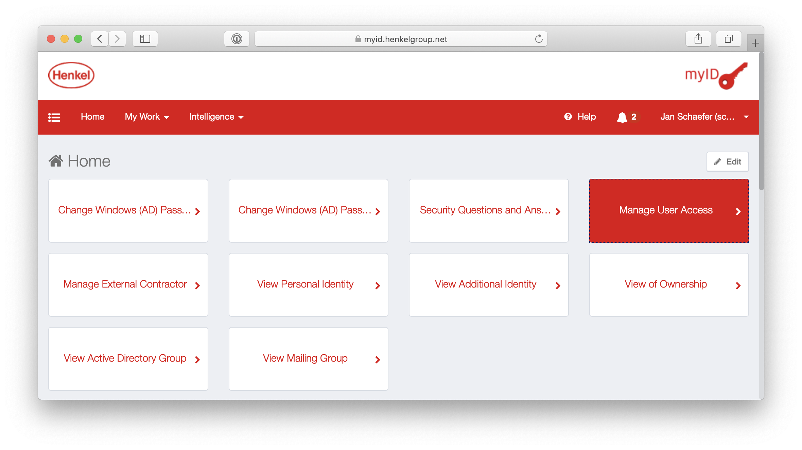

# How to get access to GitHub?
License assignment is done in the Azure AD. This can happen for individual users


1. Request an account via myid.
   - Go to https://myid.henkelgroup.net and browse to **Manage User Access**
        - Select your user account
     
 
   - Search for **APP-GITHUB-USER**
     
   - Submit the request
   - After a review, your account will be created automatically and you will gain access to https://github.com/orgs/henkel/ 

# How to request access for project team


 1. Project owner needs to ensure that the people have a github license (requestable via a central myID group, please see the section **How do I get access to GitHub?**
2.    Project owner is required to create a group via myID - this group will be granted access to the project via GitHub Team Syncronization 
For more info how to create MyID Group, please check the [Link](https://docs.henkelgroup.cloud/howto/myid-new-group/)
3.   Project owner requests a new team on github per ServiceNow
In order to create any request for Azure DevOps, please navigate to [Henkel SNOW](https://henkelprod.service-now.com/sp?id=sc_cat_item&sys_id=4a1e914edbac5780dde1e5ea4b96198d&sysparm_category=78d5a75adb32df00b39adcd74896194e) and raise a **Generic Request**.
    The affected Configuration Item is **GitHub** and the Assingment Group will be **Global.Team.Consulting.DevOps.X**
``` mail
Dear DevOps team,

I’d like to kindly ask you for creating a new GitHub Team for our project <projectname>

Henkel or DX organisation: (dxT/dxS/dxV...)
Team Name: (WebStudio)
MyID group: (Group-WebStudio)

```  


