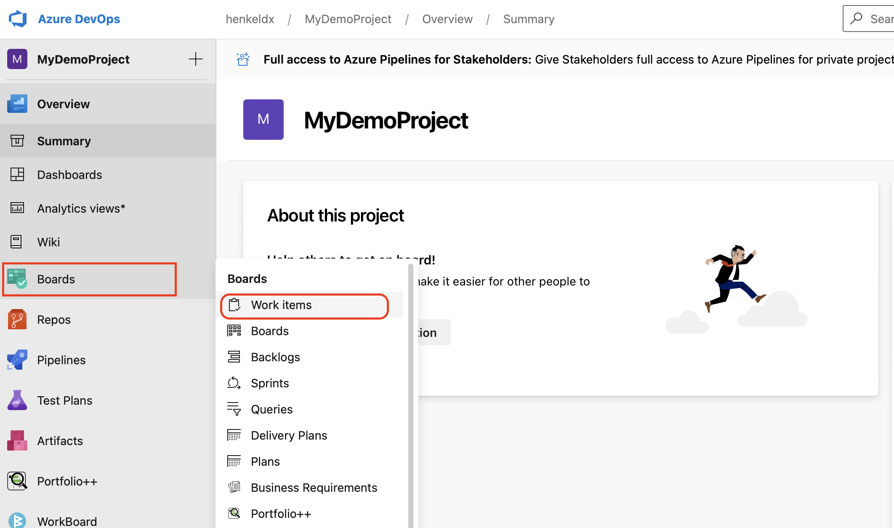
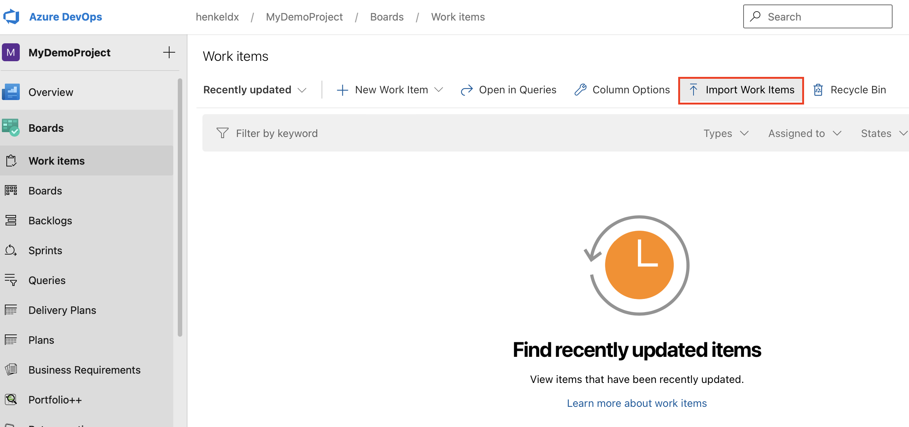
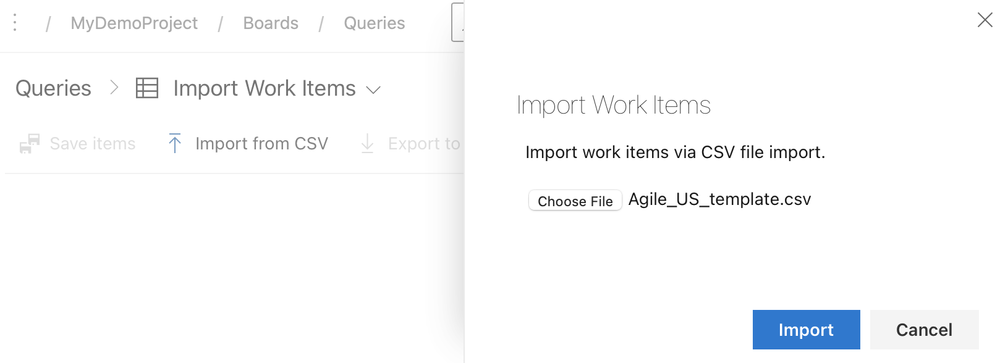
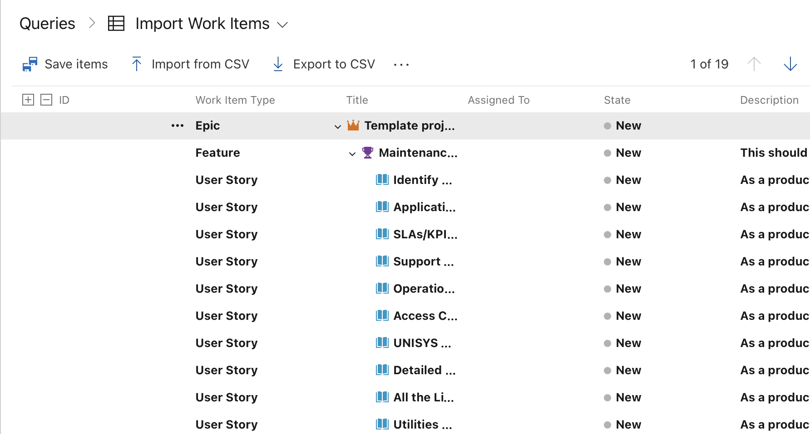

## How to Request a new Azure DevOps project

Please see [How to Request a new Azure DevOps project, Access Level or organisation](https://docs.henkelgroup.cloud/howto/request-azuredo/) HowTo page.  

## How to learn who is the project administrator for a specific Azure DevOps project?

Ask any member of that Azure DevOps project. They can find this out by going to '*Project settings > Overview > Project administrators*'.

In case you don't know any project member either, feel free to send an email to [devops_support@henkel.com](mailto:devops_support@henkel.com) and ask; but usually the first variant is the faster one.

## I have an existing project, how can I import the standard set of backlog items to cover non-functional requirements relevant for Operations?
You can follow the below steps to import the standard set of backlog items in your existing project:

- Download the archive containing the default CSV templates and extract the csv file which applies to your current project process: [Download archive](https://dev.azure.com/henkeldx/cloud-docs/_apis/git/repositories/cloud-docs/items?path=/docs/PDF/Archive_standard_backlog_items&$format=zip&download=true)

- Go to your Azure DevOps project - Boards - Work items

- Click on "Import Work Items" and choose the csv file you just extracted 

- Click on "Import"

- Once all work items are imported, click on "Save items" (the ID column should now be filled with IDs)

## I am trying to customize the process (Basic, Agile, Scrum or CMMI) for my Azure DevOps project, but I receive the error message that I don't have sufficient permissions, who do I contact?

In Azure DevOps, the four default processes (Basic, Agile, Scrum or CMMI) cannot be modified. But based on these default processes we can create inherited processes which can be customised.
To request a customizable process please use the ServiceNow form, option 'Only for existing projects - create new custom process'. 

## Can I use an existing process for my project? 
There are two ways on how to achieve this:

1. Use the very same process as another project.
2. Copy the process of another project.

With **Variant 1**, it is easy to keep multiple projects process configuration in sync. 

The drawback, however, is that you can't make changes to just one project. As soon as a process configuration is changed, it is changed for every project using this process. Also, the owner of the originating process is not responsible to investigate which other projects might have adopted the process and inform everybody before each change or ask for permission. 
It is also fair to decide for the owning team to ignore requests of other teams for changes to the process. Last but not least, it is not possible to keep a history of process configurations to revert a change, making it impossible to restore a configuration.

**Variant 2** is a better choice in case you are planning to start a new project, 
but would like to prevent being surprised by changes the other team is introducing to their process configuration.
