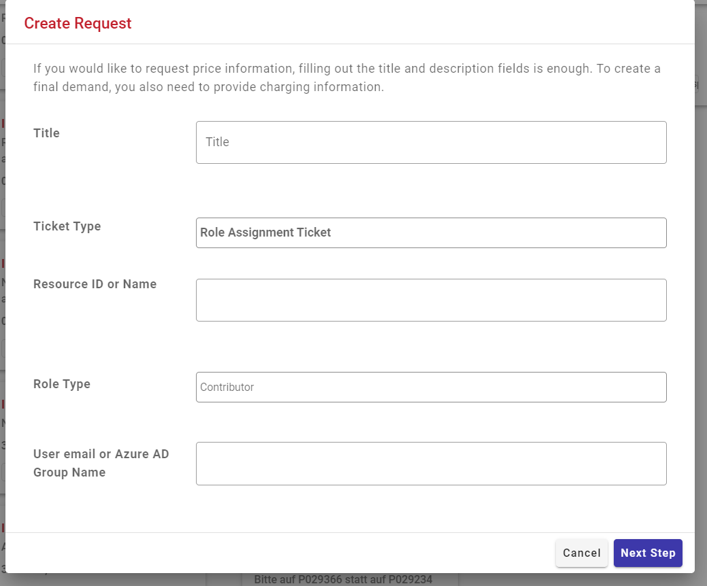
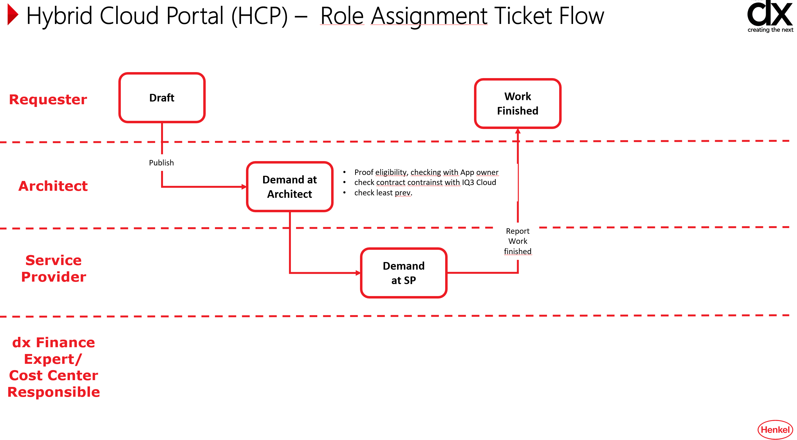

# Requesting a Role Assignment

Follow the video instruction and summary of [Cloud Portal](../cloud/cloud-portal.md) and select "Role Assignment" under Create Request dropdown.

Role Assignment allows you to change or add Azure AD group be asssigned to given Azure Ressource Groups or Subscriptions.

Please give a meaningful justification as otherweise the request may gets rejected and this causes delays.

### Role Assignment         

## Workflow

## Tipps

Contributor
-Create a MYID Azure AD Group for developers beforehand. howto guide under [Create new AD Group in MYID](myid-new-group.md))

Billing and Costs
-details under [Henkel Billing Codes](../cloud/hmc-costs.md))
-If clarity codes are missing pls approach [cloud@henkel.com](mailto://cloud@henkel.com).
