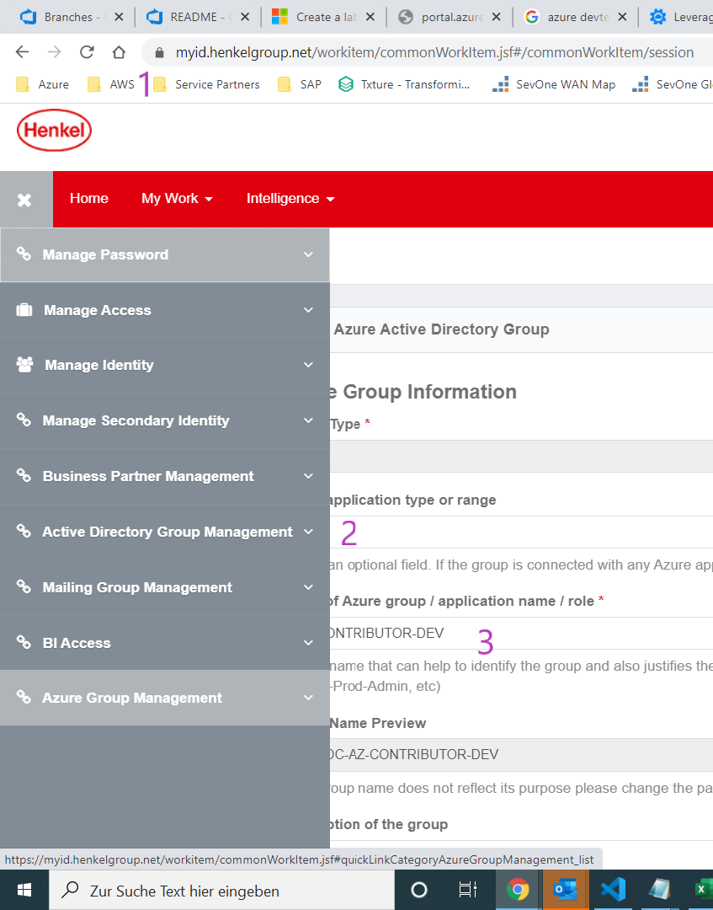

# Create New AD Group in MYID

- The global Identity Management process and tool **[MyID](https://myid/)** controls users and groups.
- Active Directory Groups can manage Henkel ID membership, but don't support guest users (=Externals). For guest user access, approach [DirectoryServicesTeam@henkel.com](mailto://DirectoryServicesTeam@henkel.com)
- A Henkel employee can invite *Business Partners* for such purposes.
- Create new Group in Active Directory as below in 1-3

## Step by Step

Follow 1-3. Please refer to the screenshot.

1. Enter "myid/"
2. Select Active Directory Group Panel
3. Enter Group Details

- Select the corresponding AG group
- Now you are able to add or remove users by seeking their names and submit your request.
