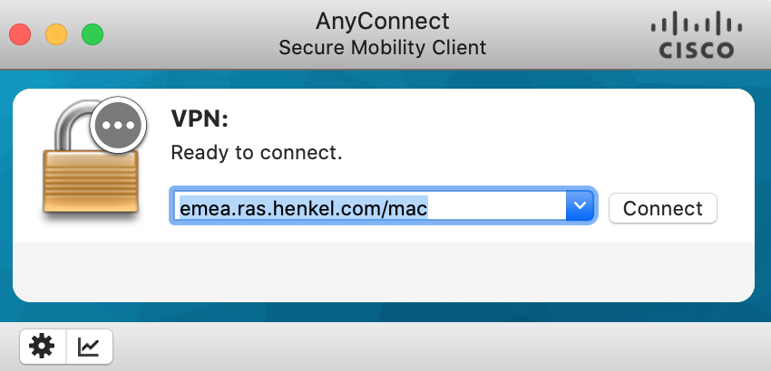

# Onboarding

This page is to help members who are new joiners or old joiners that forget :-)
It is focused on Mac users, but the same mechanisms apply for all Henkel users.

## MyID

- Is the central IAM tool at Henkel.
- Is a self-service portal for Active Directory group join and access requests
- It can be found with the short name [MyID](http://myid/) or its FQDN https://myid.henkelgroup.net/
- Is used to onboard externals using the *Invite Business Partner* function

## VPN

- You should have installed Cisco Any Connect. If not contact the help desk

### Change your region

| Region        | URL |
| ------------- | -------------------------|
| EMEA          | emea.ras.henkel.com/mac  |
| North America | us.ras.henkel.com/mac    |
| APAC          | apac.ras.henkel.com/mac  |

(leave out `/mac` for Windows users)
