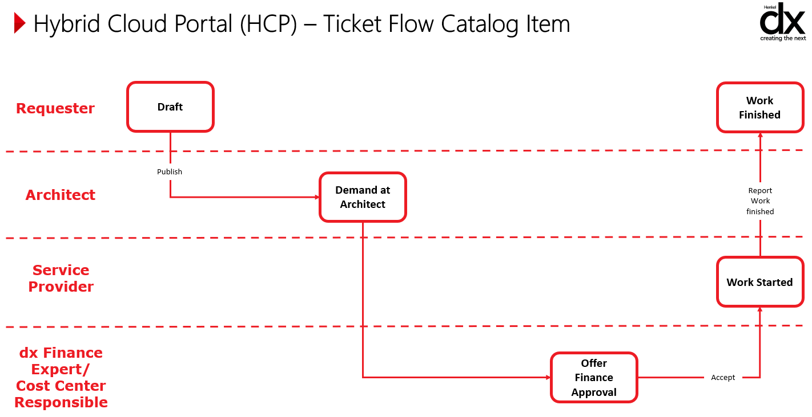

# Requesting a New Landing Zone
When requesting a new landing zone a new Cloud Portal Request is required but before creating the request you need to collect information about the project. Below you will find the required information to create a landing zone:

- Project Name and Project abbreviation.
    - The project abbreviation is used as part of the naming convention in Azure.
    - The Abbreviation must be between 3 and 10 characters.
- Application ID
    - A valid Application ID from [Alfabet](https://henkel.alfabetcloud.com/Application.aspx) is required.
    - The Application ID must be considered valid my MyID as well.
- Business Unit
    - The business unit can be found in Alfabet based on the Application ID.
    - The Business Unit must be one of the following:
        dx, dxa, dxc, dxd, dxf, dxm, dxt, dxs, dxv
- Project Type
    - The Project Type can be chosen as Managed or BizDevOps. Additional information regarding this can be found in [Service Model](../cloud/azure/az-service-model.md).
- Application Owner
    - A Henkel employee must be chosen as owner of the project and person's email provided.
- Application Admins
    - Minimum two Henkel employees must be chosen as admins and their emails provided. 
- Environments
    - The landing zones can be hosted in two different Management Groups. Namely in Non-Prod and Prod.
        - Non-Prod is intended for environments that are used for development and testing purposes. These environments must not be connected with workloads in the Production Management Group.
        The following environment abbreviations can be chosen in Non-Prod (Note the abbreviation can not be used twice, but it is allowed to use multiple of them)
            > dev, tst, uat, npr, qua
        - Prod is intended for production workloads and should be treated as such.
        The following environment abbreviations can be chosen in Prod (Note ythe abbreviation can not be used twice, but it is allowed to use multiple of them)
            > prd, qua, dev, tst
- DevOps Project
    - It is a requirement from Henkel that any workloads on Azure should be deployed/provisioned through Azure DevOps. Thus an existing DevOps Project needs to be provided. If a DevOps Project is not owned yet, one must be requested (information about requesting a DevOps project can be found here: [Request a new Azure DevOps Project](request-azuredo.md)).
    The Organisation and Project name of the Azure DevOps project needs to be provided in the Cloud Portal Request. An example could be
        > Organisation: hmanagedcloud\
        Project: AzurePlatform

## Additional information needed to obtain a Landing Zone

This section describe the information needed for the Platform to provision network related Azure resources along with the landing zones.

!!!info
    If the Managed Project Type is chosen this section will be handled by the Cloud Adoption team.

### Virtual Network layout

In order to provision resources into the subscriptions provided with the landing zones, a virtual network is needed. The landing zone support defining a virtual network and additional resources that might be required for the environment.

A Virtual Network enables Azure resources to communication through Azure backbone and ensure the communication is kept private. Additionally, the Virtual Network implements firewall rules (Network Security Groups) to restrict network traffic between Azure resources.
When requesting a landing zone, it is important that the Azure Resources needed and the communication with both external service and service within the Virtual Network are outlined. Thus, being aware of IP addresses and ports used in the communication.

#### Bastion

In some cases a jumphost is needed to reach resources with the Virtual Network. In particular when hosting Virtual Machines, a jumphost can be used to easily access virtual machines from the Azure Portal. The landing zone support provisioning an Azure Bastion along with the landing zone. It will be placed in dedicated subnet of the Virtual Network.

#### Build Agent

In most cases connectivity to Azure Resources within the Virtual Network is needed from Azure DevOps. This would for instance be the case when deploying application code. A build agent can be provided along with the landing zone. This will provision a Virtual Machine Scale Set in a dedicated subnet and create an Agent Pool in Azure DevOps project provided. Thus, all that is needed is to reference the agent in the Azure DevOps Pipelines and there will be  connectivity to Azure resources. Additional information about build agents can be found in the section [Azure DevOps Build Agents](../cloud/azure/platform-guide/azure-network-buildagents.md).

!!!info
    The build agent is only meant to solve connectivity issues. The build agent does come with limited support of software and tools. If additional software and tools in the agents, then the Azure provided Build Agents should be used instead and only use the landing zone provided Build Agent for connectivity (deployments).

#### Private DNS Zone

Often a team like to use custom domains for user friendliness or migration resiliency when hosting their web application or even using Azure resource that requires a Private DNS Zone. The landing zone provide the possibility to provision a different Private DNS Zone and link them to relevant Virtual Networks. Additional information can be found in the section [Custom Private DNS Zones](../cloud/azure/platform-guide/azure-network-dns.md).

#### NAT Gateways

If Azure Resources should be hsoted behind a NAT gateway the landing zone can provision one or more Azure NAT gateways.

### Role assignments

As optional role assignments can be created by the platform as part of the landing zone roll-out. Here role assignment scoped to specific resources and resource groups within the subscription provided by the landing zone can be assigned.

!!!info
    We do recommend granting role assignments through terraform using the service connections in Azure DevOps which is provided by the Platform.

## Workflow of a Cloud Portal Request

