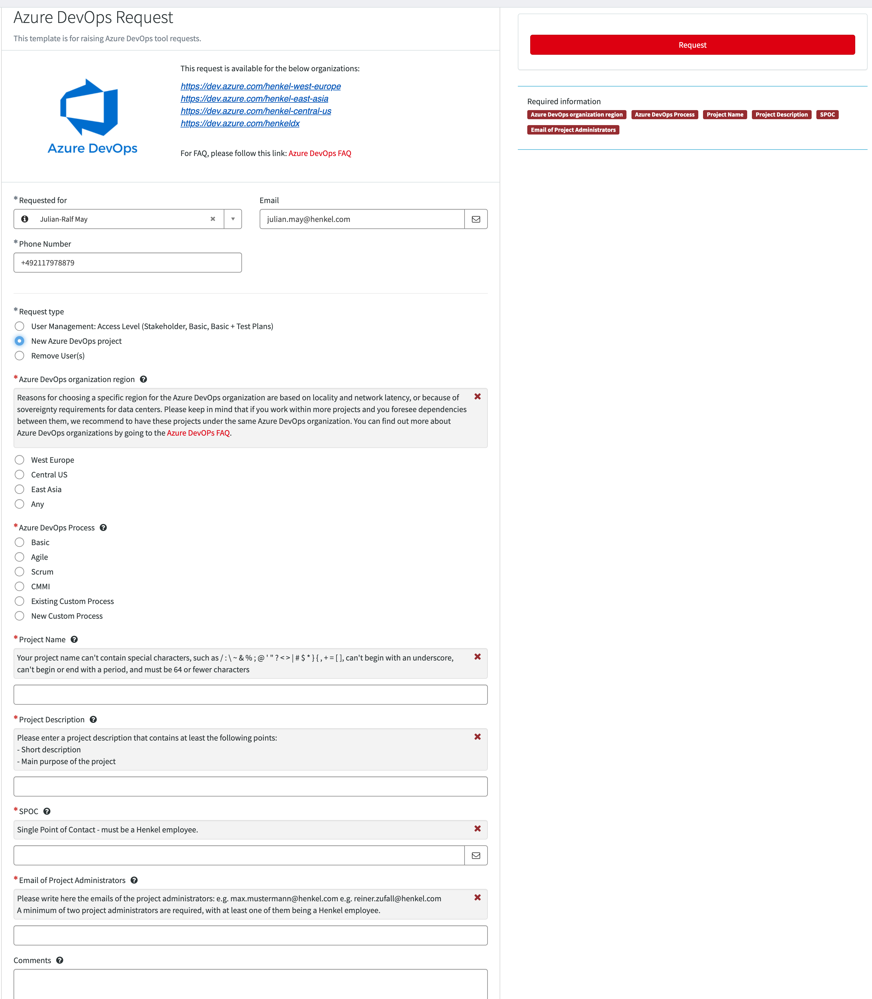

# How to Request a new Azure DevOps project, change of Access Level or a new Azure DevOps organization

## Step 1: Identify your demand

If you are not sure if you need a project or an organization, the first step is to consult with our Henkel DevOps team.

Factors that could render an own organization a good idea are if you have concrete plans to start more than 10 projects or your pipelines will consume a tremendous amount of cloud computing power.
But in any way, consult with DevOps team beforehand, since a migration of projects into another organization is a non-trivial task.

## Step 2: Send a request

Please raise Azure DevOps requests only via ServiceNow - navigate to [Henkel ServiceNow](https://henkelprod.service-now.com/sp?id=sc_cat_item&sys_id=e46475d41b5cf89097eaea836b4bcb11) and search for "Azure DevOps" in the main search field. Once you have selected the entry "Azure DevOps Request" you will be taken to the customized template for raising requests.

Note: No VPN connection needed to access ServiceNow.

### Project request

For a **new project**: please select "New Azure DevOps project" and fill in required fields.

Example for requesting new project:

#### Azure DevOps project name

The project name has to follow the following rules:

* It can't contain special characters, such as `/ : \ ~ & % ; @ ' " ? < > | # $ * } { , + = [ ]`
* It can't begin with an underscore
* It can't begin or end with a period
* It must consist of 64 or fewer characters
* It must be unique

#### Azure DevOps organizations

Due to known Azure DevOps project limitation within an organization, DevOps team has created Azure DevOps organizations in different regions:

* <https://dev.azure.com/henkel-west-europe/> - region West Europe
* <https://dev.azure.com/henkel-east-asia/> - region Southeast Asia
* <https://dev.azure.com/henkel-central-us/> - region Central US
* <https://dev.azure.com/henkeldx/> - region West Europe 

#### Info:
If you want to request a project in hbif organization, which is not in our dxt DevOps Team scope, please use the following [link](https://hdf-guide.azurewebsites.net/guide/More-Information/Request-Access-to-Azure-DevOps.html).

#### Azure DevOps Process

For those who come from a Jira background: A "*process*" is similar to a "*workflow*" in Jira. It defines transitions from one ticket state to another, types of issues and so on. This can be changed later at any given time.

To learn more about this, please consult the [official Microsoft documentation](https://docs.microsoft.com/en-us/azure/devops/boards/work-items/guidance/choose-process?view=azure-devops&tabs=basic-process).

#### SPOC

For each project, there must be a SPOC (single point of contact) who is also our main contact for governance matters. 

The SPOC, who must be a Henkel employee, must have the authority to make decisions regarding the project.

#### Project Administrators

DevOps team is only providing the initial setup of projects and acts as a consulting team for Azure DevOps. Project administration tasks, such as changing the project description, managing role and group assignments of the project fall under the responsibility of the project administrators.  

Project administrators are users with higher permissions within the scope of the project. They do **not** have the permission to make organization wide changes that also affect other projects.

Every project needs to have at least two project administrators, at least one of them beeing a Henkel employee.

## Access Level

All users have an access level (also known as license) per organization, and this can be changed depending on user needs.

#### Which access level do I need?

You can choose from 3 access levels:

1. ### Stakeholder:

  - Limited access for Boards, Backlog, Wiki 
  - Full access to own Tasks, Artifacts and Project administration (if added to the Project administrators Team) 
  - Can not work with repositories

The Stakeholder access level provides partial access to features and sometimes is sufficient for users who just want to "peek" into Azure Boards. 

"Stakeholder" is the default access level for new users.

2. ### Basic:
The basic access level allows access to all technical features of Azure DevOps.

3. ### Basic + Test Plans:

- Similar to Basic, but can create Test Plans and Test Suites

For more details, you can consult the following documents:

* [Henkel Azure DevOps FAQ](https://docs.henkelgroup.cloud/devops/azure-devops-and-github-faq/)
* [Microsoft docs on access levels](https://docs.microsoft.com/en-us/azure/devops/organizations/security/access-levels?view=azure-devops)

### Access Level changes

For Access Level changes, please raise a ServiceNow Request as described in step above. Please make sure that the external collaborators were first invited in myID under Business Partner Management.

!!! INFO

    NOTE: If the "Basic + Test Plans" or the "Basic" access level is not actively used for two months, the access level is considered unused and will be downgraded to the next lower access level to reduce costs.

### New organization request

Please send a consultation meeting to dxT DevOps team: [devops_support@henkel.com](mailto:devops_support@henkel.com) for discussing together which option would better fit your requirements.
